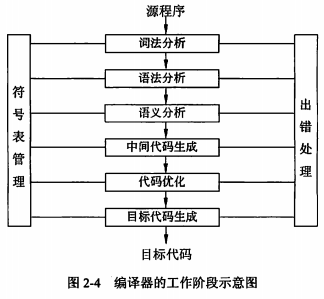
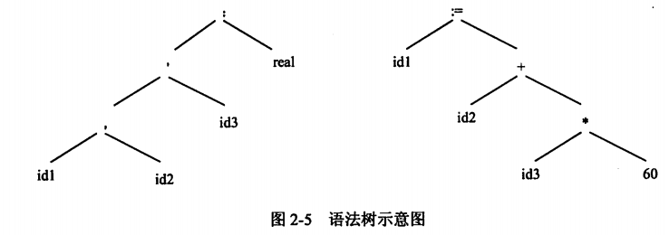
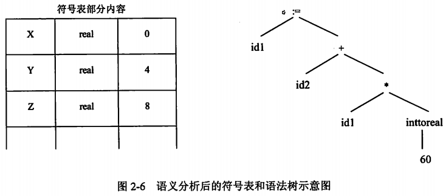
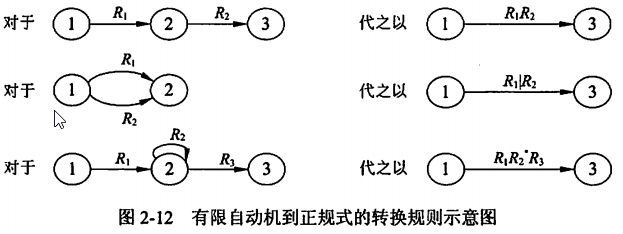
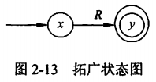
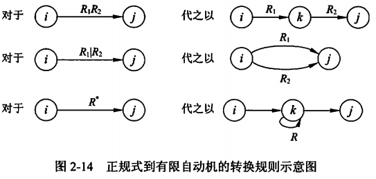
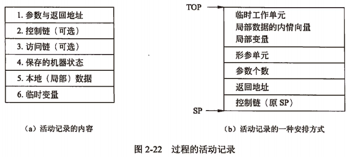

title:: 程序设计语言基础知识/语言处理程序基础/编译程序基本原理
alias:: 编译程序基本原理

- ## 编译过程概述
  collapsed:: true
	- 
	- 编译程序的功能是把某高级语言书写的源程序翻译成与之等价的目标程序（汇编语言或机器语言）。编译程序的工作过程可以分为6个阶段，如图2-4所示，实际的编译器中可能会将其中的某些阶段结合在一起进行处理。
	- ### 词法分析
		- 源程序可以简单的被看成是一个多行的字符串。词法分析阶段是编译过程的第一阶段，这个阶段的任务是对源程序从前到后（从左到右）逐个字符地扫描，从中识别出一个个“单词”符号。“单词”符号是程序设计语言的基本语法单位，如关键字（或称保留字）、标识符、常数、运算符和分隔符（如标识符号、左右括号）等。词法分析程序输出的“单词”常以二元组的方式输出，即单词种别和单词自身的值。
		- 词法分析过程依据的是语言的词法规则，即描述“单词”结构的规则。例如，对于某PASCAL源程序中的一条声明语句和赋值语句：
		  ```
		  VAR X,Y,Z:real;
		  X:=Y+Z*60;
		  ```
		- 词法分析阶段将构成这条语句的字符串分割成如下的单词序列。
		  |        |      |            |      |
		  | ------ | ---- | ---------- | ---- |
		  | 保留字 | VAR  | 标识符     | X    |
		  | 逗号   | ,    | 标识符     | Y    |
		  | 逗号   | ,    | 标识符     | Z    |
		  | 冒号   | :    | 标准标识符 | real |
		  | 分号   | ;    | 标识符     | X    |
		  | 赋值号 | :=   | 标识符     | Y    |
		  | 加号   | +    | 标识符     | Z    |
		  | 乘号   | *    | 整常数     | 60   |
		  | 分号   | ;    |            |      |
		- 对于标识符X、Y、Z，其单词种别都是id（用户标识符），字符串“X’、”Y“、”Z“都是单词的值；而对于单词60，整常数是该单词的各类，60是该单词的值。这里用id1、id2和id3分别代表X、Y、Z，强调标识符的内部标识由于组成该标识符的字符串不同而有所区别。经过词法分析后，声明语句VAR X,Y,Z:real;表示为VAR id1,id2,id3:real，赋值语句X:=Y+Z\*60;表示为id1:=id2+id3\*60;。
	- ### 语法分析
		- 语法分析的任务是在词法分析的基础上，根据语言的语法规则将单词符号序列分解成各类语法单位，如”表达式“、”语句“和”程序“等。语法规则就是各类语法单位的构成规则。通过语法分析确定整个输入串是否构成一个语法上正确的程序。如果源程序中没有语法错误，语法分析后就能正确地构造出其语法树；否则就指出语法错误，并给出相应的诊断信息。对id1:=id2+id1*60进行语法分析后形成的语法树如图2-5所示。
		  {:height 213, :width 596}
		- 词法分析和语法分析本质上都是对源程序的结构进行分析。
	- ### 语义分析
		- 语义分析阶段主要检查源程序是否包含静态语义错误，并收集类型信息供后面的代码生成阶段使用。只有语法和语义都正确的源程序才能被翻译成正确的目标代码。
		- 语义分析的一个主要工作是进行类型分析和检查。程序语言中的一个数据类型一般包含两个方面的内容：==类型的载体==及==其上的运算==。例如，整除取余运算符只能对整型数据进行运算，若其运算对象中有浮点数就认为是类型不匹配的错误。
		- 在确认源程序的语法和语义之后，就可对其进行翻译并给出源程序的内部表示。对于声明语句，需要记录所遇到的符号的信息，所以应进行符号表的填查工作。在图2-6所示的符号表中，每一行存放一个符号的信息。第一行存放标识符X的信息，其类型为real，为它分配的地址是0；每二行存放y的信息，其类型是real，为它分配的地址是4。因此，在这种语言中，为一个real型数据分配的存储空间是4个存储单元。对于可执行语句，则检查结构合理的表达式是否有意义。对id1:=id2+id1*60进行语义分析后的语法树如图2-6所示，其中增加了一个语义处理节点inttoreal，该运算用于将一个整型数转换为浮点数。
		  {:height 267, :width 590}
	- ### 中间代码生成
		- 中间代码生成阶段的工作是根据语义分析的输出生成中间代码。”中间代码“是一种简单且含义明确的记号系统，可以有若干种形式，它们的共同特征是与具体的机器无关。最常用的一种中间代码是与汇编语言的指令非常相似的三地址码，其实现方式常采用四元式。四元式的形式为：
		  ```
		  (运算符,运算对象1,运算对象2,运算结果)
		  ```
		- 例如，对语句X:=Y+Z*60，可生成以下四元式序列：
		  1. (inttoreal,60,-,t1)
		  2. (*,id3,t1,t2)
		  3. (+,id2,t2,t3)
		  4. (:=,t3,-,id1)
		- 其中，t1、t2、t3是编译程序生成的临时变量，用于存放临时的运算结果。
		- 语义分析和中间代码生成所依据的是语言的语义规则。
	- ### 代码优化
		- 优化是一个编译器的重要组成部分，由于编译器将源程序翻译成中间代码的工作是机械的、按固定模式进行的，因此，生成的中间代码往往在时间上和空间上有较大的浪费。当需要生成高效的目标代码时，就必须进行优化。优化过程可以在中间代码生成阶段进行，也可以在目标代码生成阶段进行。由于中间代码不依赖于具体机器，此时所作的优化一般建立在对程序的控制流和数据流分析的基础之上，与具体的机器无关。优化所依据的原则是程序的等价变换规则。例如，在生成X:=Y+Z*60的四元式后，60是编译时已知的常数，把它转换为60.0的工作可以在编译时完成，没有必要生成一个四元式，同时t3仅仅用来将其值传递给id1，也可以被化简掉，因此上述的中间代码可转优化成下面的等价代码：
		  1. (*,id3,60.0,t1)
		  2. (+,id2,t1,id1)
		- 这只是优化工作中的一个简单示例，真正的优化工作还要涉及==公共子表达式的提取==、==循环优化==等更多的内容和技术。
	- ### 目标代码生成
		- 目标代码生成是编译器工作的最后一个阶段。这一阶段的任务是把中间代码变换成特定机器上的绝对指令代码、可重定位的指令代码或汇编指令代码，这个阶段的工作与具体的机器密切相关。例如，使用两个寄存器R1和R2，可对上述的四元式生成下面的目标代码：
		  > 1. MOVF id3, R2
		  > 2. MULF \#60.0, R2
		  > 3. MOVF id2, R1
		  > 4. ADDF R2, R1
		  > 5. MOV R2, id1
		- 这里用`#`表明60.0为常数。
	- ### 符号表管理
		- 符号表的作用是记录源程序中各个符号的必要信息，以辅助语义的正确性检查和代码生成，在编译过程中需要对符号表进行快速有效地查找、插入、修改和删除等操作。符号表的建立可以始于词法分析阶段，也可以放到语法分析和语义分析阶段，但符号表的使用有时会延续到目标代码的运行阶段。
	- ### 出错处理
		- 用户编写的源程序不可避免的会有一些错误，这些错误大致可分为静态错误和动态错误。动态错误也称**动态语义错误**，它们发生在程序运行时，例如变量取零时作除数、引用数组元素下标错误等。**静态错误**是指编译阶段发现的程序错误，可分为语法错误和静态语义错误，如单词拼写错误、标点符号错、表达式中缺少操作数、括号不匹配等有关语言结构上的错误称为语法错误，而语义分析时发现的运算符与运算对象类型不合法等错误属于静态语义错误。
		- 在编译时发现程序中的错误后，编译程序应采用适当的策略修复它们，使得分析过程能够继续下去，以便在一次编译过程中尽可能多地找出程序中的错误。
	- 对于编译器的各个阶段，在逻辑上可以把它们划分为前端和后端两部分。==前端==包括从词法分析到中间代码生成各阶段的工作，==后端==包括中间代码优化和目标代码的生成、优化等阶段。这样，以**中间代码**生成为分水岭，把编译器分成了与机器有关的部分和与机器无关的部分。如此一来，对于同一种程序的编译器，开发出一个前端之后，就可以针对不同的机器开发相应的后端，前后端有机结合后就形成了该语言的一个编译器。当语言有改动时，只会涉及前端部分的维护。对于不同的程序语言，分别设计出相应的前端，然后将各个语言的前端与同一个后端相结合，就可得到各个语言在某种机器上的编译器。
- ## 文法和语言的形式描述
  collapsed:: true
	- ### 字母表、字符串、字符串集合及运算
		- **字母表**\Sigma和字符：字母表是字符的非空有穷集合，字符是字母表\Sigma中的的一个元素。例如\Sigma={a,b}，a或b是字符。
		- **字符串**：\Sigma中的字符组成的有穷序列。例如a，ab，aaa都是\Sigma上的字符串。
		- 字符串的长度：指字符串中的字符个数。如|aba|=3。
		- **空串**\epsilon：由零个字符组成的序列，|\epsilon|=0。
		- **连接**：字符串S和T的连接是指将串T接续在串S之后，表示为S \cdot T，连接符号 \cdot 可省略。显然，对于字母表\Sigma上的任意字符串S，S \cdot \epsilon = \epsilon \cdot S = S。
		- \Sigma\^\*：是指包括空串\epsilon在内的\Sigma上所有字符串的集合。例如，设\Sigma={a,b}，\Sigma\^\*={\epsilon,a,b,aa,bb,ab,ba,aaa,…}。
		- 字符串的**方幂**：把字符串a自身连接n次得到的串，称为字符串a的n次方幂，记为a\^n。a\^0=\epsilon，a\^n=aa\^{n-1}=a\^{n-1}a （n > 0）。
		- 字符串集合的运算：设A，B代表字母表\Sigma上的两个字符串集合。
			- 或（合并）：A \cup B = {a|a \in A 或 a \in B}。
			- 积（连接）：AB={ab|a \in A 且 b \in B}。
			- 幂：A\^n = A \cdot A\^{n-1} = A\^{n-1} \cdot A (n > 0)，并规定A\^0 = {\epsilon}。
			- **正则闭包**+：$$ A^+ = A^1 \cup A^2 \cup A^3 \cup … \cup A^n \cup … $$ 。
			- **闭包**\*：$$A^* = A^0 \cup A^+$$ 。显然， $$\Sigma^* = \Sigma^0 \cup \Sigma^1 \cup \Sigma^2 \cup \cdots \cup \Sigma^n \cup \cdots$$ 。
	- ### 文法和语言的形式描述
		- **语言L**是有限字母表\Sigma上有限长度字符串的集合，这个集合中的每个符号串都是按照一定的规则生成的。下面从产生语言的角度出发，给出方法和语言的形式定义。所谓产生语言，是指制定出有限个规则，借助它们就能产生此语言的全部句子。
		- 文法的定义：描述语言语法结构的形式规则称为**文法**。文法G是一个四元组，可表示为 $$G=(V_N, V_T, P, S)$$ ，其中VT是一个非空有限集，其每个元素称为一个终结符；VN是一个非空有限集，其每个元素称为非终结符。$$V_N \cap V_T = \Phi$$ ，即VN和VT不含公共元素。令 $$V = V_N \cup V_T$$ ，称为V为文法G的**词汇表**，V中的符号称为**文法符号**，包括终结符和非终结符。 $$S \in V_N$$ ，称为**开始符号**，它至少要在一条产生式中作为左部出现。P是**产生式**的有限集合，每个产生式是形如 $$\alpha \to \beta$$ 的规则，其中a称为产生式的左部， $$a \in V^+$$ 且a中至少含有一个非终结符；b称为产生式的右部，且 $$\beta \in V^*$$ 。若干个产生式 $$\alpha \to \beta_1, \alpha \to \beta_2, \cdots, \alpha \to \beta_n$$ 的左部相同时，可简写为 $$\alpha \to \beta_1|\beta_2|\cdots|\beta_n$$ ，称 \beta i (1<=i<=n)为a的一个候选式。
		- 文法的分类：
			- 乔姆斯基（Chomsky）把方法分成4种类型，即0型、1型、2型和3型。这4类文法之间的差别在于对产生式要施加不同的限制。若文法 $$G=(V_N, V_T, P, S)$$ 的每个产生式 a \to b，均有$$\alpha \in (V_N \cup V_T)^*$$ ，a至少含有一个非终结符，且 $$\beta \in (V_N \cup V_T)^*$$ ，则称G为**0型文法**。对0型文法的每条产生式分别施加以下限制，则可得以下文法。
			- **1型文法**：G的任何产生式a \to b（S \to \epsilon 除外）均满足|a| <= |b|（|x|表示x中文法符号的个数）。
			- **2型文法**：G的任何产生式形如A \to b，其中A \in VN，b \in $$(V_N \cup V_T)^*$$
			- **3型文法**：G的任何产生式形如A \to a 或 A \to aB（或者A \to Ba），其中A，B \in VN，a \in VT。
			- 0型文法也称为**短语文法**，其能力相当于图灵机，任何0型语言都是递归可枚举的；反之，递归可枚举集也必定是一个0型语言。1型文法也称为**上下文有关文法**，这种文法意味着对非终结符的替换必须考虑上下文，并且一般不允许替换成\epsilon串。例如，若 $$\alpha AB \to \alpha\gamma\beta$$ 是1型文法的产生式，a和b不全为空，则非终结符A只有在左边是a，右边是b的上下文中才能替换成 \gamma。2型文法就是**上下文无关文法**，非终结符的替换无需考虑上下文。3型文法等价于**正规式**，因此也被称为正规文法或线性文法。
		- 句子和语言:
			- 设有文法 $$G = (V_N, V_T, P, S)$$
			- 推导与直接推导：**推导**就是从文法的开始符号S出发，反复使用产生式，将产生式左部的非终结符替换为右部的文法符号序列（展开产生式用=>表示），直到产生一个终结符的序列时为止。若有产生式 $$\alpha \to \beta \in P, \gamma, \delta \in V^*$$ ，则 $$\gamma\alpha\delta \Rightarrow \gamma\beta\delta$$ 称为文法G中的一个**直接推导**，并称 \gamma\alpha\delta 可直接推导出 \gamma\beta\delta 。显然，对P中的每一个产生式 a \to b 都有 a => b。若在文法中存在一个直接推导序列，即a0 => a1 => a2 => … => an (n > 0)，则称a0可推导出an，an是a0的一个推导，并记为$$a_0 \Rightarrow_G^+ a_n$$ 。用记号 $$a_0 \Rightarrow_G^* a_n$$ 表示a0=an或者 $$a_0 \Rightarrow _G^+ a_n$$ 。
			- 直接归约和归约（推导的逆过程）：若文法G中有一个直接推导 a=>b，则称b可直接归约成a，或a是b的一个直接归约。若文法G中有一个推导 $$\gamma \Rightarrow_G^* \delta$$，则称\delta 可归约成\gamma，或\gamma是\delta的一个**归约**。
			- 句型和句子：若文法G的开始符号为S，那么，从开始符号S能推导出的符号串称为文法的一个**句型**，即a是文法G的一个句型，当且仅当有如下推导 $$S \Rightarrow _G^* a, a \in V^*$$ 。若X是文法G的一个句型，且 $$X \in V_T^*$$ ，则称X是文法G的一个**句子**，即仅含终结符的句型是一个句子。
			- 语言：从文法G的开始符号出发，能推导出的句子的全体称为文法G产生的**语言**，记为L(G)。
		- 文法的等价：若文法G1与文法G2产生的语言相同，即L(G1)=L(G2)，则称这两个==文法是等价==的。
- ## 词法分析
  collapsed:: true
	- 语言中具有独立含义的最小语法单位是符号（单词），如标识符、无符号常数与界限符等。词法分析的任务是把构成源程序的字符串转换成单词符号序列。词法规则可用3型文法（正规文法）或正规表达式描述，它产生的集合是语言基本字符集 \Sigma （字母表）上的字符串的一个子集，称为正规集。
	- ### 正规表达式和正规集
		- 对于字母表 \Sigma ，其上的正规式及其表示的正规集可以递归定义如下。
			- \epsilon 是一个正规式，它表示集合 $$L(\epsilon) = {\epsilon}$$ 。
			- 若a是\Sigma上的字符，则a是一个正规式，它所表示的正规集为{a}。
			- 若正规式r和s分别表示正规集L(r)和L(s)，则：
				- r|s是正规式，表示集合L(r) \cup L(s)。
				- r \cdot s 是正规式，表示集合L(r)L(s)。
				- \( r^* \) 是正规式，表示集合 \( (L(r))^* \) 。
				- (r)是正规式，表示集合 L(r)。
		- 仅由有限次地使用上述三个步骤定义的表达式才是\Sigma上的正规式，其中运算符“|”、“\cdot”、“\*”分别称为“或”、“连接”和“闭包”。在正规式的书写中，连接运算符“\cdot”可省略。运算符的优先级从高到低顺序排列为”\*“、”\cdot“、”|“。
		- 设 $$\Sigma={a,b}$$，表2-1列出了\Sigma上的一些正规式和相应的正规集。
		  {:height 190, :width 667}
		- 若两个正规式表示的正规集相同，则认为二者等价。两个等价的正规式U和V记为U=V。例如，$$b(ab)^* = (ba)^*b, (a|b)^* = (a^*b^*)^*$$ 。设U、V和W均为正规式，正规式的代数性质如表2-2所示。
		  {:height 122, :width 667}
	- ### 有限自动机 #有限自动机
- ## 正规式与有限自动机之间的转换
  collapsed:: true
	- ### 有限自动机转换为正规式
		- 对于\Sigma上的NFA M，可以构造一个\Sigma上的正规式R，使得L(R)=L(M)。
		- 拓广状态转换图的概念，令每条弧可用一个正规式作标记。为\Sigma上的NFA M构造相应的正规式R，分为如下两步。
		  1. 在M的状态转换图中加两个节点，一个x节点，一个y节点。从x节点到NFA M的初始状态节点引一条弧并用\epsilon标记，从NFA M的所有终态节点到y节点引一条弧并用\epsilon标记。形成一个与M等价的M’，M’只有一个初态x和一个终态y。
		  2. 按下面的方法逐步消去M’中除x和y的所有节点。在消除节点的过程中，用正规式来标记弧，最后节点x和y之间弧上的标记就是所求的正规式。消除节点的规则如图2-12所示。
		- {:height 215, :width 550}
	- ### 正规式转换为有限自动机
		- 同样地，对于\Sigma上的每个正规式R，可以构造一个\Sigma上的NFA M，使得L(M)=L(R)。
		- 1. 对于正规式R，可用图2-13所示的拓广状态图表示。
		  2. 通过对正规式R进行分裂并加入新的节点，逐步把图转变成每条弧上的标记是\Sigma上的一个字符或\epsilon，转换规则如图2-14所示。
		- {:height 93, :width 160} 
		  {:height 227, :width 458}
		- 最后所得的图即为一个NFA M，x为初态节点，y为终态节点。显然，L(M)=L(R)。
- ## 词法分析器的构造
  collapsed:: true
	- > 1. 用正规式描述语言中的单词构成规则
	  > 2. 为每个正规式构造一个NFA，它识别正规式所表示的正规集
	  > 3. 将构造出的NFA转换成等价的DFA
	  > 4. 对DFA进行最小化处理，使其最简
	  > 5. 从DFA构造词法分析器
- ## 语法分析 #语法分析
- ## 语法制导翻译和中间代码生成
  collapsed:: true
	- 程序语言的语言我分为静态语义和动态语义。描述程序语义的形式化方法主要有属性文法、公理语义、操作语义和指称语义等，其中属性文法的扩充。目前应用最广的静态语义分析方法是语法制导翻译，其基本思想是语言结构的主义以属性的形式赋予代表此结构的文法符号，而属性的计算以语义规则的形式赋予文法的产生式。在语法分析的推导或归约的步骤中，通过语义规则实现对属性的计算，以达到对语义的处理。
	- ### 中间代码
	  collapsed:: true
		- 从原理上讲，对源程序进行语义分析之后就可以直接生成目标代码，但由于源程序与目标代码的逻辑结构往往差别很大，特别是考虑到具体机器指令系统的特点，要使翻译一次到位很困难，而且用语法制导方式机械生成的目标代码往往是繁琐低效的，因此有必要设计一种中间代码，将源程序首先翻译成中间代码表示形式，以利于进行与机器无关的优化处理。由于中间代码实际上也起着编译器前端和后端分水岭的作用，所以使用中间代码也有助于提高编译程序的可移植性。常用的中间代码有后缀式、三元式、四元式和树等形式。
		- **后缀式（逆波兰式）**：逆波兰式是波兰逻辑学家卢卡维奇（Lukasiewicz）发明的一种表示表达式的方法。这种表示方式把运算符写在运算对象的后面，例如，把a+b写成ab+，所以也称为后缀式。这种表示法的优点是根据运算对象和算符的出现次序进行计算，不需要使用括号，也便于用栈实现求值。对于表达式x:=(a+b)\*(c+d)，其后缀式为xab+cd+\*:=。
		- **树形表示**：例如表达式x:=(a+b)\*(c+d)的树形表示为：
		  
		- **三元式表示**：三元式是由运算符OP、第一运算对象ARG1和第二运算对象ARG2组成的。例如，表达式x:=(a+b)\*(c+d)的三元表示为：
		  1. (+,a,b)
		  2. (+,c,d)
		  3. (*,1,2)
		  4. (:=,3,x)
		- **四元式表示**：四元式是一种普遍采用的中间代码形式，其组成成分为运算符OP、第一运算对象ARG1、第二运算对象ARG2和运算结果RESULT。其中，运算对象和运算结果有时指用户自定义的变量，有时指编译程序引入的临时变量，RESULT总是一个新引进的临时变量，用来存放运算结果。例如，表达式x:=(a+b)\*(c+d)的四元式表示为：
		  1. (+,a,b,t1)
		  2. (+,c,d,t2)
		  3. (*,t1,t2,t3)
		  4. (:=,t3,_,x)
	- ### 常见语法单位的翻译
	  collapsed:: true
		- 常见语法单位主要有算术表达式、布尔表达式、赋值语句和控制语句（if、while）等。不同结构需要不同的处理方法，但翻译程序的构造原理是相似的。
		- 对于各种语法单位的语法制导翻译，一般是在相应的语法规则中加入适当的语义处理，下面先说明一些翻译过程中要使用的语义变量和语义过程。
			- Entity(id)：在符号表中查找标识符id以获取它在表中的位置（入口）
			- S.code：语句S被翻译后形成的代码序列。
			- E.place：与非终结符E相联系的主义变量，表示存放E值的变量名在符号表的入口或整数码（若此变量是临时变量）。
			- E.tc：当表达式E的值为真时控制流转向的语句标号（四元式的地址编号）。
			- E.fc：当表达式E的值为假时控制流转向的语句标号（四元式的地址编号）。
			- GEN（OP，ARG1，ARG2，RESULT）：产生四元式（OP，ARG1，ARG2，RESULT）填进四元式表中。
			- NXQ：表示下一个将要形成但尚未形成的四元式地址（编号）。NXQ的初值为1，每执行一次GEN()，NXQ就自动累增1。
			- Merg(P1,P2)：把以P1和P2为链首的两条链合并为一条链，并返回合并后的链首指针。
			- Backpatch(p,t)：把p所链接的每条四元式的第4项都以t作为值进行填充。
			- Newtemp：生成一个新的临时存储单元。
		- ==拉链==与==回填==的基本思想是当一个四元式中存在尚不确定的转身地址时，将所有转向同一地址的四元式链接成一个链表，一旦转向地址被确定，则沿此链向所有的四元式回填该地址。
		- 下面简单说明程序语言中常见结构的语法制导翻译方法。
			- （1）赋值语句及简单算术表达式的翻译。下面的产生式描述了由简单变量，算术加、乘、取负运算和圆短号构成的简单算术表达式，以及将一个算术表达式赋值给一个简单变量的赋值语句的形式规则。
			  ```
			  A ->id:=E
			  E->E+E|E*E|-E|(E)|id
			  ```
			  为该文法编写的语义规则如下：
			  ```
			  A->id:=E {GEN(:=,E.place,_,Entry(id))}
			  E->E(1)+E(2) {E.place:=Newtemp;GEN(+,E(1).place,E(2).place,E.place)}
			  E->E(1)+E(2) {E.place:=Newtemp;GEN(*,E(1).place,E(2).place,E.place)}
			  E->-E(1) {E.place:=Newtemp;GEN(@,E(1).place,_,E.place)}
			  E->(E(1)) {E.place:=E(1).place}
			  E->id {E.place:=Entry(id)}
			  ```
			- （2）布尔表达式的翻译。布尔表达式常用于表示控制结构中的条件，其计算过程可采用直接计算和短路计算两种形式。直接计算是指布尔表达式中的每个因子都进行运算，而短路计算是指只要表达式的值能够确定下来，就停止计算。下面介绍布尔表达式作为控制条件时的翻译方法（采用短路计算方式）。
			  布尔表达式的形式定义（文法）为：
			  ```
			  E->E and E|E or E|not E|(E)|id|id relop id 
			  ```
			  其中，relop代表关系运算符（<、>、<=、>=、=、!=），运算符的优先级和结合律遵照通常的习惯。E->E(1) and E(2)，E->E(1) or E(2)的代码结构如图2-19(a)和图2-19(b)所示。
			  
			  改写文法并编写语义子程序如下。
			  对于E->E(1) and E(2)，为记住E(2)的第一条四元式的地址，需改写为：
			  ```
			  E^->E(1) and {Backpatch(E(1).tc,NXQ): E^.fc:=E(1).fc} // 回填真出口，传假出口
			  E->E^E(2) {E.tc:=E(2).tc: E.fc:=Merg(E^.fc,E(2).fc)} // 传真出口，合并假出口
			  ```
			  对于E->E(1) or E(2)，为记住E(2)的第一条四元式的地址，需改写为：
			  
			- 常见语句的翻译。下面简单说明if语句和while语句的翻译方法，其形式定义为：
			  S->A|if E then S(1) | if E then S(1) else S(2) | while E do S(1)
			  用语义变量S.chain记录语句结束后的转向地址。回填工作将在处理S的外层环境的某个时刻完成。If语句的代码结构如图2-20所示，while循环语句的代码结构如图2-21所示。
			  
			  
			- 【例2.8】设NXQ的初值为1，每产生一条四元式，NXQ的值就增1，将语句if a\<b then while a\<b do a:=a+b翻译成四元式的主要步骤如下。
			  
			  最后产生的四元式序列如下所示，其中2，4两条四元式有待于回填。
			  1. (j<,a,b,3)
			  2. (j,-,-,0)
			  3. (j<,a,b,5)
			  4. (j,-,-,0)
			  5. (+,a,b,t1)
			  6. (:=,t1,-,a)
			  7. (j,-,-,3)
	- ### 动态存储分配和过程调用的翻译
	  collapsed:: true
		- 过程（函数）说明和过程（函数）调用是程序中一种常见的语法结构，绝大多数语言都含有这方面的内容。过程说明和调用语句的翻译，有赖于形式参数与实际参数结合的方式以及数据空间的分配方式。
		- 由于各种语言的不同特点，在目标程序运行时，对存储空间的分配和组织有不同的要求，在编译阶段应产生相应的目标来满足不同的要求。需要分配存储空间的对象有基本数据类型（如整型、实型和布尔型等）、结构化数据类型（如数组和记录等）和连接数据（如返回地址、参数等）。分配的依据是名字的作用域和生存期的定义规则。分配的策略有静态存储和动态存储分配两大类。
		- 如果在编译时就能确定目标程序运行时所需的全部数据空间的大小，则在编译时就安排好目标程序运行时的全部数据空间，并确定每个数据对象的存储位置。这种分配策略称为静态存储分配。FORTRAN语言的早期版本可以完全采用静态存储分配策略。
		- 如果一个程序语言允许递归过程和可变数据结构，那么就需采用动态存储分配技术。动态存储分配策略的实现有栈分配方式和堆分配方式两种。在栈式动态存储分配中，将程序的数据空间设计为一个栈，每当调用一个过程时，它所需的数据空间就分配在栈顶；每当过程执行结束时，就释放这部分空间。若空间的使用未必服从“先申请后释放”的原则，那么栈式的动态存储分配方式就不适用了，这种情况下通常使用堆分配技术。下面仅就一个简单的栈式分配为例，说明过程调用和过程说明的翻译。
		- 考虑一种简单的程序语言结构：没有分程序结构，过程定义不嵌套，但允许过程递归调用。
		- 称过程（函数）的一次运行为一个活动。活动是一个动态的概念，除了设计为永不停机的过程（如操作系统等），或者是因为设计错误而出现死循环的情况外，任何过程的活动均有有限的生存期。每个活动在运行时的环境就称为它的活动记录。一般情况下，一个活动记录的内容如图2-22（a）所示，活动记录内容的一种安排方式如图2-22（b）所示。其中，SP指向当前活动记录在控制栈中的起始位置，TOP指向栈顶位置。
		  {:height 274, :width 600}
		- 设SP总是指向现行过程活动记录的起点，TOP始终指向栈顶单元，则过程调用语句call P(T1,T2,…,Tn)的四元式序列是：
		  ```
		  para T1
		  para T2
		  ...
		  para Tn
		  call P,n
		  ```
			- （1）在运行时，para和call应产生传递参数和进行调用的代码。
			  ```
			  (i+3)[TOP]:=Ti (传递参数值) 或 (i+3)[TOP]:=addr(Ti) (传递参数地址)
			  1[TOP]:=SP (保护现行SP)
			  3[TOP]:=n (传递参数个数)
			  JSR P (转子程序指令，即控制转向过程P的第一条指令)
			  ```
			- （2）转入过程P后，就进入过程说明的代码。
			  ```
			  SP:=TOP+1 (定义新的SP)
			  1[SP]:=返回地址 （保留返回地址）
			  TOP:=TOP+L （定义新的TOP，L是过程P的活动记录所需要的单元数，编译时可确定）
			  ```
			- （3）过程说明中数组说明的代码，调整TOP的代码。
			- （4）过程体内执行语句的代码（用SP变址方式访问的数据对象）。
			- （5）退出过程语句时，return(E)的代码序列为
			  ```
			  R:=E.place (把E的值放到特定的寄存器R中，调用段将从中获得被调用过程的结果值)
			  TOP:=SP-1 (恢复TOP)
			  SP:=[SP] (恢复SP)
			  PC:=2[TOP] (取返回地址)
			  JMP PC
			  ```
- ## 中间代码优化和目标代码生成
  collapsed:: true
	- 优化就是对程序进行等价变换，使得从变换后的程序能生成更有效的目标代码。所谓等价，是指不改变程序的运行结果；所谓有效，是指目标代码运行时间较短，占用的存储空间较少。
	- 最主要的优化是在目标代码生成以前对中间代码进行的，这类优化不依赖于具体的计算机。
	- ### 中间代码形式
		- 中间代码有多种形式，其中树与后缀表示形式适用于解释器，而编译器多采用与机器指令格式较接近的**四元式形式**。
	- ### 目标代码形式
		- 目标代码可以分为两大类：==汇编语言形式==和==机器指令形式==。机器指令形式 的目标代码又可以根据需求的不同分为绝对机器指令代码和可再定位机器代码。**绝对机器代码**的优点是可以立即执行，一般应用于一类称为load-and-go形式的编译模式，即编译后立即执行，不形成存在外存上的目标代码文件。**可再定位机器代码**的优点是目标代码可以被任意链接并装入内存的任意位置，是编译器采用较多的代码形式。汇编语言作为一种中间输出形式，便于进行分析和测试。
	- ### 寄存器的分配
		- 由于存取寄存器的速度远快于存取内存单元的速度，所以总是希望尽可能多地使用寄存器存储数据，而寄存器的个数是有限的，因此，如何分配及使用寄存器，是目标代码生成时需要着重考虑的。
	- ### 计算次序的选择
		- 代码执行的效率会随计算次序的不同有较大的差别。在生成正确目标代码的前提下，适当地安排计算次序并优化代码序列，也是生成目标代码时要考虑的重要因素之一。