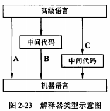

filters:: {"索引" false}
title:: 程序设计语言基础知识/语言处理程序基础/解释程序基本原理
alias:: 解释程序基本原理

- 
- 解释程序不产生源程序的目标程序，这是它和编译程序的主要区别。
	- A：源程序被直接解释执行的处理方式
	- B和C：先将源程序翻译成某种中间代码形式，然后对中间代码进行解释来实现用户程序的运行
	- C：解释程序采用的中间代码更接近于机器语言。在这种实现方案中，高级语言和低级中间代码间存在着1-n的对应关系。PASCAL-P解释系统是这类解释程序的一个实例，它在词法分析、语法分析和语义基础上，先将源程序翻译成P-代码，再由一个非常简单的解释程序来解释执行这种P-代码。这类系统具有比较好的可移植性。
- ## 解释程序的基本结构
	- 解释程序可以分成两部分：第一部分是==分析部分==，包括通常的词法分析、语法分析和语义分析程序，经语义分析后把源程序翻译成中间代码，中间代码常采用**逆波兰表示形式**。
	- 第二部分是==解释部分==，用来对第一部分产生的中间代码进行解释执行。
	- 设用数组MEM模拟计算机的内存，源程序的中间代码和解释部分的各个子程序都存放在数组MEM中。全局变量PC是一个程序计数器，它记录了当前正在执行的中间代码的位置。这种解释部分的常见结构可以由下面两部分组成。
	  （1）PC:=PC+1
	  （2）执行位于opcode-table[MEM[PC]]的子程序（解释子程序执行后返回到前面）。
	- 下面用一个简单例子来说明其工作原理。设两个实型变量A和B进行相加的中间代码是：
	  ```
	  start: Ipush
	             A
	         Ipush
	             B
	         Iaddreal
	  ```
	  其中，中间代码Ipush和Iaddreal实际上都是opcode-table表的索引值（即位移），而该表的单元中存放的值就是对应的解释子程序的起始地址，A和B都是MEM中的索引值。解释部分开始执行时，PC的值为start-1。
	  ```
	  opcode-table[Ipush]=push
	  opcode-table[Iaddreal]=addreal
	  ```
	  解释部分可表示如下：
	  ```
	  interpreter-loop: PC:=PC+1;
	                    goto opcode-table[MEM[PC]];
	              push: PC:=PC+1;
	                    stackreal(MEM[MEM[PC]]);
	                    goto interpreter-loop;
	           addreal: stackreal(popreal()+popreal());
	                    goto interpreter-loop;
	  ...(其余各解释子程序)
	  ```
	  其中，stackreal()表示把相应值压入栈中，而popreal()表示取得栈顶元素值并弹出栈顶元素。上面的代码基于栈实现了将两个数值相加并将结果存入栈中的处理。
- ## 高级语言编译与解释方式的比较
	- ### 效率
		- 编译比解释方式可能取得更高的效率。
		- 在解释方式下运行程序时，解释程序可能需要反复扫描源程序。例如，每一次引用变量都要进行类型检查，甚至需要重新进行存储分配，从而降低了程序的运行速度。在空间上，以解释方式运行程序需要更多的内存，因为系统不但需要为用户程序分配运行空间，而且要为解释程序及其支撑系统分配空间。
		- 在编译方式下，编译程序除了对源程序进行语法和语义分析外，还要生成源程序的目标代码并进行优化，所以这个过程比解释方式需要更多的时间。虽然与仔细写出的机器程序相比，一般由编译程序创建的目标程序运行的时间更长，需要占用的存储空间更多，但源程序只需要被编译程序翻译一次，就可以多次运行。因此总体来讲，编译方式比解释方式可能取得更高的效率。
	- ### 灵活性
		- 当解释器直接运行源程序时，“在运行中”修改程序就成为可能，例如增加语句或者修改错误等。另外，当解释器直接在源程序上工作时，它可以对错误进行更精确地定位。
	- ### 可移植性
		- 解释器一般也是用某种程序设计语言编写的，因此只要对解释器进行重新编译，就可以使解释器运行在不同的环境中。
		- 现有的一些编译系统既提供编译的方式，也提供解释的方式，甚至将两种方式进行结合。例如，在Java虚拟机上发展的一种compiling-just-in-time新技术，就是在代码第一次运行时进行编译，在其后的运行中就不再进行编译了。