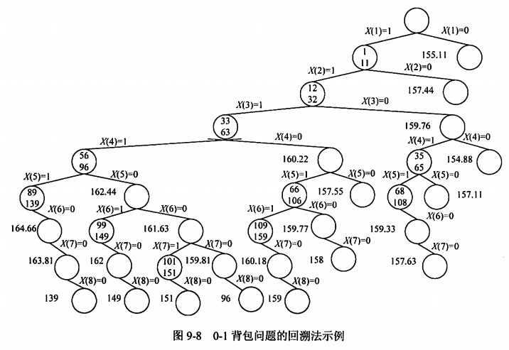

title:: 算法设计与分析/回溯法/回溯法的典型实例
alias:: 回溯法的典型实例

- 【例9.16】0-1背包问题。
	- 0-1背包问题的定义如例9.10所示。
	- 图9-7给出了0-1背包问题的一个解空间树的示例。在该问题中，目标是为了得到最大的价值，因此可以“杀掉”那些不可能产生最大价值的活节点。那么如何判断哪些节点扩展后不可能产生最大价值呢？考虑贪心策略，先对所有物品按其单位重量价值从大到小排序，对搜索空间树中的某个节点如F，已经确定了某些X(i)，1<=i<=k，而其他的X(i)，k+1<=i<=n待定。此时可以将0-1背包问题松弛为背包问题，求从F节点扩展下去，计算能获得的最大价值。若该价值比当前已经得到的某个可行解的值要小，则该节点不必再扩展。
	- 假设所有物品已经按其单位重量价值从大到小排序。假设前k（包含k）个物品是否放入背包已经确定，现在考虑在当前背包的剩余容量下，若是背包问题，那么能获得的最大价值是多少？即求背包中物品的价值上界，伪代码如下所示。
	  ```c
	  BOUND(v,w,k,W)
	    b <- v
	    c <- w
	    for i <- k+1 to n
	      do c <- c+w[i]
	        if c <W
	          then b <- b+v[i]
	          else return (b+(1-(c-W)/w[i])*v[i])
	    return b
	  ```
	  其中v、w、k和W分别表示当前已经获得的价值、背包的重量、已经确定的物品数和背包的总容量。
	- ```c
	  BKNAP1(W,n,w,v,fw,fp,X)
	    cw <- cp <- 0
	    k <- 1
	    fp <- 1
	    while (true)
	      while k <= n and cw+w[k]<= W do
	        cw <= cw+w[k]
	        cp <- cp+v[k]
	        Y[k] <- 1
	        k <- k+1
	      if k > n
	        then fp <- cp
	        			fw <- cw
	        			k <- n
	        			X <- Y
	        else Y(k) <- 0
	      while BOUND(cp,cw,k,W) <= fp do
	        while k != 0 and Y(k) != 1 do
	          k <- k-1
	        if k = 0
	          then return
	        Y[k] <- 0
	        cw <- cw-w[k]
	        cp <- cp-v[k]
	      k <- k+1
	  ```
	  其中，W、n、w、v、fw、fp和X分别表示背包的总容量、物品个数、重量数组、价值数组、获得最大价值时背包的重量、背包获得的最大价值和问题的最优解。
	- 假设n=8，W=110，物品的价值和重量如表9-5所示。
	  {:height 108, :width 608}
	- 则根据上述伪代码得到图9-8所示的搜索空间树。
	  {:height 422, :width 603}
	- 图9-8所示树中的节点内若有数据，则上面表示背包当前的重量，下面表示背包当前的价值；节点内若无数据，则旁边的数据表示在已有的选择下，背包能获得的价值的上界。X(i)=1和X(i)=0分别表示第i个物品放入和不放入背包中。浅灰色节点表示对应可行解的值，如存在5个可行解，基偷走一分别为139，149，151，96，159，对应的解分别为X1=(1,1,1,1,1,0,0,0)，X2=(1,1,1,1,0,1,0,0)，X3=(1,1,1,1,0,0,1,0)，X4=(1,1,1,1,0,0,0,0)，X5=(1,1,1,0,1,1,0,0)。其中X5为最优解，其值为159。
- 【例9.17】n-皇后问题：
	- 这是来源于国际象棋的一个问题。n后问题要求在一个nxn格的棋盘上放置n个乒乓，使得它们彼此不受攻击。按照国际象棋的规则，一个皇后可以攻击与之处在同一行或同一列或同一条斜线上的其他任何棋子。因此，n后问题等价于要求在一个nxn格的棋盘上放置n个皇后，使得任何两个皇后不能被放在同一行或同一列或同一条斜线上。
	- 求解过程从空棋盘开始，设在第1行至第m行都已经正确放置了m个皇后的基础上，再在第m+1行上找合适的位置放第m+1个皇后。直至在第n行也找到合适的位置放置第n个皇后时，就找到了一个解。接着改变第n行上皇后的位置，希望获得下一个解。另外，在任一行上有n种可选的位置。开始时，位置在第1列，以后改变时，顺次选择第2列、第3列、…、第n列。当第n列也不是一个合理的位置时，就要回溯，去改变前一行的位置。图9-9给出了回溯法求解4皇后问题的搜索过程。
	  {:height 288, :width 649}
	- n皇后问题的限界函数可以根据问题的定义直接设计，即任意两个皇后不在同行、同列和同一斜线上，伪代码如下。
	  ```c
	  Place(k)
	    i <- 1
	    while i < k do
	      if X[i] = X[k] or abs(X[i]-X[k]) = abs(i-k)
	        then return false
	      i <- i+1
	    return true
	  ```
	- 用回溯法得到皇后问题的伪代码如下：
	  ```c
	  NQueens(n)
	    X[1] <- 0
	    k <- 1
	    while k >0 do
	      X[k] <- X[k]+1
	      while X[k] <= n and not Place(k) do
	        X[k] <- X[k]+1
	      if X[k] <= n
	        then if k = n
	          then output X
	          else k <- k+1
	            X[k] <- 0
	        else k <- k-1
	  ```