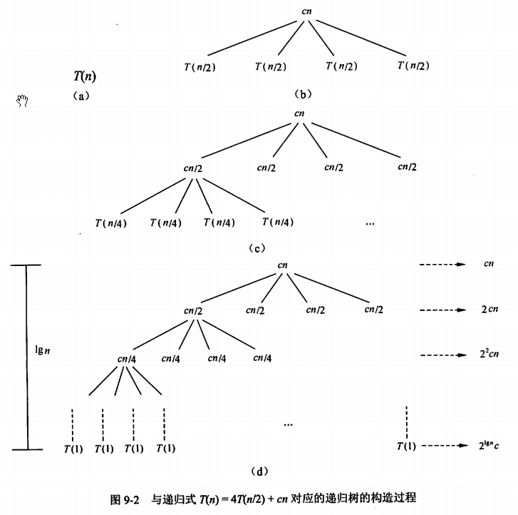

title:: 算法设计与分析/算法分析基础/递归式
alias:: 递归式

- 从算法的结构上看，算法可以分为非递归形式和递归形式。非递归算法的时间复杂度分析较简单，本节主要讨论递归算法的时间复杂度分析方法。
- ## 展开法
	- 将递归式中等式右边的项根据递归式进行替换，称为==展开==。展开后的项被再次展开，如此下去，直到得到一个求和表达式，得到结果。
	- 【例9.2】求 
	  $$
	  T(n)=\begin{cases}
	  1 & n = 1 \\
	  T(n-1)+n & n > 1
	  \end{cases}
	  $$
	  的解。
	- 解：
	  $$
	  \begin{align}
	  T(n) & = T(n-1) +n \\
	  & = T(n-2) + (n-1) +n \\
	  & \vdots \\
	  & = 1+ 2 + \cdots + (n-1) +n \\
	  & = n(n+1)/2 \\
	  & = O(n^{2})
	  \end{align}
	  $$
- ## 代换法
	- 这一名称来源于当归纳假设用较小值时，用所猜测的值代替函数的解。在用代换法解递归式时需要3个步骤：
		- > 1. 猜测解的形式；
		  > 2. 用数学归纳法证明猜测的正确性；
		  > 3. 求出使解真正有效的常数。
	- 【例9.3】确定 
	  $$
	  T(n) = \begin{cases}
	  1 & n = 1 \\
	  2T(n/2) + n & n > 1
	  \end{cases}
	  $$
	  的上界。
	- 解：(1)猜测其解为\( T(n)=O(n\lg n) \)。目标是要证明\( T(n) \le c n\lg n \)，其中c>0为常数。
	  (2)先假设这个界对n/2成立，即 \( T(n/2)<=c n \lg(n/2)/2 \)。
	  (3)对递归式做替换，得到 
	  $$
	  \begin{align}
	  T(n) & \le 2c n \lg(n/2)/2+n \\
	          & =c n \lg n - c n+n \\
	           & \le c n \lg n(c \ge 1)
	  \end{align}
	  $$
	- 尽管代换法提供了一种证明递归式解的正确性的简单方法，但并不存在通用的方法来猜测递归式的正确解，这种猜测需要经验，有时甚至是创造性的。因为往往很难得到“好”的猜测，因此这种方法较难用。
- ## 递归树法
	- 递归树法弥补了代换法猜测困难的缺点，它适于提供“好”的猜测，然后用代换法证明。在递归树中，每一个结点都代表递归函数调用集合中一个子问题的代价。将树中每一层内结点的代价相加得到一个每层代价的集合，再将每层的代价相加得到递归式所有层次的总代价。当用递归式表示分治算法的时间复杂度时，递归树方法尤其有用。
	- 【例9.4】确定
	  $$
	  T(n) = \begin{cases}
	  c & ,n = 1 \\
	  4T(n/2) + cn &, n>1
	  \end{cases}
	  $$
	  的紧致界。
	- 解：用递归树法求解，图9-2(a)、图9-2(b)、图9-2(c)和图9-2(d)给出了递归树的构造过程。
	  {:height 602, :width 599}
	- 将递归树每一层代价相加就可以得到递归式的解，如下式所示。
	  $$
	  \begin{align}
	  T(n) & = (1+2+2^2+ \cdots +2^{\lg n -1})cn + \theta(n^2) \\
	  & = (2^{\lg n} -1)cn + \theta(n^2) \\
	  & = \theta(n^2)
	  \end{align}
	  $$
- ## 主方法
	- 主方法也称为主定理，给出了求解如下形式的递归式的快速方法。
	  $$
	  T(n) = aT(n/b)+f(n)
	  $$
	  其中，a>=1和b>1是常数，f(n)是一个渐进的正函数。
	- 【定理9.1】（主定理）设a>=1和b>1为常数，f(n)为函数，T(n)为定义在非负整数上的递归式，T(n)=aT(n/b)+f(n)，其中n/b指 \( \lfloor n/b \rfloor \) 或 \( \lceil n/b \rceil \)，那么T(n)可能有如下的渐进紧致界。
		- > 1. 若对于某常数\epsilon > 0，有 \( f(n)=O(n^{\log_{b} a - \epsilon}) \)，则 \( T(n) = \Theta(n^{\log_{b} a}) \)
		  > 2. 若 $$f(n)=\Theta(n^{\log_{b} a} \lg^{k}n)$$，则 $$T(n)=\Theta(n^{\log_{b} a} \lg^{k+1} n)$$
		  > 3. 若对于某常数 $$\epsilon > 0$$，有$$f(n) = \Omega(n^{\log_{b} a + \epsilon})$$，且对常数 c<1与所有足够大的n，有af(b/n) <= cf(n)，则 $$T(n)=\Theta(f(n))$$。
	- 【例9.5】 用主方法求解下列递归式。
		- (1) \( T(n) = 9T(n/3) +n  \)
		  解：a = 9, b = 3, f(n) = n
		  \( \log_{b} a = 2，f(n) = O(n^{\log_{b} a - \epsilon}) \)，其中\epsilon = 1，属于情况(1), 
		  因此有 \( T(n) = \Theta(n^{\log_{b} a}) = \Theta(n^{2}) \)
		- (2) \( T(n) = T(2n/3) + 1 \)
		  解：a = 1, b = 3/2, f(n) = 1
		  \( \log_{b} a = 0，f(n) = \Theta(n^{\log_{b} a} lg^{k} n) \)，其中k=0，属于情况(2)，
		  因此有 \( T(n) = \Theta(n^{\log_{b} a} \lg^{k+1} n) = \Theta(\lg n) \)
		- (3) \( T(n) = 3T(n/4) + n\lg n \)
		  解：a = 3, b = 4, f(n) = n\lg n
		  \( \log_{b} a \approx 0.793，f(n) = \Omega(n^{\log_{b} a + \epsilon}) \)，其中\( \epsilon \approx 0.2 \)，属于情况(3)，
		  因此有 \( T(n) = \Theta(f(n)) = \Theta(n\lg n) \)。