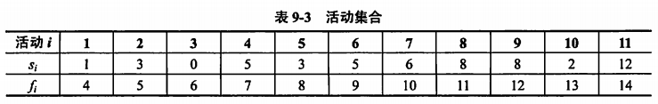
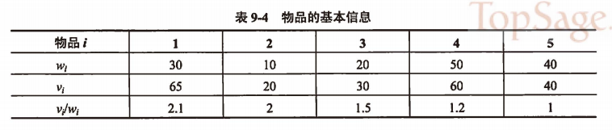

title:: 算法设计与分析/贪心法/贪心法的典型实例
alias:: 贪心法的典型实例

- ## 【例9.13】活动选择问题
	- 活动选择问题是指若干个具有竞争性的活动要求互斥使用某一公共资源时，如何选择最大的相容活动集合。假设有一个需要使用某一资源（如教室等）的n个活动组成的集合S={a1,a2,…,an}。该资源一次只能被一个资源占用。每个活动ai有个开始时间si和结束时间fi，且0<=si<=fi<\infty。一旦被选择后，活动ai就占据半开时间区间[si,fi]。如果两个活动ai和aj的时间区间互不重叠，则称活动ai和aj是兼容的。活动选择问题就是要选择出一个由互相兼容的活动组成的最大子集合。考虑表9-3中的活动集合，其中各活动已经按结束时间的单调递增顺序进行了排序。从表中可以看到，子集{a3,a9,a11}由相互兼容的活动组成。然而，它不是最大的子集，子集{a1,a4,a8,a11}更大。事实上，{a1,a4,a8,a11}是一个最大的相互兼容活动子集。另外，还有一个最大子集是{a2,a4,a9,a11}。
	  
	- 经分析，该问题具有最优子结构，可以用动态规划法求解。但同时该问题还具有贪心选择性质，因此可以用贪心法更简单地求解。
	- 定义集合 $$S_{ij} = \{a_{k} \in S: f_{i} \le s_{k} \lt f_{k} \le s_{j} \}$$ 。为了完整地表示问题，加入两个虚拟活动a0和an+1，其中f0=0，sn+1=\infty，这样S=S0,n+1。
	- 【定理9.3】对于任意非空子问题Sij，设am是Sij中具有最早结束时间的活动。那么，
		- > 1. 活动am在Sij的某个最大兼容活动子集中。
		  > 2. 子问题Sim为空，所以选择am将使Smj为唯一可能非空的子问题。
		   （证明略）
	- 假设对n个活动按其结束时间单调递增进行了排序，排序的时间复杂度为O(n\lg n)。下面给出解决活动选择问题的贪心算法的递归形式和迭代形式。
	- 递归贪心算法：
	  ```c
	  RecursiveActivitySelector(s,f,i,n)
	    m <- i+1
	    while m<=n and sm<fi
	      do m <- m+1
	    if m<=n
	      then return {am} \union RecursiveActivitySelector(s,f,m,n)
	      else return \Phy
	  ```
	  迭代贪心算法：
	  ```c
	  GreedyActivitySelector(s,f)
	    n <- length(s)
	    A <- {a1}
	  	i <- 1
	    for m <- 2 to n
	      do if sm >= fi
	        then A <- A \Union {am}
	  				i <- m
	    return A
	  ```
	  这两个版本都能在O(n)的时间复杂度内完成。
- ## 【例 9.14】背包问题
	- 背包问题的定义与0-1背包问题类似，但是每个物品可以部分装入背包，即在0-1背包问题中，xi=0或者xi=1；而在背包问题中，0<=xi<=1。
	- 为了更好地分析该问题，考虑一个例子：n=5，W=100，表9-4给出了各个物品的重量、价值和单位重量的价值。假设物品已经按其单位重量的价值从大到小排好序。
	- 
	- 为了得到最优解，必须把背包放满。现在用贪心策略求解，首先要选出度量的标准。
	- ==按最大价值先放背包的原则==
		- 此时，先放物品1和4，获得价值65+60=125，背包还剩容量100-30-50=20，此时物品5是价值最大的，但其重量为40，不能全部放入背包。而且一般将物品2和3放入背包比把物品5的一半放入背包能获得更大的价值。因此把物品2放入背包，得到价值125+20=145，剩余容量20-10=10。此时可再放入物品3的1/3，得到总价值145+1.5x10=160，对应的解为{1,1,1/3,1,0}。
	- ==按最小重量先放背包的原则==
		- 此时，将物品2,3,1和5放入背包中，风景好装满，得到价值20+30+65+40=155，对应的解为{1,1,1,0,1}。
	- ==按最大单位重量价值先放背包的原则==
		- 此时，将物品1,2和3放入背包中，得到价值65+20+30=115，剩余容量100–30-10-20=40。此时可再放入物品4的4/5，得到总价值115+4/5x60=163，对应的解为{1,1,1,4/5,0}。可以证明，该解为问题的最优解。
		- 假设对n个物品按其单位重量价值从大到小进行了排序，排序的时间复杂度为O(nlg n)。下面给出用贪心法解决背包问题的伪代码。
		  ```c
		  GreedyKnapsack(v,w,W,x,n)
		    x <- 0
		    c <- W
		    for i <- 1 to n
		      do if w[i] <= c
		        then x[i] <- 1
		        			c <- c-w[i]
		    if i <= n
		      then x[i] <- c/w[i]
		    return x
		  ```
- 【例 9.15】 多机调度问题。
	- 假设有n个独立的作业{1,2,…,n}，由m台相同的机器{M1,M2,…,Mm}进行加工处理，作业i所需的处理时间为ti，每个作业均可在任意一台机器上加工处理，但不可间断或拆分，即一旦一个作业在某台机器上加工处理，便不会再转移到其他的机器上。多机调度问题要求给出一种作业调度方案，使所给的n个作业在尽可能短的时间内由m台机器加工处理完成。
	- 多机调度问题是NP难问题，到目前还没有有效的算法。对于这类问题，用贪心算法求解有时可以得到较好的近似解。贪心法求解多机调度问题时的贪心策略是最长处理时间优先。当m>=n时，只要将机器i上的[0,ti]时间区间分配给作业i即可；当m<n时，首先将n个作业按其所需的处理时间从大到小排序，然后依此顺序将作业分配给空闲的机器。例如，假设有7个作业{1,2,3,4,5,6,7}，由3台机器{M1,M2,M3}加工处理，各个作业所需要的时间分别为{2，14，4，16，6，5，3}。首先将这7个作业按其处理时间从大到小排序，则作业{4,2,5,6,3,7,1}的处理时间为{16,14,6,5,4,3,2}。图9-6给出了按最长处理时间作业有限的原则时，这7个作业的调度情况及其所需要的总加工处理时间。
	  
	- 假设对n个作业按其加工处理时间从大到小进行了排序，排序的时间复杂度为O(nlg n)。下面给出用贪心法解决多机调度问题的伪代码。
	  ```c
	  MultiMachineSchedule(T)
	    for i <- 1 to m
	      d[m] <- 0
	    for i <- 1 to m
	      S[i] <- {i}
	  		d[i] <- T[i]
	    for i <- m+1 to n
	      j <- 数组d中最小值元素对应的下标
	      S[j] <- S[j] Union {i}
	  		d[j] <- d[j] + T[i]
	    return S
	  ```
	  其中T、d和S分别表示n个作业的处理时间数组、m台机器的空闲时间数组、m台机器所处理的作业列表数组。