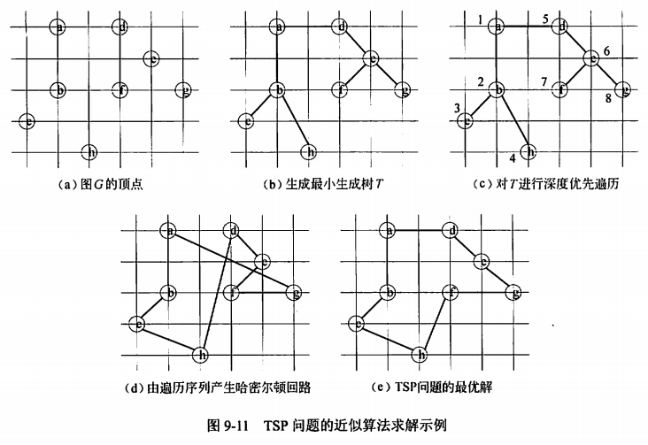

title:: 算法设计与分析/近似算法
alias:: 近似算法

- 迄今为止，所有的难解问题都没有多项式时间算法，采用回溯法和分支限界法等算法设计技术可以相对有效地解决这类问题。然而，这些算法的时间性能常常是无法保证的。近似算法是解决难解问题的一种有效策略，其基本思想是放弃求最优解，而用近似最优解代替最优解，以换取算法设计上的简化和时间复杂度的降低。近似算法是这样一个过程：虽然它可能找不到一个最优解，但它总会给待求解的问题提供一个解。为了具有实用性，近似算法必须能够给出算法所产生的解与最优解之间的差别或者比例的一个界限，它保证任意一个实例的近似最优解与最优解之间相差的程度。显然，这个差别越小，近似算法越具有实用性。
- 衡量近似算法性能最重要的标准有如下两个。
	- > 1. 算法的时间复杂度。近似算法的时间复杂度必须是多项式阶的，这是近似算法的基本目标。
	  > 2. 解的近似程度。近似最优解的近似程度也是设计近似算法的重要目标。近似程度与近似算法本身、问题规模，乃至不同的输入实例有关。
- 下面通过几个实例来说明近似算法的应用。
- 【例9.18】顶点覆盖问题
  collapsed:: true
	- 无向图G=(V,E)的顶点覆盖是顶点集V的一个子集V’，V’ 包含于 V，使得若(u,v)是G的一条边，则 u \in V’或者 v \in V’。顶点覆盖V’的大小是它所包含的顶点个数|V’|。顶点覆盖问题是求出图G中的最小顶点覆盖，即含有顶点数最少的顶点覆盖。
	- 顶点覆盖问题是一个NP难问题，因此，没有一个多项式时间算法有效的求解。虽然要找到图G的一个最小顶点覆盖是很困难的，但要找到图G的一个近似最小覆盖却很容易。可以采用如下策略：初始时边集E’=E，顶点集V’={}，每次从边集E’中任取一条边(u,v)，把顶点u和v加入到顶点集V’中，再把与u和v顶点相邻接的所有边从边集E’中删除，直到边集E’为空。显然，最后得到的顶点集V’是无向图的一个顶点覆盖，由于每次把尽量多的相邻边从边集E’中删除，可以期望V’中的顶点数尽量少，但不能保证V’中的顶点数最少。图9-10给出了一个顶点覆盖问题的近似算法求解过程。
	  {:height 397, :width 625}
- 【例9.19】TSP问题。
  collapsed:: true
	- TSP问题是指旅行家要旅行n个城市，要求各个城市经历且仅经历一次，然后回到出发城市，并要求所走的路最短。
	- TSP问题是著名的NP完全问题，并不存在有效的多项式时间算法，但是可以设计一个近似算法求解。其过程如下：首先采用Prim算法生成图的最小生成树T，如图9-11(b)所示，图中粗线表示最小生成树中的边。然后对T进行深度优先遍历，经过的路线为a->b->c->b->h->b->a->d->e->f->e->g->e->d->a，得到遍历路线为L=(a,b,c,h,d,e,f,g)。由序列L得到哈密尔顿回响，即近似最优解，如图9-11(d)所示，其路径长度约为19.074。图9-11(e)所示是图9-11(a)的最优解，其路径长度约为16.084。
	  {:height 414, :width 600}
- 【例9.20】子集和数问题。
  collapsed:: true
	- 令S={s1,s2,…,sn}是一个正整数的集合，子集和数问题要求在这个正整数集合中，找出其和不超过正整数C的最大和数的子集。
	- 考虑用蛮力法求解子集和数问题，为了求得集合S的所有子集和，先将所有子集和的集合初始化为L0={0}，然后求得子集和中包含s1的情况，即L0中的每一个元素加上s1，用L0+s1表示对集合L0中的每个元素加上s1后得到的新集合，则所有子集和的集合为L1=L0+(L0+s1)={0,s1}；再求得子集和中包含s2的情况，即L1中的每一个元素加上s2，所有子集和的集合为L2=L1+(L1+s2)={0,s1,s2,s1+s2}。依此类推，一般情况下，为求得子集和中包含si(1<=i<=n)的情况，即Li-1的每个元素加上si，所有子集和的集合为Li=Li-1+(Li-1+si)。因为子集和要求不超过正整数C，所以每次合并后都要在Li中删除所有大于C的元素。例如，若S={104,102,201,101}，C=308，利用上述算法求解子集和数问题的过程如图9-12所示。
	  {:height 220, :width 594}
	- 上述算法具有指数时间复杂度，因此也是非常难的问题。现基于上述思想，用近似算法求解，其基本思想是在迭代过程中，对Li进行适当的修整，使得在子集和不超过一定误差的前提下，尽可能减少Li中的元素个数，从而获得算法时间性能的提高。具体方法是：用一个修整参数 \delta(0 < \delta < 1)，从集合Li中删去尽可能多的元素得到Lli，使得每一个从Li删除的元素y，在集合Lli中都有一个修整后的元素z满足(1-\delta)*y <= z <= y，可以将z看作是被删去元素y在修整后的集合Lli中的代表。例如，若S={104,102,201,101}，C=308，\delta=0.05，利用上述算法求解子集和数问题的过程如图9-13所示。
	  {:height 314, :width 588}