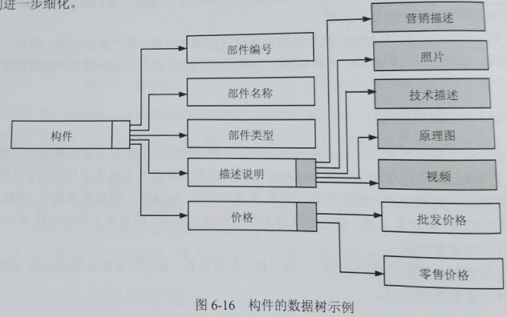

alias:: WebApp需求模型

- WebApp分析与传统的软件需求分析有所不同。虽然传统的软件需求分析的概念和原则全部可以应用于Web工程的分析活动，但WebApp分析的内容及参考的元素还是呈现出了其特殊性。并针对其特点，出现如面向数据的基于ER发展而来的WebML、模型对象基于UML的UWE等建模方法。严格意义上讲，这些方法并非均为结构化方法，但是为了集中描述WebApp的建模，将其归在本章介绍。
- 建模以需求工程中确定的用户类别、可用目标、使用场景、业务环节等各类需求等为输入，产生如下5种主要的模型类型。
- ## 内容模型
  collapsed:: true
	- 内容模型给出由WebApp提供的全部系列内容，包括文字、图形、图像、音频和视频。内容模型包含结构元素，它们为WebApp的内容需求提供了一个重要的视图。这些结构元素包含内容对象和所有分析类，在用户与WebApp交互时生成并操作用户可见的实体。
	- 内容的开发可能发生在WebApp实现之前、WebApp构建之中，或者WebApp投入运行以后的很长一段时间里。在每种情况下，它都通过导航链接合并到WebApp的总体结构中。内容对象可能是产品的文本描述、描述新闻事件的一篇文章、拍摄的一张动作照片、在一次论坛讨论中某个用户的回答、一个演讲的简短视频等。这些内容对象可能存储分布于分享的文件中，直接嵌入Web页中，或从数据库中动态获得。换句话说，内容对象是呈现给最终用户具有汇聚信息的所有条目。
	- 通过检查直接或间接引用内容的场景描述，可以根据用例直接确定出内容对象。内容模型必须具备描述内容对象构件的能力。在许多实例中，用一个简单的内容对象列表，并给出每个对象的简短描述就足以定义和实现所必需的内容需求。但是在某些情况下，内容模型可以从更丰富的分析中获得好处，即在内容对象之间的关系和WebApp维护的内容层次中采用图形表示其关系。
	- 图6-16中的==数据树==表述了常用于描述某个构件的一种信息层次，不带阴影的长方形表示简单或复合数据项（一个或多个数据值），带阴影的长方形表示内容对象。在此图中，“描述说明”是由5个内容对象定义的。在某些情况下，随着数据数的扩展，其中的一个或多个对象将会得到进一步细化。
	- {:height 301, :width 470}
	- 由多项内容对象和数据项组成的任何内容都可以生成数据树。开发数据树尽力在内容对象中定义层级关系，并提供一种审核内容的方法，以便在开始设计前发现遗漏和不一致的内容。另外，数据树可以作为内容设计的基础。
- ## 交互模型
  collapsed:: true
	- 交互模型描述了用户与WebApp采用了哪种交互方式，绝大多数WebApp都能使最终用户与应用系统的功能、内容及行为之间进行“会话”。交互模型由一种或多种元素构成，包括用例、顺序图、状态图、用户界面原型等。
	- **用例**是交互分析的主要工具，方便客户理解系统的功能。在许多实例中，一套用例足以描述在分析阶段的所有交互活动。然而，当遇到复杂的交互顺序并包含多个分析类或多任务时，有时更值得采用严格图解方式描述它们。
	- **顺序图**是交互分析中描述用户与系统进行交互的方式。通过顺序图，能显示用户按照一定的顺序使用系统，以完成相应的功能。
	- **状态图**是交互分析中对系统进行动态的描述。
	- **用户界面原型**展现用户界面布局、内容、主要导航链接、实施的交互机制及用户WebApp的整体美观度。尽管用户界面原型的设计可以说是一个设计活动，但最好在创建分析模型时就实施它。对用户界面的物理表示评估的越早，越有可能满足最终用户的需求。
- ## 功能模型
  collapsed:: true
	- 许多WebApp提供大量的计算和操作功能，这些功能与内容直接相关（既能使用又能生成内容）。这些功能常常以用户——WebApp的交互活动为主要目标，正是由于这个原因必须对功能需求进行分析，并且当需要时也可以用于建模过程。
	- 功能模型定义了将用于WebApp内容并描述其他处理功能的操作，这些处理功能不依赖于内容却是最终用户所必需的。功能模型描述WebApp的两个处理元素，每个处理元素代表抽象过程的不同层次：
	  1. 用户可观察到的功能是由WebApp传递给最终用户的；
	  2. 分析类中的操作实现与类相关的行为。
	- 用户可观察到的功能包括直接由用户启动的任何处理功能。这些功能实际上可能使用分析类中的操作完成，但是从最终用户的角度看，这些功能是可见的结果。
	- 在抽象过程的更低层次，分析模型描述了由分析类操作执行的处理，这些操作可以操纵类的属性，并参与类之间的协作来完成所需要的行为。不管抽象过程的层次如何，UML的活动图可以用来表示处理细节。在分析阶段，仅在功能相对复杂的地方才会使用活动图。许多WebApp的复杂性不是出现在提供的功能中，而是与可访问信息的性质以及操作的方式相关。
- ## 导航模型
  collapsed:: true
	- 导航模型为WebApp定义所有导航策略。导航模型考虑了每一类用户如何从一个WebApp元素（例如内容对象）导航到另一个元素。把导航机制定义为设计的一部分，在这个阶段，分析人员应该关注于总体的导航需求，应考虑以下问题。
	- > 1. 某些元素比其他元素更容易达到吗（即需要更少的导航步骤）？表示的优先级是什么？
	  2. 为了促使用户以他们自己的方向导航，应该强调某些元素吗？
	  3. 应该怎样处理导航错误？
	  4. 导航到关键元素组的优先级应该高于导航到某个特定元素的优先级吗？
	  5. 应该通过链接方式、基于搜索的访问方式还是其他方式来实现导航？
	  6. 根据前面的导航行为，某些确定的元素应该展现给用户吗？
	  7. 应该为用户维护导航日志吗？
	  8. 在用户交互的每一点处，一个完整的导航地图或菜单都可用吗？
	  9. 导航设计应该由大多数普遍期望的用户行为来驱动，还是由已定义的WebApp元素可感知的重要性来驱动？
	  10. 为了促进将来使用快捷方式，一个用户能否“存储”他以前对WebApp的导航？
	  11. 应该为哪类用户设计最佳导航？
	  12. 应该如何处理WebApp外部的链接？应该覆盖现有的浏览器窗口吗？能否作为一个新的浏览器窗口，还是作为一个单独的框架？
	- 提出并回答这些问题及其他一些问题是导航分析的一部分工作。
- ## 配置模型
	- 配置模型描述WebApp所在的环境和基础设施。
	- 在某些情况下，配置模型只不过是服务器端和客户端的属性列表。但是对于更复杂的WebApp来说，多种配置的复杂性（例如，多服务器之间的负载分配、高速缓存的体系结构、远程数据库、同一网页上服务于不同对象的多个服务器）可能对分析和设计产生影响。在必须考虑复杂配置体系结构的情况下，可以使用UML部署图。