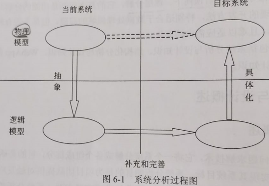

title:: 结构化开发方法/系统分析与设计概述/系统分析概述
alias:: 系统分析概述

- 系统分析是一种问题求解技术，它将一个系统分解成各个组成部分，目的是研究各个部分如何工作、交互，以实现其系统目标。系统分析的目的是为项目团队提供对触发项目的问题和需求的的更全面的理解，因此强调业务问题方面，而非技术或实现方面。系统分析阶段要求和系统用户一起工作，以便清楚地定义新系统的业务需求和预期。
- ## 系统分析的目的和任务
	- 系统分析的主要任务是对现行系统进一步详细调查，将调查中所得到的文档资料集中，对组织内部整体管理状况和信息处理过程进行分析，为系统开发提供所需的资料，并提交系统方案说明书。系统分析侧重于==从业务全过程的角度==进行分析，主要内容有业务和数据的流程是否通畅、是否合理；数据、业务过程和组织管理之间的关系；原系统管理模式改革和新系统管理方法的实现是否具有可行性等。
	- 确定的分析结果包括==开发者==对于现有组织管理状况的了解，==用户==对信息系统功能的需求，数据和业务流程，管理功能和管理数据指标体系以及新系统拟改动和新增的管理模型等。
	- 最后，提出信息系统的各种设想和方案，并对所有的设想和方案进行分析、研究、比较、判断和选择，获得一个最优的新系统的逻辑模型，并在用户理解计算机系统的工作流程和处理方式的情况下，将它明确地表达成书面资料——系统分析报告，即系统方案说明书。
- ## 系统分析的主要步骤
	- 企业信息系统是一个具有业务复杂性和技术复杂性的大系统，为的是目标系统既能实现当前系统的基本职能，又能改进和提高。系统开发人员首先必须理解并描述出已经实际存在的当前系统，然后进行改进，从而创造出基于当前系统又高于当前系统的目标系统，即新系统。
	- 系统分析过程一般按如图6-1所示的逻辑进行。
		- {:height 265, :width 372}
		- > 1. 认识、理解当前的现实环境，获得当前系统的“物理模型”
		  > 2. 从当前系统的“物理模型”抽象出当前系统的“逻辑模型”。
		  > 3. 对当前系统的“逻辑模型”进行分析和优化，建立目标系统的“逻辑模型”。
		  > 4. 对目标系统的逻辑模型具体化（物理化），建立目标系统的物理模型。
	- 系统开发的目的是把现有系统的物理模型转化为目标系统的物理模型，即图6-1中双虚线所描述的路径，而系统分析阶段的结果是得到目标系统的逻辑模型。逻辑模型反映了系统的功能和性质，而物理模型反映的是系统的某一种具体实现方案。
	- 按照图6-1，可将系统分析阶段的主要工作分为以下几步。
		- > 1. 对当前系统进行详细调查，收集数据。
		  > 2. 建立当前系统的逻辑模型。
		  > 3. 对现状进行分析，提出改进意见和新系统应达到的目标。
		  > 4. 建立新系统的逻辑模型
		  > 5. 编写系统方案说明书