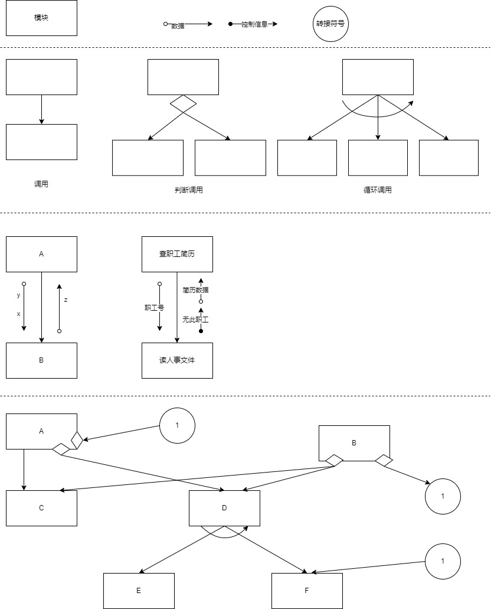

title:: 结构化开发方法/系统分析与设计概述/系统总体结构设计
alias:: 系统总体结构设计

- 系统总体结构设计是要根据系统分析的要求和组织的实际情况对新系统的总体结构形式和可利用的资源进行大致设计，这是一种宏观、总体上的设计和规划。下面介绍系统总体设计的主要内容。
- ## 系统结构设计原则
	- > 1. **分解-协调原则**。整个系统是一个整体，具有整体目的和功能，但这些目的和功能的实现又是由相互联系的各个组成部分共同工作的结果。解决复杂问题的一个很重要的原则就是把它分解成多个小问题分别处理，在处理过程中根据系统总体要求协调各部门的关系。
	  > 2. **自顶向下原则**。首先抓住系统总的功能目的，然后逐层分解，即先确定上层模块的功能，再确定下层模块的功能。
	  > 3. **信息隐蔽、抽象的原则**。上层模块只规定下层模块做什么和所属模块与模块之间层次分明，易于理解、实施和维护。
	  > 4. **一致性原则**。要保证整个软件设计过程中具有统一的规范、统一的标准和统一的文件模式等。
	  > 5. **明确性原则**。每个模块必须功能明确、接口明确，消除多重功能和无用接口。
	  > 6. 模块之间的耦合尽可能小，模块的内聚度尽可能高。
	  > 7. **模块的扇入系统和扇出系数要合理**。一个模块直接调用其他模块的个数称为模块的**扇出**系统；反之，一个模块被其他模块调用时，直接调用它的模块个数称为模块的**扇入**系统。模块的扇入、扇出系统必须适当。经验表明，一个设计得好的系统的平均扇入、扇出系数通常是3或4，一般不应该超过7，否则会引起出错概率的增大。但菜单调用型模块的扇入与扇出系数可以大一些，公用模块的扇入系数可以大一些。
	  > 8. **模块的规模适当**。过大的模块常常使系统分解得不充分，其内部可能包含了若干部分的功能，因此有必要进一步把原有的模块分解成若干功能尽可能单一的模块。但分解也必须适度，因此过小的模块有可能降低模块的独立性，造成系统接口的复杂性。
- ## 子系统划分
	- ### 子系统划分的原则
		- **子系统要具有相对独立性**。子系统的划分，必须使得子系统的内部功能、信息等各方面的凝聚性较好。子系统独立可以减少子系统间的相互影响，有利于多人分工开发不同的模块，从而提高软件产品的生产率，保证软件产品的质量，同时也增强了系统的可维护性和适应性。
		- **子系统之间数据的依赖性尽量小**。子系统之间的联系要尽量减少，接口要简单明确。一个内部联系强的子系统对外部的联系必然很少，所以在划分的时候，应将联系较多者列入子系统内部，而剩余的一些分散、跨度比较大的联系，就成为这些子系统间的联系和接口。这样划分的子系统，将来调试、维护和运行都是非常方便的。
		- **子系统划分的结果应使数据冗余较小**。如果把相关的功能数据分布到各个不同的子系统中，则会有大量的原始数据需要调用，大量的蹭结果需要保存和传递，大量的计算工作将要重复进行，从而使得程序结构紊乱，数据冗余，不仅给编码带来很大的困难，而且系统的工作效率也大降低。
		- **子系统的设置应考虑今后管理发展的需要**。子系统的设置仅依靠上述系统分析的结构是不够的，因为现存的系统由于各种原因，很可能没有考虑到一些高层次管理决策的要求。
		- **子系统的划分应便于系统分阶段实现**。信息系统的开发是一项较大的工程，它的实现一般要分批进行，所以子系统的划分应能适应这种分期分批的实施。另外，子系统的划分还必须兼顾组织结构的要求。
		- **子系统的划分应考虑到各类资源的充分利用**。一个适当的子系统划分应该既考虑有利于各种设备资源在开发过程中的搭配使用，又考虑到各类信息资源的合理分布和充分使用，以减少系统对网络资源的过分依赖，减少输入、输出和通信等设备压力。
	- ### 子系统结构设计
		- > 1. 每个子系统如何划分成多个模块？
		  > 2. 如何确定子系统之间、模块之间传送的数据及其调用关系？
		  > 3. 如何评价并改进模块结构的质量？
		  > 4. 如何从数据流图导出模块结构图？
- ## 系统模块结构设计
	- ### 模块的概念
		- 模块是组成系统的基本单位，它的特点是可以组合、分解和更换。系统中的任何一个处理功能都可以看成是一个模块。根据功能具体化程度的不同，模块可以分为逻辑模块和物理模块。在系统逻辑模型中定义的处理功能可视为逻辑模块。物理模块是逻辑模块的具体化，可以是一个计算机程序、子程序或若干条程序语句，也可以是人工过程的某项具体工作。
		- ==输入和输出==。模块的输入来源和输出动向都是同一个调用者，即一个模块从调用者那里取得输入，进行加工后再把输出返回给调用者。
		- ==处理功能==。指模块把输入转换成输出所做的工作。
		- ==内部数据==。指仅供该模块本身引用的数据。
		- ==程序代码。==指用来实现模块功能的程序。
		- 前两个要素是模块外部特性，反映了模块的外貌。后两个要素是模块的内部特性。在结构化设计中，主要考虑的是模块的外部特性，对其内部特性只做必要了解，具体的实现将在系统实施阶段完成。
	- ### 模块结构图
		- 结构设计应遵循以下原则：
		  > 1. 所划分的模块其内部的凝聚性要强，模块之间的联系要少，即模块具有较强的独立性。
		  > 2. 模块之间的连接只能存在上下级之间的调用关系，不能有同级之间的横向联系。
		  > 3. 整个系统呈树状结构，不允许网状结构或交叉调用关系出现。
		  > 4. 所有模块（包括后继IPO图）都必须严格地分类编码并建立归档文件。
		- 模块结构图主要关心的是模块的外部属性，即上下级模块、同级模块之间的数据传递和调用关系，并不关心模块的内部。
		- **模块结构图**是结构化设计中描述系统结构的图形工具。作为一种文档，它必须严格地定义模块的名字、功能和接口，同时还应当在模块结构图上反映出结构化设计的思想。模块结构图由模块、调用、数据、控制信息和转接符号5种基本符号组成。
			- **模块**：这里所说的模块通常是指用一个名字就可以调用的一段程序语句。在长方形中间标上能反映模块处理功能的模块名字。
			- **调用**：箭头总是由调用模块指向被调用模块，但是应该理解被调用模块执行后又返回到调用模块。如果一个模块是否调用一个从属模块，取决于调用模块内部的判断条件，则该调用模块间的判断调用采用菱形符号表示。如果一个模块通过其内部的循环功能来循环调用一个或多个从属模块，则该调用称为循环调用，用弧形箭头表示。
			- **数据**：当一个模块调用另一个模块时，调用模块可以把数据传送到被调用模块供处理，而被调用模块又可以将处理的结构送回到调用模块。在模块之间传送的数据，使用与调用箭头平行的带空心圆的箭头表示，并在旁边标上数据名。
			- **控制信息**：在模块间有时必须传送某些控制信息。例如，数据输入完成后给出的结束标志，文件读到末尾时所产生的文件结束标志等。控制信息与数据的主要区别是前者只反映数据的某种状态，不必进行处理。“无此职工”就是用来表示送来的职工号有误的控制信息。
			- **转接符号**：当模块结构图在一张纸上画不下，需要转接到另一张纸上，或者为了避免图上线条交叉时，都可以使用转接符号，圆圈内加上标号。
		- {:height 849, :width 680}
- ## 数据存储设计
	- 信息系统的主要任务是从大量的数据中获得管理所需要的信息，这就必须存储和管理大量的数据。因此，建立一个良好的数据组织结构和数据库，使整个系统都可以迅速、方便、准确地调用和管理所需的数据，是衡量信息系统开发工作好坏的主要指标之一。
	- 数据结构组织和数据库或文件设计，就是要根据数据的不同用途、使用标、统计渠道和安全保密性等来决定数据的整体组织形式、表或文件的形式，以及决定数据的结构、类别、载体、组织方式、保密级别等一系列的问题。
	- 一个好的数据结构和数据库应该充分满足组织的各级管理要求，同时还应该使后继系统的开发工作方便、快捷、系统开销（如占用空间、网络传输频度、磁盘或光盘读写次数等）小、易于管理和维护。有关数据库及数据库设计的相关内容可参见第7章。
	- 在建立了数据的整体结构之后，接下的就是要确定数据的资源分布和安全保密性。其中，数据资源的分布是针对分布数据库系统而言的，而安全保密属性的定义则是针对某些特殊信息，例如财务数据等而言的。
		- 数据资源分布。如果所规划和设计的系统是在网络环境之下，那么数据库设计必须考虑整个数据资源在网络各结点（包括网络服务器）上的分配问题。
		- 数据的安全保密。一般数据库软件都提供定义数据安全保密性的基本功能。系统所提供的安全保密功能一般有8个等级（0~7级），4 种不同方式（只读、只写、删除、修改），而且允许用户利用这8个等级的4种方式对每一个表自由地进行定义。