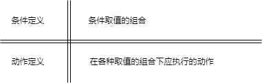

title:: 结构化开发方法/结构化分析方法/数据字典
alias:: 数据字典

- 数据流图描述了系统的分解，但没有对图中各成分进行说明。数据字典就是为数据流图中的每个数据流、文件、加工，以及组成数据流或文件的数据项做出说明。其中，对加工的描述称为“小说明”，也可以称为“加工逻辑说明”。
- ## 数据字典的内容
	- 数据字典有以下4类条目：数据流、数据项、数据存储和基本加工。数据项是组成数据流和数据存储的最小元素。源点、终点不在系统之内，故一般不在字典中说明。
	- ### 数据流条目
		- 数据流条目给出了DFD中数据流的定义，通常列出该数据流的各组成数据项。在定义数据流或数据存储组成时，使用表6-1给出的符号。
		- |符号 |含义 |举例及说明 |
		  |- |- |- |
		  |= |被定义为 | |
		  |+ |与 |x=a+b，表示x由a和b组成 |
		  |[... \vert ...] |或 |x=[a \vert b]，表示x由a或b组成 |
		  |{...} |重复 |x={a}，表示x由0个或多个a组成 |
		  |m{...}n或{...}\_m\^n |重复 |x=2{a}5表示x中最少出现2次a，最多出现5次a。5、2为重复次数的上、下限 |
		  |(...) |可选 |x=(a)表示a可在x中出现，也可不出现 |
		  |“...” |基本数据元素 |x=“a”，表示x是取值为字符a的数据元素 |
		  |.. |连接符 |x=1..9，表示x可取1~9中任意一个值 |
	- ### 数据存储条目
		- 数据存储条目是对数据存储的定义
	- ### 数据项条目
		- 数据项条目是不可再分解的数据单位
	- ### 基本加工条目
		- 加工条目是用来说明DFD中基本加工的处理逻辑的，由于下层的基本加工是由上层的加工分解而来，只要有了基本加工的说明，就可理解其他加工。
- ## 数据词典管理
	- 词典管理主要是把词典条目按照某种格式组织后存储在词典中，并提供排序、查找和统计等功能。如果数据流条目包含了来源和去向，文件条目包含了读文件和写文件，还可以检查数据词典与数据流图的一致性。
- ## 加工逻辑的描述
	- 加工逻辑也称为“小说明”。常用的加工逻辑描述方法有结构化语言、判定表和判定树3种。
	- ### 结构化语言
		- 结构化语言（如结构化英语）是一种介于自然语言和形式化语言之间的半形式化语言，是自然语言的一个受限子集。
		- 结构化语言没有严格的语法，它的结构通常可分为内层和外层。外层有严格的语法，内层的语法比较灵活，可以接近于自然语言的描述。
		- #### 外层
			- 用来描述控制结构，采用顺序、选择和重复3种基本结构。
			- ==顺序结构==。一组祈使语句、选择语句、重复语句的顺序排列。祈使语句是指至少包含一个动词及一个名词，指出要执行的动作及接受动作的对象。
			- ==选择结构==。一般用IF-THEN-ELSE-ENDIF、CASE-OF-ENDCASE等关键词。
			- ==重复结构==。一般用DO-WHILE-ENDDO、REPEAT-UNTIL等关键词
		- #### 内层
			- 一般采用祈使语句的自然语言短语，使用数据字典中的名词和有限的自定义词，其动词含义要具体，尽量不用形容词和副词来修饰，还可使用一些简单的算法运算和逻辑运算符号。
	- ### 判定表
		- 在有些情况下，数据流图中某个加工的一组动作依赖于多个逻辑条件的取值。这时，用自然语言或结构化语言都不易于清楚地描述出来，而用判定表能够清楚地表示复杂的条件组合与应做的动作之间的对应关系。
		- 判定表由4个部分组成，用双线分割成4个区域，如图6-12所示。
		  
	- ### 判定树
		- 判定树是判定表的变形，一般情况下它比判定表更直观，且易于理解和使用。