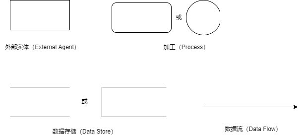
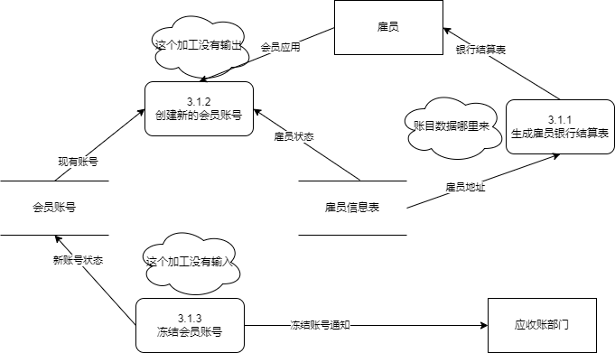
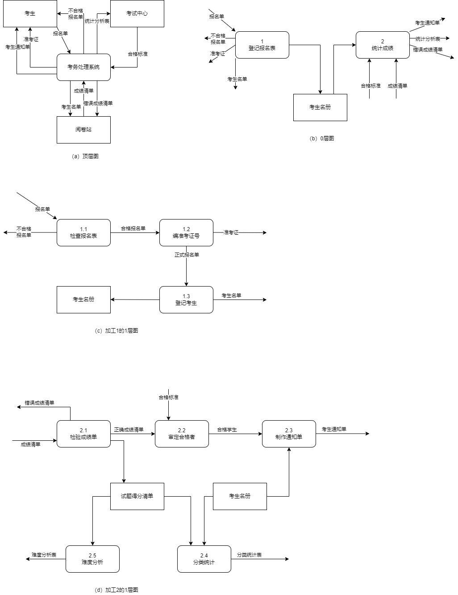
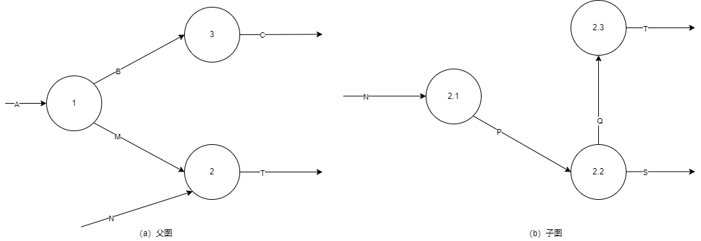

title:: 结构化开发方法/结构化分析方法/数据流图
alias:: 数据流图

- 数据流图也称数据流程图（Data Flow Diagram，DFD），它是一种便于用户理解、分析系统数据流程的图形工具。它摆脱了系统的物理内容，精确地在逻辑上描述系统的功能、输入、输出和数据存储等，是==系统逻辑模型==的重要组成部分。
- ## 数据流图的基本图形元素
	- 数据流图中的基本图形元素包括数据流（Data Flow）、加工（Process）、数据存储（Data Store）和外部实体（Extenal Agent）。其中，数据流、加工和数据存储用于构建软件系统内部的数据处理模型；外部实体表示存在于系统之外的对象，用来帮助用户理解系统数据的来源和去向。
	  {:height 251, :width 538}
	- ### 数据流
		- 数据流由一组固定成分的数据组成，表示数据的流向。在DFD中，数据流的流向可以有以下几种：
			- > 1. 从一个加工流向另一个加工；
			  > 2. 从加工流向数据存储（写）；
			  > 3. 从数据存储流向加工（读）；
			  > 4. 从外部实体流向加工（输入）；
			  > 5. 从加工流向外部实体（输出）；
		- DFD中的每个数据流用一个定义明确的名字表示。除了流向数据存储或从数据存储流出的数据流不必命名外，每个数据流都必须有一个合适的名字，以反映该数据流的含义。
		- 值得注意的是，DFD中描述的是数据流，而不是控制流。
		- 数据流或者由具体的数据属性（也称为数据结构）构成，或者由其他数据流构成。组合数据流是由其他数据流构成的数据流，它们用于在高层的数据流图中组合相似的数据流，以使数据流图更便于阅读。
	- ### 加工
		- 加工描述了输入数据流到输出数据流之间的变换，也就是输入数据流经过什么处理后变成了输出数据流。每个加工都有一个名字和编号。编号能反映出该加工位于分层DFD中的哪个层次和哪张图中，也能够看出它是哪个加工分解出来的子加工。
		- 一个加工可以有多个输入数据流和多个输出数据流，但至少有一个输入数据流和一个输出数据流。数据流图中常见的3种错误如图6-9所示。
			- {:height 339, :width 575}
			- > 1. 加工3.1.2有输入但是没有输出，我们称之为“黑洞”。因为数据输入到过程，然后就消失了。在大多数情况下，建模人员只是忘了输出。
			  > 2. 加工3.1.3有输出但没有输入。在这种情况下，输入流似乎被忘记了。
			  > 3. 加工3.1.1中输入不足以产生输出，我们称之为“==灰洞==”。
			  这有几种可能的原因：一个错误的的命名过程；错误命名的输入或输出；不完全的事实。
			  灰洞是最常见的错误，也是最使人为难的错误。
			  一旦数据流图交给了程序员，到一个加工的输入数据流必须足以产生输出数据流。
	- ### 数据存储
		- 数据存储用来存储数据。通常，一个流入加工的数据流经过加工处理后就消失了，而它的某些数据（或全部数据）可能被加工成输出数据流，流向其他加工或外部实体。除此之外，在软件系统中还常常要把某些信息保存下来以供以后使用，这时可以使用数据存储。例如，在教务处理系统中，报名时产生的考生名册要随着报名的过程不断补充，在统计成绩和制作考生通知书时还要使用考生名册的相关信息。因此，考生可以作为数据存储存在，以保存相关的考生信息。
		- 每个数据存储都有一个定义明确的名字标识。可以有数据流流入数据存储，表示数据的写入操作；也可以有数据流从数据存储流出，表示数据的读操作；还可以用双向箭头的数据流指向数据存储，表示对数据的修改。
		- 这里要说明的是，DFD中的数据存储在具体实现时可以用文件系统实现，也可以用数据库系统实现。数据存储的存储介质可以是磁盘、磁带或其他存储介质。
	- ### 外部实体（外部主体）
		- 外部实体是指存在于软件系统之外的人员或组织，它指出系统所需数据的发源地（源）和系统所产生的数据的归宿地（宿）。例如，对于一个考务处理系统而言，考生向系统提供报名单（输入数据流），所以考生是教务处理系统的一个源；而考务处理系统要将考试成绩的统计分析表（输出数据流）传递给考试中心，所以考试中心是该系统的一个宿。
		- 在许多系统中，某个源和某个宿可以是同一个人员或组织，此时，在DFD中可以用同一个符号表示。考生向系统提供报名单，而系统向考生送出准考证，所以在教务处理系统中，考生既是源又是宿。
		- 源和宿采用相同的图形符号表示，当数据流从该符号流出时，表示它是源；当数据流流向该符号时，表示它是宿；当两者皆有时，表示它既是源又是宿。
- ## 数据流图的扩充符号
	- 在DFD中，一个加工可以有多个输入数据流和多个输出数据流，此时可以加上一些扩充符号来描述多个数据流之间的关系。
	- ### 星号（\( \ast \)）
		- 星号表示数据流之间存在“**与**”关系。
		  如果是输入流则表示所有输入数据流全部到达后才能进行加工处理；
		  如果是输出流则表示加工结束将同时产生所有的输出数据流。
	- ### 加号（\(+\)）
		- 加号表示数据流之间存在“**或**”关系。
		  如果是输入流则表示其中任何一个输入数据流到达后就能进行加工处理；
		  如果是输出流则表示加工处理的结果是至少产生其中一个输出数据流。
	- ### 异或（\( \oplus \)）
		- 异或表示数据流之间存在“**互斥**”关系。
		  如果是输入流则表示当且仅当其中一个输入流到达后才能进行加工处理；
		  如果是输出流则表示加工处理的结果是仅产生这些输出数据流中的一个。
- ## 数据流图的层次结构
	- 从原理上讲，只要纸足够大，一个软件系统的分析模型就可以画在一张纸上。然而，一个复杂的软件系统可能涉及上百个加工和上百个数据流，甚至更多。如果将它们画在一张图上，则会十分复杂，不易阅读，也不易理解。
	- 根据自顶向下逐层分解的思想，可以将数据流图按照层次结构来绘制，每张图中的加工个数可大致控制在“7加减2”的范围内，从而构成一套分层数据流图。
	- ### 层次结构
		- 分层数据流图的顶层只有一张图，其中只有一个加工，代表整个软件系统，该加工描述了软件系统与外界之间的数据流，称为**顶层图**。
		- 顶层图中的加工（即系统）经分解后的图称为**0层图**，也只有一张。处于分层数据流图最底层的图称为底层图，在**底层图**中，所有的加工不再进行分解。分层数据流图中的其他图称为中间层，其中至少有一个加工（也可以是所有加工）被分解成一张子图。在整套分层数据流图中，凡是不再分解成子图的加工称为基本加工。
	- ### 图和加工的编号
		- 首先介绍父图和子图的概念。
		- 如果某图（记为A）中的某一个加工分解成一张子图（记为B），则称A是B的父图，B是A的子图。若父图中有n个加工，则它可以有0~n张子图，但每张子图只对应一张父图。
		- 为了方便对图进行管理和查找，可以采用下列方式对DFD中的图和加工编号。
			- > 1. 顶层图中只有一个加工（代表整个软件系统），该加工不必编号
			  > 2. 0层图中的加工编号分别为1、2、3...
			  > 3. 子图号就是父图中被分解的加工号
			  > 4. 对于子图中加工的编号，若父图中的加工号为x的加工分解成某一子图，则该子图中的加工编号分别为x.1、x.2、x.3...
- ## 分层数据流图的画法
	- 下面以某考务处理系统为例介绍分层数据流图的画法。
	- 考务处理系统的功能需求如下：
		- > 1. 对考生送来的报名单进行检查。
		  > 2. 对合格的报名单编好准考证号后将准考证送给考生，并将汇总后的考生名单送给阅卷站。
		  > 3. 对阅卷站送来的成绩清单进行检查，并根据考试中心指定的合格标准审定合格者
		  > 4. 制作考生通知单（内含成绩合格/不合格标志）送给考生
		  > 5. 按地区、年龄、文化程度、职业和考试级别等进行成绩分类统计和试题难度分析，产生统计分析表
	- 部分数据流的组成如下：
		- ```
		  报名单 = 地区 + 序号 + 姓名 +文化程度 + 职业 + 考试级别 + 通信地址
		  正式报名单 = 准考证号 + 报名单
		  准考证 = 地区 + 序号 ＋ 姓名 ＋ 准考证号 ＋ 考试级别 ＋ 考场
		  考生名单 ＝ ｛准考证号 ＋ 考试级别｝其中｛ｗ｝表示ｗ重复多次
		  考生名册 ＝ 正式报名单
		  统计分析表 ＝ 分类统计表 ＋ 难度分析表
		  考生通知单 ＝ 准考证号 ＋ 姓名 ＋ 通信地址 ＋ 考试级别 ＋ 考试成绩 ＋ 合格标志
		  ```
	- 下面介绍画分层数据流图的步骤：
	- ### 1. 画系统的输入和输出
		- 系统的输入和输出用顶层图来描述，即描述系统从哪些外部实体接收数据流，以及系统发送数据流到哪些外部实体。
		- 顶层图只有一个加工，即待开发的软件系统。顶层图中的数据流就是系统的输入/输出信息。顶层图中通常没有数据存储。考务处理系统的顶层图如图6-10（a）所示。
	- ### 2. 画系统的内部
		- 将顶层图的加工分解成若干个加工，并用数据流将这些加工连接起来，使得顶层图中的输入数据经过若干个加工处理后变换成顶层图的输出数据流，这张图称为0层图。从一个加工画出一张数据流图的过程实际上就是对这个加工的分解。
		- #### 确定加工
		  collapsed:: true
			- 这里的加工指的是父图中某加工分解而成的子加工，可以采用下面两种方法来确定加工。
			- 根据==功能分解==来确定加工。一个加工实际上反映了系统的一种功能，根据功能分解的原理，可以将一个复杂的功能分解成若干个较小的功能，每个较小的功能就是分解后的子加工。这种方法多应用于高层DFD中加工的分解。
			- 根据==业务处理流程==确定加工。分析父图中待分解的加工的业务处理流程，流程中的每一步都可能是一个子加工。特别要注意在业务流程中数据流发生变化或数据流的值发生变化的地方，应该存在一个加工，该加工将原数据流（作为该加工的输入数据流）处理成变化后的数据流（作为该加工的输出数据流）。该方法较多应用于低层DFD中加工的分解，它能描述父加工中输入数据流到输出数据流之间的加工细节。
		- #### 确定数据流
		  collapsed:: true
			- 当用户把若干个数据看作一个整体来处理（这些数据一起到达，一起加工）时，可以把这些数据看成一个数据流。通常，实际工作环境中的表单就是一种数据流。
			- 在父图中某加工分解而成的子图中，父图中相应加工的输入/输出数据流就是子图边界上的输入/输出数据流。另外，在分解后的子加工之间应增添一些新的数据流，这些数据流是加工过程中的中间数据（对某子加工输入数据流的改变），它们与所有的子加工一起完成了父图中相应加工的输入数据流到输出数据流的变换。如果某些中间数据需要保存，以备使用，那么可以表示为流向数据存储的数据流。
			- 同一个源或加工可以有多个数据流流向另一个加工，如果它们不是一起到达和一起加工的，那么可以将它们分成多个数据流。同样，同一个加工也可以有多个数据流流向另一个加工或宿。
		- #### 确定数据存储
		  collapsed:: true
			- 在由父图中某加工分解而成的子图中，如果父图中该加工存在流向数据存储的数据流（写操作），或者存在从数据存储流向该加工的数据流（读操作），则这种数据存储和相关的数据流都画在子图中。
			- 在分解的子图中，如果需要保存某些==中间数据==，以备以后使用，那么可以将这些数据组成一个新的文件。在自顶向下画分层数据流图时，新数据存储（首次出现的）至少应有一个加工为其写入记录，同时至少存在另一个加工读取该数据存储的记录。
			- 注意，对于从父图中继承下来的数据存储，在子图中只对其读记录，或者写记录。
		- #### 确定源和宿
		  collapsed:: true
			- 通常在0层图和其他子图中不必画出源和宿，有时为了提供可读性，可以将顶层图中的源和宿画在0层图中。
			- 当同一个外部实体（人或组织）既是系统的源，又是系统的宿时，可以用同一个图形符号来表示。为了画图的方便，避免图中线的交叉，同一个源或宿可以重复画在DFD的不同位置，以增加可读性，但它们仍代表同一个实体。
			- 在考务处理系统的0层图中，采用功能分解方法来确定加工。分析系统的需求说明，可知系统的功能主要分为考试报名及统计成绩两大部分，其中，报名工作在考试前进行，统计成绩工作在考试后进行。
			- 为此，定义两个加工：登记报名表和统计成绩。0层图中的数据流，除了继承顶层图中的输入/输出数据流外，还应定义这两个加工之间的数据流。由于这两个加工分别在考试前后进行，并不存在直接关系，因此，“登记报名表”所产生的结果“考生名册”应作为数据存储，以便考试后由“统计成绩”读取。考务处理系统的0层图如图6-10（b）所示。
	- ### 3. 画加工的内部
	  collapsed:: true
		- 当DFD中存在某个比较复杂的加工时，可以将它分解成一张DFD子图。分解的方法是将该加工看作一个小系统，该加工的输入/输出数据流就是这个假设的小系统的输入/输出数据流，然后采用画0层图的方法画出该加工的子图。
		- 下面介绍考务处理系统0层图中加工1的分解，这里根据业务处理流程来确定加工1的分解。分析考务处理系统的功能需求和0层图，将加工1分解成3个子加工：检查报名表、编准考证号和登记考生。加工1分解而成的子图如图6-10（c）所示。
		- 采用同样的方法画出加工2分解的DFD子图，如图6-10（d）所示。
		- 重复第3）步的分解，直到图中尚未分解的加工都足够简单（也就是说，这种加工不必再分解）。
		- 这里假设图6-10（c）、（d）中的每个加工都已经足够简单，不需要再分解，该考务处理系统的分层DFD绘制工作结束。
		- {:height 1212, :width 931}
	-
- ## 分层数据流图的审查
	- 在分层数据流图画好后，应该认真检查图中是否存在错误或不合理（不理想）的部分。
	- ### 分层数据流图的一致性和完整性
		- 分层数据流图的一致性是指分层DFD中不存在矛盾和冲突。这里讲的完整性是指分层DFD本身的完整性，即是否有遗漏的数据流、加工等元素。所以，分层DFD的一致性和完整性实际上反映了图本身的正确性。但是图本身的正确性并不意味着分析模型的正确性，分析模型的正确性要根据模型==是否满足用户的需求==来判断。
		- #### 分层数据流图的一致性
			- ==1. 父图与子图的平衡==：
				- 父图与子图平衡是指任何一张DFD子图边界上的输入/输出数据流必须与其父图中对应加工的输入/输出数据流保持一致。
				- 由于一张子图是被分解的加工的一种细化，所以，这张子图应该保证可以画到父图中替代被分解的加工，因此保持父图与子图平衡是理所当然的。
				- 例如，图6-11所示的父图与子图是不平衡的。图6-11（b）是父图中加工2的子图，加工2的输入数据流有M和N，输出数据流是T，而子图边界上的输入数据流是N，输出数据流是S和T，很显然它们是不一致的。
				  {:height 292, :width 828}
				- 如果父图中某个加工的一条数据流对应于子图中的几条数据流，而子图中组成这些数据流的数据项全体正好等于父图中的这条数据流，那么它们仍然是平衡的。
				- 保持父图与子图平衡是画数据流的重要原则。自顶向下逐层分解是降低问题复杂性的有效途径。然而，如果只分别关注单张图的合理性，忽略父图与子图之间的关系，则很容易造成父图与子图不平衡的错误。
			- ==2. 数据守恒==：
				- 数据守恒包括两种情况：
				  第一种情况是指一个加工的所有输出数据流中的数据必须能从该加工的输入数据流中直接获得，或者能通过该加工的处理而产生。
				  第二种情况是加工未使用其输入数据流中的某些数据项。这表明这些未用到的数据项是多余的，可以从输入数据流中删去。当然，这不一定就是错误，只表示存在一些无用数据。然而这些无用的数据常常隐含着一些潜在的错误，如加工的功能描述不完整、遗漏或不完整的输出数据流等。因此，在检查数据守恒时，不应该忽视对这种情况的检查。
			- ==3. 局部数据存储==：
				- 这里讨论分层数据流图中的一个数据存储应该画在哪些DFD中，不应该画在哪些DFD中。
				- 在一套完整的分层DFD中，任何一个数据存储都应有写和读的数据流，否则这个文件就没有存在的必要。除非这个数据存储的建立是为另一个软件系统使用或者这个数据存储是由另一个软件系统产生和维护的。
				- 在自顶向下分解加工的过程中，如果某个加工需要保存一些数据，同时在将加工的同一张DFD上至少存在另一个加工需要读这些数据，那么该数据存储应该在这张DFD上画出。也就是在一张DFD中，当一个数据存储作为多个加工之间的交界面时，该数据存储应该画出。如果在一张DFD中，一个数据存储仅与一个加工进行读/写操作，并且在该DFD的父（祖先）图中未出现过该数据存储，那么该数据存储只是相应加工的内部文件，在这张DFD中不应该画出。
			- ==4. 一个加工的输出数据流不能与该加工的输入数据流同名==：
				- 同一个加工的输出数据流和输入数据流，即使它们的组成成分相同，仍应该给它们取不同的名字，以表示它们是不同的数据流。但是允许一个加工有两个相同的数据流分别流向两个不同的加工。
		- #### 分层数据流图的完整性
			- 1. 每个加工至少有一个输入数据流和一个输出数据流。一个没有输入数据流或者没有输出数据流的加工通常是没有意义的。当出现这种情况时，常常意味着可能遗漏了某些输入数据流或输出数据流。
			- 2. 在整套分层数据流图中，每个数据存储应至少有一个加工对其进行读操作，另一个加工对其进行写操作。对于某一张DFD来说，可以只写不读或只读不写。
			- 3. 分层数据流图中的每个数据流和文件都必须命名（除了流入或流出数据存储的数据流），并保持与数据字典一致。
			- 4. 分层数据流图中的每个基本加工都应有一个加工规约。
	- ### 构造分层DFD时需要注意的问题
		- #### 1. 适当命名
			- DFD中的每个数据流、加工、数据存储、外部实体都应被适当地命名，名字应符合被命名对象的实际含义。通常，
			  数据流名可用名词或形容词加名词来描述；
			  加工名可以用动词或及物动词加宾语来描述；
			  数据存储名可以用名词来描述；
			  外部实体可以用实际的人员身份或组织的名称来命名。
			- 用户在命名时应注意以下问题：
			  1. 名字应反映整个对象（如数据流、加工），而不是只反映它的某一部分。
			  2. 避免使用空洞的、含义不清的名字，如“数据”“信息”“处理”“统计”等。
			  3. 如果发现某个数据流或加工难以命名，往往是DFD分解不当的征兆，此时应考虑重新分解。
		- #### 2. 画数据流而不是控制流
			- 数据流图强调的是数据流，而不是控制流。在DFD中一般不能明显地看出其执行的次序。为了区分数据流和控制流，可以简单地回答下列问题：“这条线上是否有数据流过？”，如果有表示是数据流，否则是控制流。
		- #### 3. 避免一个加工有过多的数据流
			- 当一个加工有过多的数据流时，意味着这个加工特别复杂，这往往是分解不合理的表现。解决的办法是重新分解，步骤如下：
			  1. 把需要重新分解的某张图的所有子图连接成一张图。
			  2. 把连接后的图重新划分成几个部分，使各部分之间的联系最小。
			  3. 重新定义父图，即第2步中的每个部分作为父图中的一个加工。
			  4. 重新建立各子图，即第2步中的每个部分都是一张子图。
			  5. 为所有的加工重新命名并编号。
		- #### 4. 分解尽可能均匀
			- 理想的分解是将一个问题（加工）分解成大小均匀的若干个问题（子加工），也就是说，对于任何一张DFD，其中的任何两个加工的分解数之差不超过1。如果在同一张图中，某些加工已是基本加工，而另一些加工仍需分解若干层，那么，这张图就是分解不均匀的。
		- #### 5. 先考虑确定状态，忽略琐碎的细节
			- 在构造DFD时，应集中精力先考虑稳定状态下的各种问题，暂时不考虑系统如何自动、如何结束、出错处理以及性能等问题，这些问题可以在分析阶段的后期，在需求规约中加以说明。
		- #### 6. 随时准备重画
			- 对于一个复杂的软件系统，其分层DFD很难一次开发成功，往往要经历反复多次的重画和修改，才能构造出完整、合理、满足用户需求的分层DFD。
	- ### 分解的程度
		- 在自顶向下画数据流图时，为了便于对分解层数进行把握，可以参照以下几条与分解有关的原则。
		  1. 7加减2
		  2. 分解应自然，概念上应合理、清晰
		  3. 只要不影响DFD的易理解性，可适当增加子加工数量，以减少层数。
		  4. 一般来说，上层分解得快一些（即多分解几个加工），下层分解得慢一些（即少分解几个加工）。
		  5. 分解要均匀。