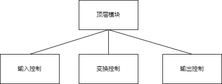
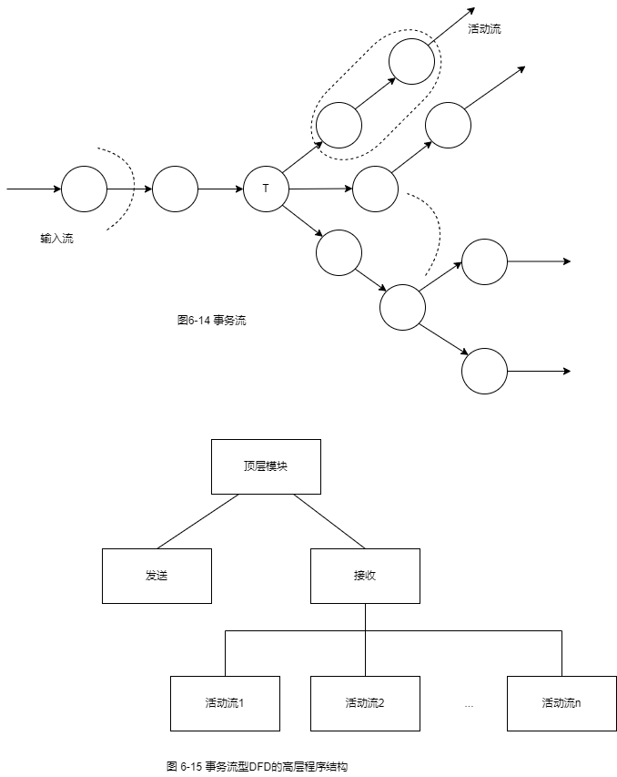

title:: 结构化开发方法/结构化设计方法/数据流图到软件体系结构的映射
alias:: 数据流图到软件体系结构的映射

- 结构化设计是将结构化分析的结果（数据流图）映射成软件的体系结构（结构图）。根据信息流的特点，可将数据流图分为变换型数据流图和事务型数据流图，其对应的映射分别称为变换分析和事务分析。
- ## 信息流的类型
	- 在需求分析阶段，用SA方法产生了数据流图。面向数据流的设计能方便地将DFD转换成程序结构图。DFD中从系统的输入数据流到系统的输出数据流的一连串连续变换形成了一条信息流。DFD的信息流大体上可以分为两种类型：变换流和事务流。
	- **变换流**。信息沿着输入通路进入系统，同时将信息的外部形式转换成内部表示，然后通过变换中心（也称为主加工）处理，再沿着输出通路转换成外部形式离开系统。具有这种特性的信息流称为变换流。变换流型的DFD可以明显地分成输入、变换（主加工）和输出三大部分。
	- **事务流**。信息沿着输入通路到达一个事务中心，事务中心根据输入信息（即事务）的类型在若干个动作序列（称为活动流）中选择一个来执行，这种信息流称为事务流。事务流有明显的事务中心，各活动流以事务中心为起点呈辐射状流出。
- ## 变换分析
	- 变换分析是从变换流型的DFD导出程序结构图。
	- ### 1. 确定输入流和输出流，分离出变换中心
		- 把DFD中系统输入端的数据流称为**物理输入**，系统输出端的数据流称为**物理输出**。物理输入通常要经过编辑、格式转换、合法性检查、预处理等辅助性的加工才能为主加工的真正输入（称为**逻辑输入**）。从物理输入端开始，一步步向系统的中间移动，可找到离物理输入端最远，但仍可被看作系统输入的那个数据流，这个数据流就是逻辑输入。同样，由主加工产生的输出（称为**逻辑输出**）通常也要经过编辑、格式转换、组成物理块、缓冲处理等辅助加工才能变成**物理输出**。从物理输出端开始，一步步向系统的中间移动，可找到离物理输出端最远，但仍可被看作系统输出的那个数据流，这个数据流就是逻辑输出。
		- DFD中从物理输入到逻辑输入的部分构成系统的输入流，从逻辑输出到物理输出的部分构成系统的输出流，位于输入流和输出流之间的部分就是**变换中心**。
	- ### 2. 第一级分解
		- 第一级分解主要是设计模块结构的顶层和第一层。一个变换流型的DFD可以映射成如图6-13所示的程序结构图。图中顶层模块的功能就是整个系统的功能。输入控制模块用来接收所有的输入数据，变换控制模块用来实现输入到输出的变换，输出控制模块用来产生所有的输出数据。
		  {:height 148, :width 368}
	- ### 3. 第二级分解
		- 第二级分解主要是设计中、下层模块。
		  1. 输入控制模块的分解。从变换中心的边界开始，沿着每条输入通路，把输入通路上每个加工映射成输入控制模块的一个低层模块。
		  2. 输出控制模块的分解。从变换中心的边界开始，沿着每条输出通路，把输出通路上的每个加工映射成输出控制模块的一个低层模块。
		  3. 变换控制模块的分解。变换控制模块通常没有通用的分解方法，应根据DFD中变换部分的实际情况进行设计。
- ## 事务分析
	- 事务分析是从事务流型DFD导出程序结构图。
	- ### 1. 确定事务中心和每条活动流的流特性
		- 图6-14给出了事务流型DFD的一般形式。其中，事务中心（图中的T）位于数条活动流的起点，这些活动流从该点呈辐射状流出。每条活动流也是一条信息流，它可以是变换流，也可以是另一条事务流。一个事务流型的DFD由输入流、事务中心和若干条活动流组成。
	- ### 2. 将事务流型DFD映射成高层的程序结构
		- 事务流型DFD的高层结构如图6-15所示。顶层模块的功能就是整个系统的功能。**接收模块**用来接收输入数据，它对应于输入流。**发送模块**是一个调度模块，控制下层的所有活动模块。每个活动流模块对应于一条活动流，它也是该活动流映射成的程序结构图中的顶层模块。
		- {:height 680, :width 536}
	- ### 3. 进一步分解
		- 接收模块的分解类同于变换分析中输入控制模块的分解。每个活动流模块根据其流特性（变换流或事务流）进一步采用变换分析或事务分析进行分解。
- ## SD方法的设计步骤
	- > 1. 复查并精化数据流图。
	  > 2. 确定DFD的信息流类型（变换流或事务流）
	  > 3. 根据流类型分别实施变换分析或事务分析
	  > 4. 根据系统设计的原则（参见5.1.2节）对程序结构图进行优化