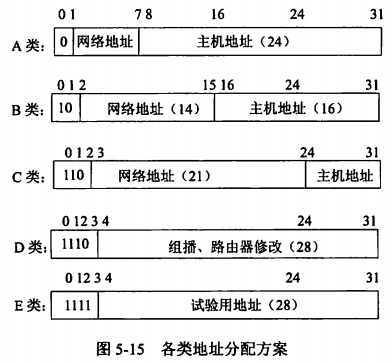
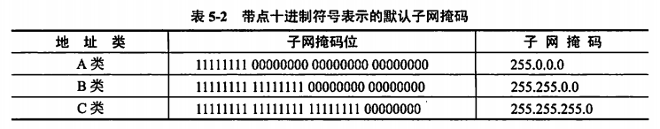
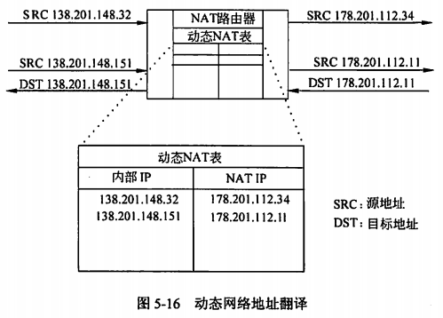
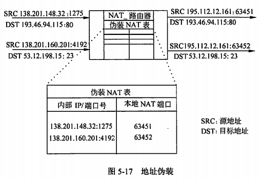
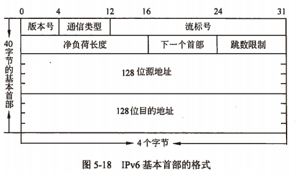
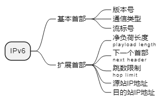

filters:: {}
title:: 网络与信息安全基础知识/Internet及应用/Internet地址
alias:: Internet地址

- 无论是在网上检索信息还是发送电子邮件，都必须知道对方的Internet地址，它能唯一确定Internet上的每一台计算机、每个用户的位置。也就是说，Internet上的每一台计算机、每个用户都有唯一的地址来标识它是谁和在何处，以方便于几千万个用户、几百万台计算机和成千上万的组织。Internet地址格式主要有两种书写形式：域名格式和IP地址格式。
- ## 域名
	- 域名（Domain Name）通常是用户所在的主机名字或地址。域名格式由若干部分组成，每个部分又称子域名，它们之间用“.”分开，每个部分最少由两个字母或数字组成。域名通常按分层结构来构造，每个域名都有其特定的含义。通常情况下，一个完整、通用的层次型主机域名由以下4个部分组成：
	  ```
	  计算机主机名.本地名.组名.最高层域名
	  ```
	- 从右到左，子域名分别表示不同的国家或地区的名称（只有美国可以省略表示国家的顶级域名）、组织类型、组织名称、分组织名称和计算机名称等。域名地址的最后一部分子域名称为高层域名（或顶级域名），它大致上可以分成两类：一类是组织性顶级域名（net，com）；另一类是地理性顶级域名（cn，jp）
	- 例如：www.dzkjdx.edu.cn cn是地理性顶级域名，表示“中国”。
	  www.263.net net是组织性顶级域名，表示“网络技术组织机构”。
	- 如果一个主机所在的网络级别较高，它可能拥有的域名仅包含3个部分：本地名.组名.最高层域名。现在，Internet地址管理机构（Internet PCA Registration Authority，IPRA）和（Internet Assigned Number Authority，IANA）负责Internet最高层域名的登记和管理。
- ## IP地址
	- Internet地址是按名字来描述的，这种地址表示方式易于理解和记忆。实际上，Internet中的主机地址是用IP地址来唯一标识的。这是因为Internet中所使用的网络协议是TCP/IP协议，故每个主机必须用IP地址来标识。
	- 每个IP地址都由4个小于256的数字组成，数字之间用“.”分开。Internet的IP地址共有32位，4个字节。它有两种表示格式：二进制格式和十进制格式。二进制格式是计算机所认识的格式，十进制格式是由二进制格式“翻译”过去的，主要是为了便于使用和掌握。例如，十进制IP地址129.102.4.11与二进制的10000001 01100110 000000100 00001011相同，显然表示成带点的十进制格式方便得多。
	- 域名和IP地址是一一对应的，域名易于记忆、便于使用，因此得到比较普遍的使用。当用户和Internet上的某台计算机交换信息时，只需要使用域名，网络会自动地将其转换成IP地址，找到该台计算机。
	- Internet中的地址可分为5类：A类、B类、C类、D类和E类。各类的地址分配方案如图所示。在IP地址中，全0代表的是网络，全1代表的是广播
		- {:height 278, :width 293}
		- > A类网络地址第一个字节的十进制值为==000\~127==。
		  > B类网络地址第一个字节的十进制值为==128\~191==。
		  > C类网络地址第一个字节的十进制值为==192\~223==。
		  > D类网络地址第一个字节的十进制值为==224\~239==。
		  > E类网络地址第一个字节的十进制值为==240\~255==。
	- ==私网地址==
	  > A类地址：10.0.0.0～10.255.255.255
	  > B类地址：172.16.0.0 ～172.31.255.255
	  > C类地址：192.168.0.0～192.168.255.255
	- 网络软件和路由器使用**子网掩码**（Subnet Mask）来识别报文是仅存放在网络内部还是被路由转发到其他地方。在一个字段内，1的出现表明一个字段包含所有或部分网络地址，0表明主机地址位置。例如，最常用的C类地址使用前三个8位来识别网络，最后一个8位识别主机。因此，子网掩码是255.255.255.0。
	- 子网地址掩码是==相对特别的IP地址而言的==，如果脱离了IP地址就毫无意义。它的出现一般是跟着一个特定的IP地址，用来为计算这个IP地址中的网络号部分和主机号部分提供依据。换句话说，就是在写一个IP地址后，再指明哪些是网络号部分，哪些是主机号部分。子网掩码的格式与IP地址相同，所有对应网络号的部分用1填上，所有对应主机号的部分用0填上。
	- A类、B类、C类IP地址类默认的子网掩码如表10-2所示。
		- {:height 127, :width 642}
	- 如果需要将网络进行子网进行子网划分，此时子网掩码可能不同于以上默认的子网掩码。例如，192.96.58.0是一个8位子网化的B类网络ID。基于B类的主机ID的8位被用来表示子网化的网络，对于网络138.96.39.0，其子网掩码应为255.255.255.0。
	- 例如，一个B类地址172.16.3.4，为了直观地说明前16位是网络号，后16位是主机号，可以附上子网掩码255.255.0.0(11111111 111111111 000000000 00000000)。
	  假定某单位申请的B类地址为179.143.xxx.xxx。如果希望所它划分为14（至少占二进制的4位）个虚拟的网络，则需要占4位主机位，子网使用掩码255.255.240.0~255.255.255.0来建立子网。每个LAN可有2^12-2个主机，且各子网可具有相同的主机地址。
	- 假设一个组织有几个相对大的的子网，每个子网包括了25台左右的计算机；而又有一些相对较小的子网，每个子网大概只有几台计算机。这种情况下，可以将一个C类地址分成6个子网（每个子网可以包含30台计算机），这样解决了很大的问题。但是出现了一个新的情况，那就是大的子网基本上完全利用了IP地址范围，但是小的子网却造成了许多IP地址的浪费。为了解决这个新的难题，避免任何的IP浪费，就出现了允许应用不同大小的子网掩码来对IP地址空间进行子网划分的解决方案。这种新的方案就叫做**可变长子网掩码**（VLSM）。
	- VLSM用一个十分直观的方法来表示，那就是在IP地址后面加上“`/网络号及子网络号编址位数`”。例如，193.168.125.0/27就表示前27位表示网络号。
	- 例如，给定135.41.0.0/16的基于B类的网络ID，所需的配置是为将来使用保留一半的地址，其余的生成15个子网，达到2000台主机。
	  由于要为将来使用保留一半的地址，完成了135.41.0.0的基于B类的网络ID的1位子网化，生成两个子网135.41.0.0/17和135.41.128.0/17，子网135.41.128.0/17被选作为将来使用所保留的地址部分，135.41.0.0/17被继续生成子网。
	- 为达到划分2000台主机的15个子网的要求，需要将135.41.128.0/17的子网化的网络ID的4位子网化。这就产生了16个子网（135.41.128.0/21、135.41.136.0/21、...、135.41.240.0/21、135.41.248.0/21），允许每个子网有2046台主机。最初的15个子网化的网络ID（135.41.128.0/21~135.41.240.0/21）被选定为网络ID，从而实现了要求。
	- 现在的IP协议的版本号为4，所以也称之为IPv4，为了方便网络管理员阅读和理解，使用了4个十进制数中间加小数点“.”来表示。但随着因特网的膨胀，IPv4不论从地址空间上，还是协议的可用性上都无法满足因特网的新要求。这样出现一个新的IP协议**IPv6**，它使用了8个十六进制数中间加小数点“:”来表示（例如，`ABCD:EF01:2345:6789:ABCD:EF01:2345:6789`）。IPv6将原来的32位地址扩展成为==128位==地址，彻底解决了地址缺乏的问题。
	- TODO 路由汇聚：
- ## NAT技术
	- 因特网面临IP地址短缺的问题。解决这个问题有所谓长期的或短期的两种解决方案。长期的解决方案就是使用具有更大地址空间的IPv6协议，网络地址翻译（Network Address Translators，**NAT**）是许多短期的解决方案中的一种。
	- NAT技术最初提出的建议是在子网内部使用局部地址，而在子网外部使用少量的全局地址，通过路由器进行内部和外部地址的转换。NAT的实现主要有两种形式。
	- ### 动态地址翻译
		- 第一种应用是**动态地址翻译**（Dynamic Address Translation）。为此，首先引入存根域的概念，所谓**存根域**（Stub Domain），就是内部网络的抽象，这样的网络只处理源和目标都在子网内部的通信。任何时候存根域内只有一部分主机要与外界通信，甚至还有许多主机可能从不与外界通信，所以整个存根域只需共享少量的全局IP地址。存根域有一个==边界路由器==，由它来处理域内与外部的通信。假定：`m`：需要翻译的内部地址数，`n`：可用的全局地址数（NAT地址）
		- 当m：n翻译满足条件（m>=1 且 m>=n）时，可以把一个大的地址空间映像到一个小的地址空间。所有NAT地址放在一个缓冲区中，并在存根域的边界路由器中建立一个局部地址和全局地址的动态映像表，如图5-16所示。这个图显示的是把所有B类网络138.201中的IP地址翻译成C类网络178.201.112中的IP地址。这种NAT地址重用有以下特点：
			- > 1. 只要缓冲区中存在尚未使用的C类地址，任何从内向外的连接请求都可以得到响应，并且在边界路由器的动态NAT表中为之建立一个映像表项。
			  > 2. 如果内部主机的映像存在，就可以利用它建立连接。
			  > 3. 从外部访问内部主机是有条件的，即动态NAT表中必须存在该主机的映像。
			- {:height 316, :width 431}
		- 动态地址翻译的好处是节约了全局适用的IP地址，而且不需要改变子网内部的任何配置，只需在边界路由器中设置一个动态地址变换表就可以工作了。
	- ### m:1翻译（伪装）
		- 另外一种特殊的NAT应用是`m : 1`翻译，这种技术也叫做**伪装**（masquerading），因为用一个路由器的IP地址可以把子网中所有主机的IP地址都隐藏起来。如果子网中有多个主机要同时通信，那么还要对端口号进行翻译，所以这种技术更经常被称为 网络地址和端口翻译（Network Address Port Translation，**NAPT**）在很多NAPT实现中，专门保留一部分端口号给伪装使用，称为**伪装端口号**。图5-17中的NAT路由器中有一个伪装表，通过这个表对端口号进行翻译，从而隐藏了内部网络138.201中的所有主机。可以看出，这种方法如下特点：
			- > 1. 出口分组的源地址被路由器的外部IP地址所代替，出口分组的源端口号被一个未使用的伪装端口号所代替。
			  > 2. 如果进来的分组的目标地址是本地路由器的IP地址，而且标端口号是路由器的伪装端口号，则NAT路由器就检查该分组是否为当前的一个伪装会话，并试图通过它的伪装表对IP地址和端口号进行翻译。
			- {:height 276, :width 392}
		- 伪装技术可以作为一种安全手段使用，借以限制外部主机的访问。另外，还可以用这种技术实现虚拟主机和虚拟路由，以便达到负载均衡和提高可靠性的目的。
- ## IPv6简介
	- IPv4（IP version 4）标准是20世纪70年代末期制定完成的。20世纪90年代初期，WWW的应用导致恩特网爆炸性发展，随着因特网应用类型日趋复杂，终端形式特别是移动终端的多样化，全球独立IP地址的提供已经开始面临沉重的压力。IPv4将不能满足因特网长期发展的需要，必须立即开始下一代IP网络协议的研究。由此，IETF于1992年成立了IPNG（NP Next Generation）工作组；1994年夏，IPNG工作组提出了下一代IP网络协议（IP version 6，IPv6）的推荐版本；1995年夏，IPNG工作组完成了IPv6的协议文本；1995年到1999年完成了IETF要求的协议审定和测试；1999年成立了IPv6论坛，开始正式分配IPv6地址，IPv6的协议文本成为标准草案。
	- IPv6具有长达128位的地址空间，可以彻底解决IPv4地址不足的问题。由于IPv4地址是32位二进制，所能表示的IP地址个数为 $$2^{32}=4' 294' 967' 296 \approx 40亿$$ 个，因而在因特网上约有40亿个IP地址。由32位的IPv4升级至128位的IPv6，因特网中的IP地址从理论上讲会有 $$2^{128}=3.4 \times 10^{38}$$ 个，如果整个地球表面（包括陆地和水面）都覆盖着计算机，那么IPv6允许每平方米有 $$7 \times 10^{23}$$ 个IP地址，如果地址分配的速率是每秒分配100万个，则需要 $$10^{19}$$ 年的时间才能将所有地址分配完毕，可见，在想象得到的将来，IPv6的地址空间是不可能用完的。除此之外，IPv6还采用分级地址模式、高效IP包首部、服务质量、主机地址自动配置、认证和加密等许多技术。
	- ### IPv6数据包的格式
		- IPv6数据包有一个40个字节的基本首部（base header），其后允许有0个或多个扩展首部（Extension Header），再后面是数据。下图所示的是IPv6基本首部的格式。每个IPv6数据包都是从基本首部开始。IPv6基本首部的很多字段可以和IPv4首部中的字段直接对应。
			- {:height 252, :width 427}
			- 
		- **版本号**：该字段占4位，说明了IP协议的版本。对于IPv6而言，该字段值是0110，也就是十进制数的6。
		- **通信类型**：该字段占8位，其中优先级字段占4位，使源站能够指明数据包的流类型。首先，IPv6把流分成两大类，即可进行拥塞控制的和不可进行拥塞控制的。每一类又分为8个优先级。优先级的值越大，表明该分组越重要。
		  对于可进行拥塞控制的业务，其优先级为0~7。当发生拥塞时，这类数据包的传输速率可以放慢。
		  对于不可进行拥塞控制的业务，其优先级为8~15。这些都是实时性业务，如音频或视频业务的传输。这种业务的数据包发送速率是恒定的，即使丢掉了一些，也不进行重发。
		- **流标号**：该字段占20位。所谓流，就是因特网上从一个特定源站到一个特定目的站（单播或多播）的一系列数据包。所有属于同一个流的数据包都具有同样的流标号。源站在建立流时是在2^24-1个流标号中随机选择一个流标号。流标号0保留作为指出没有采用流标号。源站随机地选择流标号并不会在计算机之间产生冲突，因为路由器在将一个特定的流与一个数据包相关联时使用的是数据包的源地址和流标号的组合。
		- 从一个源站发出的具有相同非0流标号的所有数据包都必须具有相同的源地址和目的地址，以及相同的逐跳选项首部（若此首部存在）和路由选择首部（若此首部存在）。这样做的好处是当路由器处理数据包时只要查一下流标号即可，而不必查看数据包首部中的其他内容。任何一个流标号都不具有特定的意义，源站应将它希望各路由器对其数据包进行的特殊处理写明在数据包的扩展首部中。
		- **净负荷长度**（Payload Length）：该字段占16位，指明除首部自身的长度外，IPv6数据包所载的字节数。可见，一个IPv6数据包可容纳64千字节长的数据。由于IPv6的首部长度是固定的，因此没有必要像IPv4那样指明数据包的总长度（首部与数据部分之和）。
		- **下一个首部**（Next Header）：该字段占8位，标识紧接着IPv6首部的扩展首部的类型。这个字段指明在基本首部后面紧接着的一个首部的类型。
		- **跳数限制**（Hop Limit）：该字段占8位，用来防止数据包在网络中无限期地存在。源站在每个数据包发出时即设定某个跳数限制。每一个路由器在转发数据包时，要先将跳数限制字段中的值减1。当跳数限制的值为0时，要将此数据包丢弃。这相当于IPv4首部中的生存期字段，但比IPv4中的计算时间间隔要简单一些。
		- **源站IP地址**：该字段占128位，是数据包的发送站的IP地址。
		- **目的站IP地址**：该字段占128位，是数据包的接收站的IP地址。
	- ### IPv6的地址表示
		- 一般来讲，一个IPv6数据包的目的地址可以是以下3种基本类型之一。
			- > 1. 单播（unicast）：传统的点对点通信。
			  > 2. 多播（multicast）：一点对多点的通信，数据包交付到一组计算机中的每一个。IPv6没有采用广播的术语，而是将广播看作多播的一个特例。
			  > 3. 任播（anycast）：这是IPv6增加的一种类型。任播的目的站是一组计算机，但数据包在交付时只交付给其中的一个，通常是距离最近的一个。
		- 为了使地址的表示简洁一些，IPv6使用冒号十六进制记法（Colon Hexadecimal Notation，Colon Hex），它把每16位用相应的十六进制表示，各组之间用冒号分隔。例如：`686E:8C64:FFFF:FFFF:0:1180:96A:FFFF`
		- 冒号十六进制记法允许0压缩（Zero Compression），即一连串连续的0可以用一对冒号所取代，例如，`FF05:0:0:0:0:0:0:B3`可以改成`FF05::B3`。
		- 为了保证0压缩有一个清晰的解释，建议中规定，在任一地址中只能使用一次0压缩。该技术对已建议的分配策略特别有用，因为会有许多地址包含连续的0串。
		- 另外，冒号十六进制记法可结合有点分十进制记法的后缀，这种结合在IPv4向IPv6的转换阶段特别有用。例如，下面的串是一个合法的冒号十六进制记法：`0:0:0:0:0:0:128.10.1.1`
		- 请注意，在这种记法中，虽然为冒号所分隔的每个值是一个16位的量，但每个点分十进制部分的值指明一个字节的值。再使用0压缩即可得出：`::128.10.1.1`