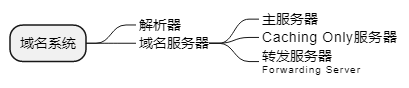

title:: 网络与信息安全基础知识/Internet及应用/Internet服务
alias:: Internet服务

- 作为全世界最大的国际性计算机网络的Internet，为全球的科研界、教育界和娱乐界等方面提供了极其丰富的信息资源和最先进的信息交流手段。在Internet上，时刻传送着大量的各种各校的信息，从电影、实况转播到最尖端的科学研究等无所不包，当然信息最多的还是科技信息，如计算机软件、科技论文、图书馆/出版社目录、最新科技动态、电子杂志、产品推销和网络新闻等。这些内容均可由Internet服务来为用户提供。
- 在使用传输控制协议或用户数据报协议时，Internet IP可支持65535种服务，这些服务是通过各个端口到名字实现的逻辑连接。端口分两类：一类是已知端口或称**公共端口**，端口号为==0\~1023==，这些端口由Internet赋值地址和端口号的组织（IANA）赋值；另一类是需在**IANA**注册登记的端口号，为1024\~65535。
- 前面介绍了Internet网络接口层、网际层协议和传输层协议，本节主要介绍Internet的高层协议，如域名服务、远程登录服务、电子邮件服务、WWW服务和文件传输服务等。
- ## 域名服务
	- Internet中的域名地址与IP地址是等价的，它们之间是通过域名服务来完成映射变换的。实际上，DNS是一种==分布式地址信息数据库系统==，服务器中包含整个数据库的某部分信息，并供客户查询。DNS允许局部控制整个数据库的某些部分，但数据库的每一部分都可通过全网查询得到。
	- 域名系统采用的是客户端/服务器模式，整个系统由解析器和域名服务器组成。
	  **解析器**是客户方，它负责查询域名服务器、解释从服务器返回来的应答、将信息返回给请求方等工作。
	  **域名服务器**是服务方，它通常保存着一部分域名空间的全部信息，这部分域名空间称为区（zone）。
	  一个域名服务器可以管理一个或多个区。域名服务器可以分为主服务器、Caching Only服务器和转发服务器（Forwarding Server）。
		- 
	- 域名系统是一个分布式系统，其管理和控制也是分布式的。一个用户A在查找另一用户B时，域名系统的工作过程如下。
	  > 1. 解析器向本地域名服务器发出请求查阅用户B的域名
	  > 2. 本地域名服务器向最高层域名服务器发出查询地址的请求
	  > 3. 最高层域名服务器返回给本地域名服务器一个IP地址
	  > 4. 本地域名服务器向组域名服务器发出查询地址的请求
	  > 5. 组域名服务器返回给本地域名服务器一个IP地址
	  > 6. 本地服务器向刚返回的域名服务器发出查询域名地址请求
	  > 7. IP地址返回给本地域名服务器
	  > 8. 本地域名服务器将该地址返回给解析器
	- 因此，本地域名服务器为了得到一个IP地址常常需要查询多个域名服务器。于是，在查询地址的同时，本地域名服务器也就得到了许多其他域名服务的信息，像它们的IP地址、所负责的区域等。本地域名服务器将这些信息连同最终查询到的主机IP地址全部存放在它的Cache中，以便将来参考。当下次解析器再查询与这些域名相关的信息时，就可以直接引用，这样大大减少了查询时间。
	- 因此，在访问主机的时候只需要知道域名，通过DNS服务器将域名变换为IP地址。DNS所用的是UDP端口，端口号为53。
- ## 远程登录服务
	- 远程登录服务是在Telnet协议的支持下，将用户计算机与远程主机连接起来，在远程计算机上运行程序，将相应的屏幕显示传送到本地机器，并将本地的输入送给远程计算机。由于这种服务基于Telnet协议且使用Telnet命令进行远程登录，故称为Telnet远程登录。
	- Telnet是基于客户端/服务器模式的服务系统，它由客户端软件、服务器软件以及Telnet以及Telnet通信协议三部分组成。远程计算机又称为Telnet主机或服务器，本地计算机作为Telnet客户端来使用，它起到远程主机的一台虚拟终端（仿真终端）的作用，通过它用户可以与主机上的其他用户一样共同使用该主机提供的服务和资源。
	- > 1. 当用户使用Telnet登录远程主机时，该用户必须在这个远程主机上拥有合法的账号和相应的密码，否则远程主机将会拒绝登录。
	  > 2. 在运行Telnet客户程序后，首先应该建立与远程主机的TCP连接，从技术上讲，就是在一个特定的TCP端口（端口号一般为23）上打开一个套接字，如果远程主机上的服务器软件一直在这个众所周知的端口上侦听连接请求，则这个连接便会建立起来，此时用户的计算机就成为该远程主机的一个终端，便可以进行联机操作了，即以终端方式为用户提供人机界面。
	  > 3. 然后将用户输入的信息通过Telnet协议便可以传送给远程主机，主机在众所周知的TCP端口上侦听到用户的请求并处理后，将处理的结果通过Telnet协议返回给客户程序。
	  > 4. 最后客户端接收到远程主机发送来的信息，并经过适当的转换显示在用户计算机的屏幕上。
- ## 电子邮件服务
	- 电子邮件（E-mail）就是利用计算机进行信息交换的电子媒体信件。它是随着计算机网络而出现的，并依靠网络的通信手段实现普通邮件信息的传输。它是最广泛的一种服务。
	- 电子邮件是一种通过计算机网络与其他用户进行联系的快速、简便、高效、价廉的现代化通信手段。如果要使用E-mail，首先必须拥有一个电子邮箱，它是由E-mail服务提供者为其用户建立在E-mail服务器磁盘上的专用于存放电子邮件的存储区域，并由E-mail服务器进行管理。用户将使用E-mail客户软件在自己的电子邮箱里收发电子邮件。电子邮件地址的一般格式为用户名@主机名，例如fqzhan@china.com。
	- E-mail系统基于客户端/服务器模式，整个系统由E-mail客户端软件、E-mail服务器和通信协议三部分组成。
	  E-mail客户端软件也称用户代理（User Agent），它是用户用来收发和管理电子邮件的工具；
	  E-mail服务器主要充当“邮局”的角色，它除了为用户提供电子邮箱外，还承担着信件的投递业务，当用户发送一个电子邮件后，E-mail服务器通过网络若干中间结点的“存储-转发”式的传递，最终把信件投递到目的地（收信人的电子邮箱）；
	- E-mail服务器主要采用SMTP（简单邮件传输协议），本协议描述了电子邮件的信息格式及其传递处理方法，保证被传送的电子邮件能够正确的寻址和可靠的传输，它是面向文本的网络协议，其缺点是不能用来传送非ASCII码文本和非文字性附件，在日益发展的多媒体环境中以及人们关注的邮件私密性方面更显出它的局限性。后来的一些协议，包括多用途Internet邮件扩充协议（MIME）及增强私密邮件保护协议（PEM），弥补了SMTP的缺点。SMTP用在大型多用户、多任务的操作系统环境中，将它用在PC上收信是十分困难的，所以在TCP/IP网络上的大多数邮件管理程序使用SMTP来发信，且采用POP（Post Office Protocol，常用的是POP3）来保管用户未能及时取走的邮件。
	- POP协议有两个版本：POP2和POP3。目前使用的POP3既能与STMP共同使用，也可以单独使用，以传送和接收电子邮件。POP协议是一种简单的纯文本协议，每次传输以整个E-mail为单位，不能提供部分传输。
	- 用户要传送E-mail，首先需在联网的计算机上使用邮件软件编好邮件正文，填好邮件收信人的E-mail地址、发信人电子邮件地址（或自动填上）、邮件的主题等内容，然后使用E-mail的发送命令发出。此时，E-mail发送端与接收端的计算机在工作时并不直接进行通信，而是在发信端计算机送出邮件后，先到达自己所注册的邮件服务器主机，再在网络传输过程中经过多个计算机和路由器的跳转到达目的地的邮件服务器主机，送进收信人的电子邮箱，最后邮件的接收者上网并启动电子邮件管理程序，它就会自动检查邮件服务器中的电子邮箱，若发现新邮件，便会下载到自己的计算机上，完成接收邮件的任务。
	- 简单邮件传送协议和用于接收邮件的POP3均是利用TCP端口。SMTP所用的端口号是25，POP3所用的端口号是110。
- ## WWW(万维网)服务
	- 万维网是一种交互式图形界面的Internet服务，具有强大的信息连接功能，是目前Internet中最受欢迎的、增长速度最快的一种多媒体信息服务系统。
	- 万维网是基于客户端/服务器模式的信息发送技术和超文本技术的综合，WWW服务器把信息组织为分布的超文本，这些信息结点可以是文本、子目录或信息指针。WWW浏览程序为用户提供基于超文本传输协议（Hyper Text Transfer Protocol，HTTP）的用户界面，WWW服务器的数据文件由超文本标记语言（Hyper Text Markup Language，HTML）描述，HTML利用统一资源定位器（URL）的指标是超媒体链接，并在文本内指向其他网络资源。
	- 超文本传输协议是一个Internet上的应用层协议，是Web服务器和Web浏览器之间进行通信的语言。所有的Web服务器和Web浏览器必须遵循这一协议，才能发送或接收超文本文件。HTTP是客户端/服务器体系结构，提供信息资源的Web结点（即Web服务器），可称为HTTP服务器，Web浏览器则是HTTP服务器的客户。WWW上的信息检索服务系统就是遵循HTTP运行的。在HTTP的帮助下，用户可以只关心要检索的信息，而无须考虑这些信息存储在什么地方。
	- 在Internet上，万维网整个系统由Web服务器、Web浏览器（Browser）和HTTP通信协议三部分组成。Wbe服务器提供信息资源；Wbe浏览器将信息显示出来；HTTP是为分布式超媒体信息系统设计的一种网络协议，主要用于域名服务器和分布式对象管理，它能够传送任意类型的数据对象，以满足Web服务器与客户端之间多媒体通信的需要，从而成为Internet中发布多媒体信息的主要协议。
	- 统一资源定位器是在WWW中标识某一特定信息资源所在位置的字符串，是一个具有指针作用的地址标准。在WWW上查询信息，必不可少的一项操作是在浏览器中输入查询目标的地址，这个地址就是URL，也称Web地址，俗称“网址”，一个URL指定一个远程服务器域名和一个Web页。换而言之，每个Web页都有唯一的URL。URL也可指向FTP、WAIS和gopher服务器代表的信息。通常，用户只需要了解和使用主页的URL，通过主页再访问其他页。当用户通过URL向WWW提出访问某种信息资源时，WWW的客户服务器程序自动查找资源所在的服务器地址，一旦找到，立即将资源调出供用户浏览。
	- 使用WWW的浏览程序（例如Internet Explorer、Netscape和Mosaic等），网页的超文本链接将引导用户找到所需要的信息资源。
	- 如果已经是Internet的用户，只要在自己的计算机上运行一个客户程序（WWW浏览器），并给出需访问的URL地址，就可以尽情浏览这些来自远方或近邻的各种信息。WWW工作过程为：
	  > 1. 首先通过局域网或通过电话拨号连入Internet，并在本地计算机上运行WWW浏览器程序，
	  > 2. 然后根据想要获得的信息来源在浏览器的指定位置输入WWW地址，并通过浏览器向Internet发出请求信息，
	  > 3. 此时网络中的IP路由器和服务器将按照地址把信息传递到所要求的WWW服务器中，而WWW服务器不断在一个众所周知的TCP端口（端口号为80）上侦听用户的连接请求，
	  > 4. 当服务器接收到请求后，找到所要求的WWW页面，最后服务器将找到的页面通过Internet传送回用户的计算机，
	  > 5. 浏览器接收传过来的超文本文件，转换并显示在计算机屏幕上。
	- 一个URL（Web地址）包括以下几部分：协议、主机域名、端口号（任选）、目录路径（任选）和一个文件名（任选）。其格式为：`scheme://host.Domain[:port][path/filename]`。
	- 其中，scheme指定服务连接的方式（协议），通常有下列几种。
	  > file: 本地计算机上的文件
	  > ftp: FTP服务器上的文件
	  > gopher: Gopher服务器上的文件
	  > http: WWW服务器上的超文本文件
	  > New: 一个USenet的新闻组
	  > telnet: 一个Telnet站点
	  > wais: 一个WAIS服务端
	  > mailto: 发送邮件给某人
	- 在地址的冒号之后通常是两个反斜线，表示后面是指定信息资源的位置，其后是一个可选的端口号，地址的最后部分是路径或文件名。如果端口号默认，表示使用与某种服务方式对应的标准端口号。根据查询要求不同，给出的URL中的目录路径这一项可有可无。如果在查询中要求包括文件路径，那么在URL中就要具体指出要访问的文件名称。
	- 下面是一些URL的例子：
	  ```
	  http://www.cctv.com/
	  http://www.xjtu.edu.cn/ 
	  ftp://ftp.xjtu.cn/
	  gopher://gopher.xjtu.edu.cn
	  ```
- ## 文件传输服务
	- 文件传输协议用来在计算机之间传输文件。由于Internet是一座装满了各种计算机文件的宝库，其中有免费和共享的软件、各种图片、声音、图像和动画文件，还有书籍和参考资料等，如果希望将它们下载到你的计算机上，最主要的一个方法是通过文件传输协议来实现，因此它是Internet中广为使用的一种服务。
	- 通常，一个用户需要在FTP服务器中进行注册，即建立用户账号，在拥有合法的登录用户名和密码后，才有可能进行有效的FTP连接和登录。对于Internet中成千上万个FTP服务器来说，这就给提供FTP服务的管理员带来很大的麻烦，即需要为每一个使用FTP的用户提供一个账号，这样做显然是不现实的。实际上，Internet的FTP服务是一种匿名（anonymous）FTP服务，它设置了一个特殊的用户名——anonymous，供公众使用，任何用户都可以使用这个用户名与提供这种匿名FTP服务的主机建立连接，并共享这个主机对公众开放的资源。
	- 匿名FTP的用户名是anonymouse，密码通常是guest或者是使用者的E-mail地址。当用户登录到匿名FTP服务器后，其工作方式与常规FTP相同。通常，出于安全的目的，大多数匿名FTP服务器只允许下载（Download）文件，而不允许上传（Upload）文件。也就是说，用户只能从匿名FTP服务器复制所需的文件，而不能将文件复制到匿名FTP服务器上。此外，匿名FTP服务器中的文件还加入一些保护性措施，确保这些文件不能被修改和删除，同时也可以防止计算机病毒的侵入。
	- FTP是基于客户端/服务器模式的服务系统，它由客户端软件、服务器软件和FTP通信协议3个部分组成。FTP客户端软件运行在用户计算机上，在用户装入FTP客户端软件后，便可以通过使用FTP内部命令与远程FTP服务器采用FTP通信协议建立连接或文件传送；FTP服务器软件软件运行在远程主机上，并设置一个名叫anonymous的公共用户账号，向公众开放。
	- FTP在客户端与服务器的内部建立两条TCP连接：一条是控制连接，主要用于传输命令和参数（端口号为21）；另一条是数据连接，主要用于传送文件（端口号为20）。
	  > 1. FTP服务器不断地在21号端口上侦听用户的连接请求，当用户使用用户名anonymous和密码guest或者用户E-mail地址进行登录时，用户即发出连接请求，这样控制连接便建立起来。
	  > 2. 此时，用户名和密码将通过控制连接发送给服务器；
	  > 3. 服务器接收到这个请求后，便进行用户识别，然后向客户回送确认或拒绝的应答信息；
	  > 4. 用户看到登录成功的信息后，便可以发出文件传输的命令；
	  > 5. 服务器从控制连接上接收到文件名和传输命令（如get）后，便在20号端口发起数据连接，并在这个连接上将文件名所指明的文件传输给客户。
	  > 6. 只要用户不使用close或者其他命令关闭连接，便可以继续传输其他文件。