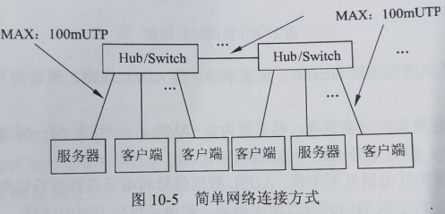
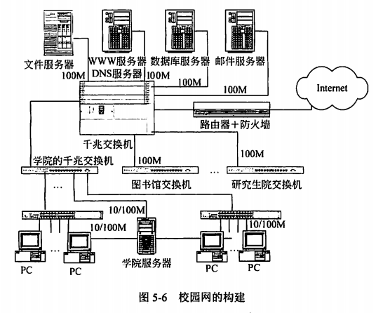
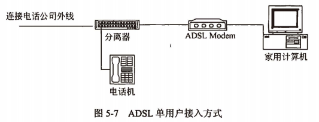
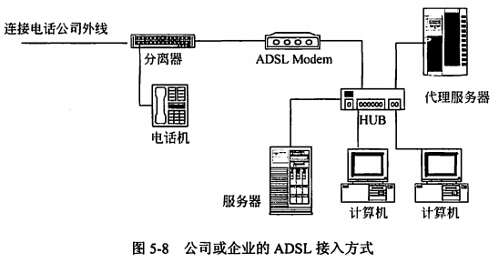

title:: 网络与信息安全基础知识/网络互联硬件/组建网络
alias:: 组建网络

- 在一个局域网中，其基本组成部件为服务器、客户端、网络设备、通信介质和网络软件等。
	- **服务器**（Server）。局域网的核心，根据它在网络中的作用，还可进一步分为文件服务器、打印服务器和通信服务器。
	- **客户端**（Client）。客户端又称为用户工作站，是用户与网络应用接口设备。
	- **网络设备**。主要指一些硬件设备，如网卡、收发器、中继器、集线器、网桥和路由器等。**网卡**是一种必不可少的网络设备，常用的网卡有Ethernet（以太网）网卡、ARCNET网卡、ESIA总线网网卡和Token-Ring网卡等。
	  id:: 6274c8a6-f976-4c1a-9578-a1fa14914eec
	- **通信介质**。数据的传输媒体。不同的通信介质有着不同的传输特性。
	- **网络软件**。网络软件主要包括底层协议软件、网络操作系统（NOS）等。**底层协议软件**是由一组标准规则及软件构成，以使实体间或网络之间能够互相进行通信。**网络操作系统**主要对整个网络的资源和运行进行管理，并为用户提供应用接口。
	- 【例10.1】为了将两个相信办公室的多台计算机连接成一个局域网，以方便传输文件、共享资源，最简单的连接方式如图10-5所示。
		- {:height 210, :width 431}
		- 可以采用集线器将两个办公室的多台计算机连接成一个局域网，如果感觉速度较慢，可将Hub换成交换机（Switch），构成树形或总线和星型结合的拓扑结构；传输介质采用五类以上的非屏蔽双绞线，使用RJ45连接Hub与计算机；网卡采用10/100M自适应的以太网卡；协议使用TCP/IP、NETBIEU或其他协议。该网络安装和维护简单易行，且费用低廉，计算机和Hub之间的最大UTP电缆长度为100m，两个计算机之间（即端-端）最多允许有4个Hub和5个电缆段，即最大网络长度为500m。
		  ((6274c8a3-e16c-4889-b9b6-d279a30b2e93))
	- 【例10.2】某学校建设高速信息网络，网络主干中心为千兆以太网的光纤局域网，连接各学院、系、图书馆等信息网，并接入Internet，以便实现各级各类网络的互连互通，为学校的各级单位、教师、学生提供方便、快捷的信息与教学服务，从而有效地为科研、教学服务，提高学校的整体水平。网络的构建如图所示。
		- 
	- 【例10.3】某家庭想连接Internet，决定申请一条ADSL线路，通过拨号来连接Internet，原因如下。
		- > 1. ADSL具有很高的传输速率，其下行为2~8Mbps，上行为64~640Kbps，为普通拨号Modem的百倍以上，也是宽带上网中速度较高的一种。
		  > 2. ADSL上网和打电话互不干扰，ADSL数据信号和电话音频信号以频分利用原理调制，各自频段互不干扰，在上网的同时可以使用电话，避免了拨号上网的烦恼。
		  > 3. ADSL独享带宽、安全可靠，其他宽带方式虽然在速度方面有超过它的，但有的是属于共享带宽方式，例如Cable Modem下行可达到20Mbps，但它是一种粗糙的总线型广播网络，成千上万用户争抢20Mbps的带宽，而非独享，更为严重的是，它属于总线型的网络，先天的广播特性造成了信息传输的不安全性。ADSL利用中国电信深入千家万户的电话网络，先天形成星型结构的网络拓扑构造，骨干网络采用遍布全城、全国的光纤传输，独享2~8Mbps带宽，信息传递快速、可靠安全。
		  > 4. ADSL费用低廉，虽然电话线同时传递电话语音和数据，但数据并不通过电话交换机，因此不用拨号，一直在线，属于专线上网方式。这意味着使用ADSL上网不需要缴纳拨号上网的电话费用。另一方面，不需要对原有电话线路进行改造，用户端不需要购买价格昂贵的设备，只需一个现在相当普及的ADSL Modem即可，相对来说投资较少。
		  > 5. ADSL能提供真正的视频点播（VOD）、网上游戏、交互电视和网上购物等宽带多媒体服务，远程LAN接入、远地办公室、在家工作等高速数据应用，远程医疗、远程教学、远地可视会议、体育比赛现场实时传送等。
		- ADSL连接Internet的方式有两种：专线接入和虚拟拨号接入。采用虚拟拨号方式的用户采用类似Modem和ISDN的拨号程序，在使用习惯上与原来的方式没什么不同。采用专线接入的用户只要开机即可接入Internet。
		- 使用ADSL上网所需的设备包括一块网卡和ADSL Modem。当然，家用计算机是必需的。连接方式如图所示。
		- 
	- 如果不是家庭，而是公司或企业，则局域网通过ADSL接入Internet，其接入方法有如下两种。
		- > 1. 将直接通过ADSL连上网的那台主机设置成代理服务器，然后本地局域网上的客户端通过该代理服务器访问外部信息资源。这种方法的好处是需要申请一个账号或一个IP地址，本地客户端可采用保留IP地址。
		  > 2. 采用专线方式，为局域网上的每台计算机向电话局申请一具IP地址。这种方法的好处是无须设置一台专用的代理服务网关，缺陷是目前对一条ADSL线路只能提供最多8个IP地址给局域网。
		- 通过代理服务器将对公司或企业接入Internet的方式如图所示。
		  
	- 在连接时需要注意的问题如下。
		- > 1. 接口方式。有以太网、USB和PCI3种。USB、PCI适用于家庭用户，性价比好，小巧、方便、实用；外置以太网口的产品只适用于企业和办公室的局域网，它可以带多台机器进行上网。有的以太网接口的ADSL Modem同时具有桥接和路由功能。
		  > 2. 分离器。使上网和打电话互不干扰。
		  > 3. 支持的协议。ADSL Modem上网拨号方式有3种，即专线方式（静态IP）、PPPoA和PPPoE。普通用户多采用PPPoE（Point-to-Point Protocol over Ethernet）或PPPoA（Point-to-Point Protocol over ATM）虚拟拨号的方式上网。