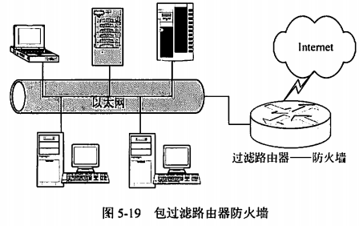
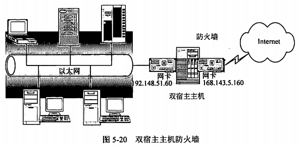
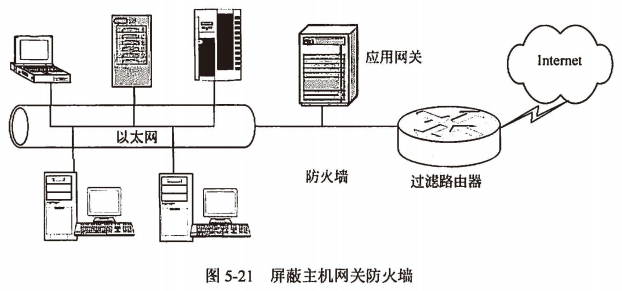
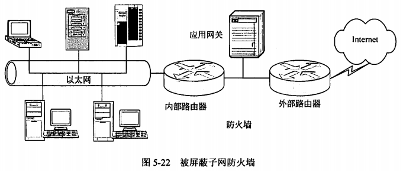

title:: 网络与信息安全基础知识/网络安全概述
alias:: 网络安全概述

- ## 网络安全威胁
	- 非授权访问。
	- 信息泄露或丢失。
	- 破坏数据完整性。
	- 拒绝服务攻击。
	- 利用网络传播病毒。
- ## 网络安全控制技术
	- 防火墙技术。
	- 加密技术。
	- 用户识别技术。
	- 访问控制技术。
	- 网络反病毒技术。
	- 网络安全漏洞扫描技术。
	- 入侵检测技术。
- ## 防火墙技术
	- 所谓**防火墙**（Firewall），是建立在内外网络边界上的过滤封锁机制，它认为内部网络是安全和可依赖的，而外部网络被认为是不安全和不可依赖的。防火墙的作用是防止不希望的、未经授权的数据包进出被保护的内部网络，通过边界控制强化内部网络的安全策略。它的实现有多种形式，但原理很简单，可以把它想象为一对开关，其中一个用来阻止传输，另一个用来允许传输。防火墙作为网络安全体系的基础和核心控制设备，贯穿于受控网络通信主干线，对通过受控干线的任何通信行为进行安全处理，如控制、审计、报警和反应等，同时也承担着繁重的通信任务。由于其自身处于网络系统中的敏感位置，自身还要面对各种安全威胁，因此，选用一个安全、稳定和可靠的防火墙产品，其重要性不言而喻。
	- 在网络层，防火墙被用来处理信息在内外网络边界的流动，它可以确定来自哪些地址的信息可以通过或者禁止哪些目的地址的主机。在传输层，这个连接可以被端到端的加密，也就是进程到进程的加密。在应用层，它可以进行用户级的身份认证、日志记录和账号管理等。因此，防火墙技术简单来说，就是一套身份认证、日志记录和账号管理等。因此，防火墙技术简单来说，就是一套身份认证、加密、数字签名和内容检查集成为一体的安全防范措施。所有来自Internet的传输信息和内部网络发出的传输信息都要穿过防火墙，由防火墙进行分析，以确保它们符合站点设定的安全策略，以提供一种内部节点或网络与Internet的安全屏障。
	- ### 防火墙的分类
		- 防火墙技术经历了包过滤、应用代理网关和状态检测三个发展阶段。包过滤型的防火墙通常直接转发报文，它对用户完全透明，速度较快；应用代理网关防火墙是通过服务器建立连接的，可以有更强的身份验证和注册功能；状态检测防火墙是在其核心部分建立状态连接表，并将进出网络的数据当成一个个的会话，利用状态表跟踪每一个会话状态。状态检测对每一个包的检查不仅根据规则表，更考虑了数据包是否符合会话所处的状态，因此提供了完整的对传输层的控制能力。
		- #### 包过滤防火墙
			- 一般有一个**包检查块**（通常称为包过滤器），数据包过滤可以根据数据包头中的各项信息来控制站点与站点、站点与网络、网络与网络之间的相互访问，但无法控制传输数据的内容，因为内容是应用层数据，而包过滤器处在网络层和数据链路层（即TCP和IP层）之间。通过检查模块，防火墙能够拦截和检查所有出站和进站的数据，它首先打开包，取出包头，根据包头的信息确定该包是否符合包过滤规则，并进行记录。对于不符合规则的包，应进行报警并丢弃该包。
			- 包过滤防火墙工作在网络层，==对数据包的源及目的IP具有识别和控制作用==，对于传输层，也只能识别数据包是TCP还是UDP及所用的端口信息。由于只对数据包的IP地址、TCP/UDP协议和端口进行分析，如果一条规则阻止包传输或接收，则此包便不被允许通过，否则该包可以被继续处理。包过滤防火墙的处理速度较快，并且易于配置。
			- 包过滤防火墙的优点是防火墙对每条传入和传出网络的包实行低水平控制；每个IP包的字段都被检查，例如源地址、目的地址、协议和端口等；防火墙可以识别和丢弃带欺骗性源IP地址的包；包过滤防火墙是两个网络之间访问的唯一来源；包过滤通常被包含在路由器数据包中，所以不必额外的系统来处理这个特征。
			- 包过滤防火墙的缺点是不能防范黑客攻击，因为网管不可能区分出可信网络与不可信网络的界限；不支持应用层协议，因为它不认识数据包中的应用层协议，访问控制粒度太粗糙；不能处理新的安全威胁。
		- #### 应用代理网关防火墙
			- 应用代理网关防火墙彻底隔断内网与外网的直接通信，内网用户对外网的访问变成防火墙对外网的访问，然后再由防火墙转发给内网用户。所有通信都必须经应用层代理软件转发，访问者任何时候都不能与服务器建立直接的TCP连接，应用层的协议会话过程必须符合代理的安全策略要求。
			- 应用代理网关的优点是可以检查应用层、传输层和网络层的协议特征，对数据包的检测能力比较强。其缺点如下：
				- 难于配置。由于每个应用都要求单独的代理进程，这就要求网管能理解每项应用协议的弱点，并能合理地配置安全策略。由于配置繁琐，难于理解，容易出现配置失误，最终影响内网的安全防范能力。
				- 处理速度非常慢。断掉所有的连接，由防火墙重新建立连接，理论上可以使应用代理防火墙具有极高的安全性。但是实际应用中并不可行，因为对于内网的那个Web访问请求，应用代理都需要开一个单独的代理进程，它要保护内网的Web服务器、数据库服务器、文件服务器、邮件服务器及业务程序等，这就需要建立一个个的服务代理，以处理客户端的访问请求。这样，应用代理的处理延迟会很大，内网用户的正常Web访问不能及时得到响应。
			- 总之，应用代理防火墙不能支持大规模的并发连接，对速度要求高的行业不能使用这类防火墙。另外，防火墙核心要求预先内置一些已知应用程序的代理，使得一些新出现的应用在代理防火墙内被无情地阻断，不能很好地支持新应用。
		- #### 状态检测技术防火墙
			- 状态检测技术防火墙结合了代理防火墙的安全性和包过滤防火墙的高速度等优点，在不损失安全性的基础上将代理防火墙的性能提高了10倍。
			- Internet上使用的是TCP/IP，TCP的每个可靠连接均需要经过“==客户端同步请求==“、”==服务器应答==”和“==客户端再应答==”三次握手。例如，最常用到的Web浏览、文件下载和收发邮件等都要经过这三次握手。这反映出数据包并不是独立的，而是前后之间有着密切的状态联系，基于这种状态变化，引出了状态检测技术。
			- 状态检测防火墙摒弃了包过滤防火墙仅考查数据包的IP地址等几个参数，而不关心数据包连接状态变化的缺点，在防火墙的核心部分建立状态连接表，并将进出网络的数据当成一个个的会话，==利用状态表跟踪每一个会话状态==。状态检测对每一个包的检查不仅根据规则表，更考虑了数据包是否符合会话所处的状态，因此提供了完整的对传输层的控制能力。状态检测防火墙在提高安全防范能力的同时也改进了流量处理速度。因为它采用了一系列优化技术，使防火墙性能大幅度提升，能应用在各类网络环境中，尤其是在一些规则复杂的大型网络上。
	- ### 典型防火墙的体系结构
		- 一个防火墙系统通常是由过滤路由器和代理服务器组成。过滤路由器是一个多端口的IP路由器，它能够拦截和检查所有出站和进站的数据。它首先打开IP包，取出包头，根据包头的信息（如IP源地址、IP目标地址）确定该包是否符合包过滤规则（如对包报头进行语法分析，阻止或允许包传输或接收），并进行记录。对于符合规则的包，则应该进行转发，否则应进行报警并丢弃该包。代理服务防火墙使用了与包过滤器不同的方法。代理服务器使用一个客户程序与特定的中间节点（防火墙）连接，然后中间节点与期望的服务器进行实际连接。与包过滤器所不同的是，使用这种类型的防火墙，内部与外部网络之间不存在直接连接。因此，即使防火墙发生了问题，外部网络也无法获得与被保护网络的连接。代理提供了详细的注册及审计功能，这大大提高了网络的安全性，也为改进现有软件的安全性能提供了可能。它是基于特定协议的，如FTP、HTTP等。为了通过代理支持一个新的协议，必须改进代理服务器以适应新协议。典型防火墙的体系结构包括包过滤路由器、双宿主主机、被屏蔽主机和被屏蔽子网等类型。
		- #### 包过滤路由器
			- 包过滤路由器又称屏蔽路由器，是最简单也是最常用的防火墙。它一般作用在网络层，对进出内部网络的所有信息进行分析，并按照一定的安全策略（过滤规则）对进出内部网络的所有信息进行限制。包过滤的核心就是安全策略，即包过滤算法的设计。包过滤型防火墙往往可用一台过滤路由器来实现，对所接收的每个数据包作允许拒绝的决定。如图5-19所示。
			  {:height 260, :width 410}
			- 采用包过滤路由器的防火墙优点在于速度快、实现方便。缺点是安全性能差；不同操作系统环境下TCP和UDP端口号所代表的应用服务协议类型有所不同，故兼容性差；没有或只有较少的日志记录能力。
		- #### 双宿主主机
			- 双宿主主机结构是围绕着至少具有两个网络接口的双宿主主机（又称**堡垒主机**）而构成的，每一个接口都连接在物理和逻辑上分离的不同网段，代理服务器软件在双宿主主机上运行，如图5-20所示。双宿主主机内外的网络均可与双宿主主机实施通信，但内外网络之间不可直接通信，内外网络之间的IP数据流被双宿主主机完全切断。主机结构采用主机取代路由器执行安全控制功能，受保护网除了看到堡垒主机外，不能看到其他任何系统。同时，堡垒主机不转发TCP/IP通信报文，网络中的所有服务必须由此主机的相应代理程序来支持。
			  {:height 268, :width 533}
			- 双宿主主机防火墙的优点是堡垒主机运行的系统软件可用于维护系统日志、硬件备份日志和远程日志等，有利于网络管理员的日后检查。其缺点是由于双宿主主机是唯一隔开内部网和外部因特网之间的屏障，若入侵者得到了双宿主主机的访问权，内部网络就会被入侵，所以为了保证内部网的安全，双宿主主机首先要禁止网络层的路由功能，还应具有强大的身份认证系统，尽量减少防火墙上用户的账户数。
		- #### 屏蔽主机网关
			- 屏蔽主机网关防火墙是由过滤路由器和应用网关组成。过滤路由器的作用是进行包过滤；应用网关的作用是代理服务，即在内部网络与外部网络之间建立两道安全屏障。屏蔽主机网关防火墙的结构如图5-21所示。
			  {:height 255, :width 542}
			- 对于这种防火墙每户，堡垒主机配置在内部网络上，而包过滤路由器则放置在内部网络和Internet之间。在路由器上进行规则配置，使得外部系统只能访问堡垒主机，去往内部系统上其他主机的信息全部被阻塞。由于内部主机与堡垒主机处于同一个网络，内部系统是否允许直接访问Internet，或者是要求使用堡垒主机上的代理服务来访问Internet由机构的安全策略来决定。对路由器的过滤规则进行配置，使得其只接受来自堡垒主机的内部数据包，就可以强制内部用户使用代理服务。
			- 屏蔽主机网关防火墙的优点是安全等级较高。可以提供公开的信息服务的服务器，如Web、FTP等，可以放置在由包过滤路由器和堡垒主机共用的网段上。如果要求有特别高的安全特性，可以让堡垒主机运行代理服务，使得内部和外部用户在与信息服务器通信之前，必须先访问堡垒主机。如果较低的安全等级已经足够，则将路由器配置为让外部用户直接去访问公共的信息服务器。缺点是配置工作复杂。过滤路由器是否正确配置是这种防火墙安全与否的关键，过滤路由器的路由表应当受到严格的保护，否则如果遭到破坏，则数据包就不会被路由到堡垒主机上。
		- #### 被屏蔽子网
			- 被屏蔽子网防火墙系统是由两个包过滤路由器和一个应用网关（堡垒主机）组成。包过滤路由器分别位于周边网与内部网、周边网与外部网之间，而应用网关居于两个包过滤路由器的中间，形成了一个“**非军事区（DMZ）**”，建立了一个最安全的防火墙系统。如图5-22所示。
			  {:height 254, :width 584}
			- 对于进来的信息，外面的这个路由器用于防范通常的外部攻击（如源地址欺骗和源路由攻击），并管理Internet到DMZ网络的访问。它只允许外部系统访问堡垒主机（还可能有信息服务器）。里面的这个路由器提供第二层防御，只接受源于堡垒主机的数据包，负责的是管理DMZ到内部网络的访问。对于去往Internet的数据包，里面的路由器管理内部网络到DMZ网络的访问。它允许内部系统只访问堡垒主机（还可能有信息服务器）。外面的路由器上的过滤规则要求使用代理服务（只接受来自堡垒主机的去往Internet的数据包）。
			- 被屏蔽子网防火墙系统的优势如下：
			  > 1. 入侵者必须突破三个不同的设备（外部路由器、堡垒主机和内部路由器）才能侵袭内部网络。
			  > 2. 由于外部路由器只能向Internet通告DMZ网络的存在，Internet上的系统不需要有路由器与内部网络相对。这样，网络管理员就可以保证内部网络是“不可见”的，并且只有在DMZ网络上选定的系统才对Internet开放。
			  > 3. 由于内部路由器只向内部网络通告DMZ网络的存在，内部网络上的系统不能直接通往Internet，这样就保证了内部网络上的用户必须通过驻留在堡垒主机上的代理服务才能访问Internet。
			  > 4. 包过滤路由器直接将数据引向DMZ网络上所指定的系统，消除了堡垒主机双宿的必要。
			  > 5. 内部路由器在作为内部网络和Internet之间最后的防火墙系统时，能够支持比双宿堡垒主机更大的数据包吞吐量。
			  > 6. 由于DMZ网络是一个与内部网络不同的网络，NAT可以安装在堡垒主机上，从而避免在内部网络上重新编址或重新划分子网。
- ## 入侵检测与防御
	- **入侵检测系统**（Instruction Detection System，IDS）作为防火墙之后的第二道安全屏障，通过从计算机系统或网络中的若干关键点收集网络的安全日志、用户的行为、网络数据包和审计记录等信息并对其进行分析，从中检查是否有违反安全策略的行为和遭到入侵攻击的迹象，入侵检测系统根据检测结果，自动做出响应。IDS的主要功能包括对用户和系统行为的监测与分析、系统安全漏洞的检查和扫描、重要文件的完整性评估、、已知攻击行为的识别、异常行为模式的统计分析、操作系统的审计跟踪，以及违反安全策略的用户行为的检测等。入侵检测通过实时地监控入侵事件，在造成系统损坏或数据丢失之前阻止入侵者进一步的行动，使系统能尽可能的保持正常工作。与此同时，IDS还需要收集有关入侵的技术资料，用于改进和增强系统抵抗入侵的能力。
	- **入侵防御系统**是在入侵检测系统的基础上发展起来的，入侵防御系统不仅能够检测到网络中的攻击行为，同时主动的对攻击行为能够发出响应，对攻击进行防御。