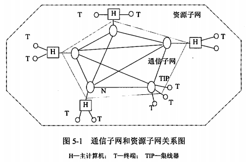

title:: 网络与信息安全基础知识/网络概述/计算机网络的概念
alias:: 计算机网络的概念

- ## 计算机网络的发展
	- 计算机网络是计算机技术与通信技术日益发展和密切结合的产物，它的发展过程大致可以划分为如下4个阶段。
	- ### 具有通信功能的单机系统
		- 该系统又称终端——计算机网络，是早期计算机网络的主要形式。它将一台计算机经通信线路与若干终端直接相连。美国于20世纪50年代建立的半自动地面防空系统SAGE就属于这一类网络。它把远距离的雷达和其他测量控制设备的信息通过通信线路送到一台旋风型计算机上进行处理和控制，首次实现了计算机技术与通信技术的结合。
	- ### 具有通信功能的多机系统
		- 对终端——计算机网进行改进：在主计算机的外围增加了一台计算机，专门用于处理终端的通信信息及控制通信线路，并能对用户的作业进行某些预处理操作，这台计算机称为“前端处理机”或“通信控制处理机”。在终端设备较集中的地方设置一台集中器，终端通过低速线路先汇集到集中器上，然后再用高速线路将集中器连到主机上。这就形成了多机系统。
	- ### 以共享资源为目的的计算机网络
		- 具有通信功能的多机系统是计算机——计算机网络，它是由若干台计算机互联的系统，即利用通信线路将多台计算机连接起来，在计算机之间进行通信。该网络有两种结构形式：一种形式是主计算机通过通信线路直接互连的结构，其中主计算机同时承担数据处理和通信工作；另一种形式是通过通信控制处理机间接地把各主计算机连接的结构，其中通信处理机和主计算机分工，前者负责网络上各主计算机间的通信处理和控制，后者是网络资源的拥有者，负责数据处理，它们共同组成资源共享的计算机网络。20世纪70年代，美国国防部高级研究计划局所研制的ARPANET是计算机——计算机网络的典型代表。最初该网仅由4台计算机连接而成，到1975年，已连接100多台不同型号的大型计算机。ARPANET成为第一个完善地实现分布式资源共享的网络，为计算机网络的发展奠定了基础。
		- 在这期间，国际标准化组织（ISO）提出了开放系统互连参考模型OSI/RM（Open System Interconnection Reference Model）。该模型定义了异种机联网所应遵循的框架结构。OSI/RM很快得到了国际上的认可，并为许多厂商所接受。由此使计算机网络的发展进入了新的阶段。
	- ### 以局域网及因特网为支撑环境的分布式计算机系统
		- 局域网是继远程网之后发展起来的，它继承了远程网的分组交换技术和计算机的I/O总线结构技术。局域网的发展也促使计算机网络的模式发生了变革，即由早期的以大型机为中心的集中式模式转变为由微机构成的分布式计算机模式。
		- 计算机网络的定义随网络技术的更新可从不同的角度给予描述。目前人们已公认的有关计算机网络的定义是利用通信设备和线路将地理位置分散的、功能独立的自主计算机系统或由计算机控制的外部设备连接起来，在网络操作系统的控制下，按照约定的通信协议进行信息交换，实现资源共享的系统。
		- 定义中涉及的“资源”应该包括硬件资源（CPU、大容量的磁盘、光盘以及打印机等）和软件资源（语言编译器、文本编辑器、各种软件工具和应用程序等）。
- ## 计算机网络的功能
	- 计算机网络提供的主要功能有如下：
		- ==数据通信==。通信或数据传输是计算机网络主要功能之一，用以在计算机系统之间传送各种信息。利用该功能，地理位置分散的生产单位和业务部门可通过计算机网络连接在一起进行集中控制和管理。也可以通过计算机网络传送电子邮件，发布新闻消息及进行电子数据交换，极大地方便了用户，提高了工作效率。
		- ==资源共享==。资源共享是计算机网络最有吸引力的功能。通过资源共享，可使网络中分散在异地的各种资源互通有无，分工协作，从而大大提高系统资源的利用率。资源共享包括软件资源共享和硬件资源共享。
		- ==负载均衡==。在计算机网络中可进行数据的集中处理或分布式处理，一方面可以通过计算机网络将不同地点的主机或外设采集到的数据送往一台指定的计算机，在此计算机上对数据进行集中和综合处理，通过网络在各计算机之间传送原始数据和计算结果；另一方面，当网络中某台计算机任务过重时，可将任务分派给其他空闲的多台计算机，使多台计算机相互协作，均衡负载，共同完成任务。
		- ==高可靠性==。指在计算机网络中的各台计算机可以通过网络彼此互为后备机，一旦某台计算机出现故障，故障机的任务就可由其他计算机代为处理，从而提高系统的可靠性。避免了单机无后备使用的情况下，计算机出现故障而导致系统瘫痪的现象，从而大大提高了系统的可靠性。
	- 计算机网络按照数据通信和数据处理的功能，可分为两层；内层通信子网和外层资源子网，如图5-1所示。**通信子网**（虚线内）的节点计算机和高速通信线路组成独立的数据系统，承担全网的数据传输、交换、加工和变换等通信处理工作，即将一台计算机的输出信息传送给另一台计算机。**资源子网**（图中点划线内虚线外）包括计算机、终端、通信子网接口设备、外部设备（如打印机、磁带机和绘图机等）及各种软件资源等，它负责全网的数据处理和向网络用户提供网络资源及网络服务。
	  {:height 288, :width 431}
	- 通信子网和资源子网的划分，完全符合国际标准化组织所制定的==开放式系统互连参考模型==（OSI）的思想。其中，通信子网对应于OSI中的低三层（物理层、数据链路层、网络层），而资源子网对应于OSI中的高三层（会话层、表示层、应用层）。这种划分将通信子网的任务从主机中抽取出来，由通信子网中的设备专门解决数据传输和通信控制问题。而资源子网中的计算机可集中精力处理数据，从而提高主机效率和网络的整体性能。