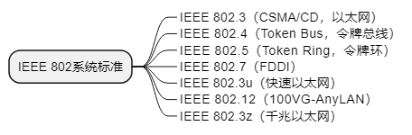
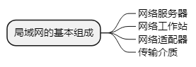
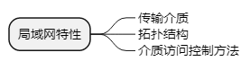
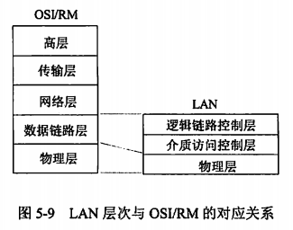
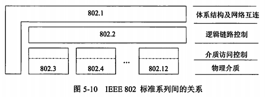

alias:: 局域网协议

- IEEE局域网标准委员会对局域网的定义为：“局域网络中的通信被限制在中等规模的地理范围内，如一所学校；能够使用具有中等或较高数据速率的物理信道，且具有较低的误码率；局域网络是专用的，由单一组织机构所使用。”局域网技术由于具有规模小、组网灵活和结构规整的特点，因此极易形成标准。事实上，局域网技术也是在所有计算机网络技术中标准化程序最高的一部分。国际电子电气工程师协议早在20世纪70年代就制定了三个局域网：IEEE 802.3（CSMA/CD，**以太网**）、IEEE 802.4（Token Bus，**令牌总线**）和IEEE 802.5（Token Ring，**令牌环**）。由于它已被市场广泛接受，因此IEEE 802系统标准已被ISO采纳为国际标准。而且，随着网络技术的发展，又出现了IEEE 802.7（**FDDI**）、IEEE 802.3u（**快速以太网**）、IEEE 802.12（**100VG-AnyLAN**）和IEEE 802.3z（**千兆以太网**）等新一代网络标准。
  
- 一个局域网的基本组成主要有网络服务器、网络工作站、网络适配器和传输介质。这些设备在特定网络软件支持下完成特定的网络功能。决定局域网特性的主要技术有三个方面：用以传输数据的==传输介质==；用以连接各种设备的==拓扑结构==；用以共享资源的==介质访问控制方法==。它们在很大程度上决定了传输数据的类型、网络的响应时间、吞吐量和利用率，以及网络应用等各种网络特性。不同的局域网协议最重要的区别是介质访问控制方法，它对网络特性具有十分重要的影响。
   
  
- ## LAN模型
	- IOS/OSI的7层参考模型本身不是一个标准，在制定具体网络协议和标准时，要依**OSI/RM参考模型**作为“参照基准”，并说明与该“参照基准”的对应关系。在IEEE 802局域网（LAN）标准中，只定义了物理层和数据链路层两层，并根据LAN的特点，把数据链路层 ((6237bf95-5a19-4502-845f-326a4aa6a915)) 分成**逻辑链路控制**（Logical Link Control，LLC）子层和**介质访问控制**（Medium Access Control，MAC）子层。还加强了数据链路层的功能，把网络层中的==寻址==、==排序==、==流控==和==差错控制==等功能放在LLC子层来实现。图5-9为LAN协议的层次以及与OSI/RM参考模型的对应关系。
	  {:height 216, :width 264}
	- ### 物理层
		- 和OSI物理层的功能一样，主要处理在物理链路上发送、传递和接收非结构化的比特流，包括对带宽的频道分配和对基带的信号调制、建立、维持、撤销物理链路，处理机械的、电气的和过程的特性。其特点是可以采用一些特殊的通信媒体，在信息组成的格式上可以有多种。
	- ### MAC
		- 主要功能是==控制对传输介质的访问==，MAC与网络的具体==拓扑方式==以及==传输介质的类型==有关，主要是==介质的访问控制==和对==信道资源的分配==。MAC层还实现帧的寻址和识别，完成帧检测序列产生和检验等功能。
	- ### LLC
		- 可提供两种控制类型，即面向连接服务和非连接服务。其中，==面向连接服务==能够提供可靠的信道。逻辑链路层提供的主要功能是数据帧的封装和拆除，为高层提供网络服务的逻辑接口，能够实现差错控制和流量控制。
	- 在计算机网络体系结构中，最具代表性和权威的是ISO的OSI/RM和IEEE的802协议。OSI是设计和实现网络协议标准的最重要的参考模型和依据，而IEEE 802则制定了一系列具体的局域网标准，并不断地增加新的标准，它们之间的关系如图5-10所示。
	  {:height 160, :width 423}
- ## 以太网
	- **IEEE 802.3**标准，以太网技术可以说是局域网技术中历史最悠久和最常用的一种。它采用的“存取方法”是带冲突检测的载波监听多路访问协议（Carrier-Sense Multiple Access with Collision Detection，CSMA/CD）技术。
	- 目前以太网主要包括三种类型：**IEEE 802.3** 中定义的==标准局域网==，速度为10Mb/s，传输介质为==细同轴电缆==；**IEEE 802.3u**中定义的==快速以太网==，速度为100Mb/s，传输介质为==双绞线==；**IEEE 802.3z**中定义的==千兆以太网==，速度为1000Mb/s，传输介质为==光纤==或==双绞线==。
	- ### 介质访问技术
		- IEEE 802.3所使用的介质访问协议CSMA/CD是让整个网络上的主机都以竞争的方式来抢夺传送数据的权力。工作过程为：首先侦听信道，如果信道空闲，则发送；如果信道忙，则继续侦听，直到信道空闲时立即发送。开始发送后再进行一段时间的检测，方法是边发送边接收，并将收、发信息相比较，若结果不同，表明发送的信息遇到碰撞，于是立即停止发送，并向总线上发出一串阻塞信号，通知信道上各站冲突已发生。已发出信息的各站收到阻塞信号后，等待一段随机时间，等待时间最短的站将重新获得信道，可重新发送。
		- 在CSMA/CD中，当检测到冲突并发出阻塞信号后，为了降低再次冲突概率，需要等待一个退避时间。退避算法有许多种，常用的一种通用退避算法称为二进制指数退避算法。
	- ### IEEE 802.3——10Mb/s以太网
		- IEEE 802.3——10Mb/s以太网定义过10Base 5、10Base 2、10Base-T和10Base-F等几种（需要注明的是，其中10Base-T与10Base-F的最后一项就是以线缆类型进行命名的，其中**T**代表==双绞线==，**F**代表==光纤==）。**10base 5**标准是最早的媒体规范，它使用阻抗为50 $$\Omega$$ 的同轴粗缆。但由于同轴粗缆的缆线直径大，所以比较笨重，不易铺设。**10Base 2**标准是为建立一个比10Base 5更廉价的局域网，它使用阻抗为50 $$\Omega$$ 的同轴细缆，唯一的差别就是它使得每两个节点间的距离限制从500m降为185m。**10Base-T**标准是一个使用非屏蔽双绞线为传输介质的标准，所要用到的非屏蔽双绞线只需3类线标准即可满足要求，是一个成功的标准。**10Base-F**标准充分利用了新兴媒体光纤的距离长、传输性能好的优点，大大改进了以太网技术。
	- ### IEEE 802.3u——100Mb/s快速以太网
	- ### IEEE 802.3z——1000Mb/s千兆以太网
		- 在物理层，千兆以太网支持如下三种传输介质。
		  > 1. ==光纤系统==。支持多模光纤和单模光纤系统，多模光纤的工作距离为500m，单模光纤的工作距离为2000m。
		  > 2. ==宽带同轴电缆系统==。其传输距离为25m。
		  > 3. ==5类UTP电缆==。其传输距离为100m，链路操作模式为半双工。
		- 千兆位以太网采用以交换机为中心的星型拓扑结构，主要用于交换机与交接机之间或者交换机与企业超级服务器之间的高速网络连接。
- ### 令牌环网(IEEE 802.5)
	- 令牌环是**环型网**中最普遍采用的介质访问控制，它适用于环型网络结构的分布式介质访问控制，其流行性仅次于以太网。令牌环网的传输介质虽然没有明确定义，但主要基于屏蔽双绞线和非屏蔽双绞线两种，拓扑结构可以有多种，如环型（最典型）、星型（采用的最多）和总线型（一种变形）。编码方法为差分曼彻斯特编码。
	- IEEE 802.5的介质访问使用的是==令牌环控制技术==，工作过程为：首先，令牌环网在网络中传递一个很小的帧，称为“令牌”，只有拥有令牌环的工作站才有权力发送信息。令牌在网络上依次顺序传递。当工作站要发送数据时，等待捕获一个空令牌，然后将要发送的信息附加到后边，发往下一站，如此直到目标站。然后将令牌释放。如果工作站要发送数据时，经过的令牌不是空的，则等待令牌释放。
- ## FDDI
	- FDDI（Fiber Distributed Data Interface，光纤分布式数据接口）类似令牌环网的协议，它用光纤作为传输介质，数据会传速可达到100Mb/s，环路长度可扩展到200km，连接的站点数可以达到1000个。FDDI采用一种新的编码技术，称为4B/5B编码，即每次对4位数据进行编码。每4位数据编码成5位符号，用光信号的存在或不存在来代表5位符号中的每一位是1还是0.
	- 光纤中传送的是光信号，有光脉冲表示1，无光脉冲表示0.这种简单编码的缺点是没有同步功能。在同轴电缆或双绞线作为传输介质的局域网中，通常采用曼彻斯特编码方式。它利用中间的跳变作为同步信号。这样对每一位数据单元产生两次，使带宽的利用率降低。5位编码的32种组合中，实际只使用了24种，其中的16种用来做数据，其余8种用来做控制符号（如帧的起始和结束符号等）。4B/5B编码中，5位码中的“1”码至少为2位，按NRZI编码原理，信号中就至少有两次跳变，因此接收端可得到足够的同步信息。
	- FDDI采用双环体系结构，两环上的信息反方向流动。双环中的一环称为主环，另一环称为次环。在正常情况下，主环传输数据，次环处于空闲状态。双环设计的目的是提供高可靠性和稳定性。FDDI定义的传输介质有单模光纤和多模光纤两种。
- ## 无线局域网
	- 带冲突避免的**载波侦听多路访问方法**（CSMA/CA）。1.在802.11中侦听载波是由两种方式来实现的，一个是实际去听是否有电波在传，然后加上优先权控制；另一个是虚拟的侦听载波，告知大家待会有多久的时间我们要传东西，以防止冲突。