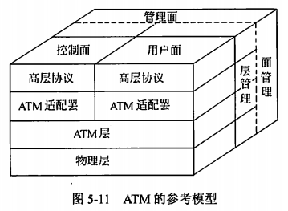
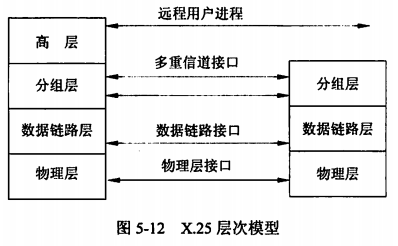

alias:: 广域网协议

- 广域网通常是指覆盖范围大，传输速率低，以数据通信为主要目的的数据通信网。随着信息技术的迅速发展，很多国家的数据通信业务的增长率已大大提高，特别是国际互联网的普及促进了数据通信网技术的发展。
- 在地域分布很远、很分散，以至于无法用直接连接来接入局域网的场合，广域网（WAN）通过专用的或交换式的连接把计算机连接起来。这种广域连接可以是通过公众网建立的，也可以是通过服务于某个专业部门的专用网建立起来。相对来说，广域网显得比较错综复杂，目前主要用于广域传输的协议比较多，例如PPP（点对点协议）、DDN、ISDN（综合业务数字网）、FR（帧中继）和ATM（异步传输模式）等。
- ## 1. 点对点协议(PPP)
	- 点对点协议主要用于“拨号上网”这种广域连接模式。它的优点在于简单、具备用户验证能力、可以解决IP分配等。它主要通过拨号或专线方式建立点对点连接发送数据，使其成为各种主机、网桥和路由器之间简单连接的一种通用的解决方案。
	- 家庭拨号上网就是通过PPP在用户端和运营商的接入服务器之间建立通信链路。目前，宽带接入正在取代拨号上网，在宽带接入技术日新月异的今天，PPP也衍生出新的应用。典型的应用是在**ADSL**（Asymmetrical Digital Subscriber Line，非对称数据用户线）接入方式当中，PPP与其他的协议共同派生出了符合宽带接入要求的新的协议，如PPPoE和PPPoA。
	  id:: 6274c8a7-94c7-4db6-a643-b442b519978f
	- 利用以太网（Ethernet）资源，在以太网上运行PPP来进行用户认证接入的方式称为**PPPoE**。PPPoE既保护了用户方的以太网资源，又完成了ADSL的接入要求，是目前ADSL接入方式中应用最广泛的技术标准。同样，在ATM网络上运行PPP来管理用户认证的方式称为**PPPoA**。它与PPPoE的原理相同，作用相同。不同的是，它是在ATM网络上，而PPPoE是在以太网网络上运行，所以要分别适应ATM标准和以太网标准。
	  id:: 6274c8a7-a68c-402e-85e8-3ca0b337e72e
- ## 2. 数字用户线(xDSL)
	- xDSL是各种数字用户线的统称，根据各种宽带通信业务需要，目前还有DSL技术和产品，例如**ADSL**（Asymmetric DSL，不对称数字用户线）、**SDSL**（Single Pair DSL，单对线数字用户环路）、**IDSL**（ISDN DSL，ISDN用的数字用户线）、**RADSL**（Rate Adaptive DSL，速率自适应非对称型数字用户线）和**VDSL**（Very High Bit Rate DSL，甚高速数字用户线）等。
	- ADSL是研制最早、发展较快的一种。它是在一对铜双绞线上为用户提供上、下行非对称的传输速率（即带宽）。ADSL接入服务能做到较高的性能价格比，ADSL接入技术较其他接入技术具有其独特的技术优势：
		- > 1. 它的速率可达到上行1兆/下行8兆，速度非常快。
		  > 2. 另外，使用ADSL上网不需要占用电话线路，在电话和上网互不干扰的同时，大大节省了普通上网方式的话费支出；
		  > 3. 独享带宽安全可靠；
		  > 4. 安装快捷方便；
		  > 5. 价格实惠。
		- 它把线路按频段分成语音、上行和下行三个信道，故语音和数据可共用1对线。ADSL特别适合于像VOD业务及Internet和多媒体业务的应用。ADSL一般采用==CAP==和==DMT==两种线路编码调制技术。传输距离与线径、速率有关，一般在3km以上。因此，ADSL是一种很有发展前途的数字接入技术。ADSL技术作为一种宽带接入方式，可以为用户提供中国电信宽带网的所有应用业务。采用各种拨号方式上网的用户将逐步过渡到ADSL宽带接入方式，ADSL在宽带接入中已经扮演着越来越重要的角色。
	- 对于==个人用户==，在现有电话线上安装ADSL，只需在用户端安装一台==ADSL Modem==和一只==分离器==，用户线路不用任何改动，极其方便。
		- > **数据线路**为：PC -> ADSL Modem -> 分离器 -> 入户接线盒 -> 电话线 -> DSL接入复用器 -> ATM/IP网络；
		  > **语音线路**为：话机 -> 分离器 -> 入户接线盒 -> 电话线 -> DSL接入复用器 -> 交换机。
	- 对于==企业用户==，在现有电话线上安装ADSL和分离器，连接Hub或Switch。
		- > **数据线路**为：PC -> 以太网（Hub或Switch）-> ADSL路由器 -> 分离器 -> 入户接线盒 -> 电话线 -> DSL接入复用器 -> ATM/IP网络；
		  > **语音线路**为：话机 -> 分离器 -> 入户接线盒 -> 电话线 -> DSL接入复用器 -> 交换机。
- ## 3. 数字专线 DDN
	- 数字数据网（Digital Data Network，DDN）是采用数字传输信道传输数据信号的通信网，可提供点对点、点对多点透明传输的数据专线出租电路，为用户传输数据、图像和声音等信息。数字数据网是以光纤为中继干线的网络，组成DDN的基本单位是结点，结点间通过光纤连接，构成网状的拓扑结构。
	- DDN专线就是市内或长途的数据电路，电信部门将它们出租给用户做资料传输使用后，它们就变成了用户的专线，直接进入电信的DDN网络，因为这种电路是采用固定连接的方式，不需要经过交换机房，所以称之为==固定DDN专线==。DDN专线不仅需要铺设专用线路（在DDN的客户端需要一个称为DDN Modem的CSU/DSU设备以及一个路由器）从用户端进入主干网络，而且需要付电信月租费、网络使用费和电路租用费等。其优势是网络传输速率高、时延小、质量好、网络透明度高、可支持任何规程、安全可靠。
- ## 4. 帧中继 FR
	- 帧中继（Frame Relay，FR）是在用户网络接口之间提供用户信息流的双向传送，并保持顺序不变的一种承载业务。用户信息以帧为单位进行传输，并对用户信息流进行统计复用。帧中继是综合业务数字网标准化过程中产生的一种重要技术，它是在数字光纤传输线路逐渐代替原有的模拟线路，用户终端智能化的情况下，由==X25分组交换技术==发展起来的一种传输技术。
	- 帧中继是一种基于==可变帧长==的数据传输网络，在传输过程中，
	  > 网络内部可以采用“帧交换”，即以==帧==为单位进行传送；
	  > 也可采用“信元交换”，即以==信元==（53字节长）为单位进行传送。
	- 帧中继提供一种简单的面向连接的==虚电路分组==服务，包括交换虚电路连接和永久虚电路连接。帧中继的优点有降低网络互联费用、简化网络功能，提高网络性能、采用国际标准、各厂商产品相互兼容等。
- ## 5. 异步传输模式 ATM
	- **异步传输模式**（Asynchronous Transfer Mode，ATM）是==B-ISDN==的关键核心技术，它是一种==面向分组的快速分组交换模式==，使用了==异步时分复用技术==，将信息流分割成固定长度的==信元==。使用统一的信息单位能比较容易地实现各种信息流混合在一起的多媒体通信，并能根据业务类型、速率的需求动态地分配有效容量。ATM能够根据需要改变传送速率，对高速信息传递频次高，而对低速信息传递频次低，按照统计复用的原理进行传输和交换，故ATM完全可以用单一的交换方式，灵活有效地支持频带分布范围极广的各种业务。
	- 在ATM网络中，数据以定长的信元为单位进行传输，信元由信元头和信元体构成，每个信元53个字节，其中信元头5个字节，信元体48个字节。
	- ATM的参考模型由4层构成，分别是用户层、ATM适配层、ATM层和物理层。图5-11给出了简化后的ATM的参考模型。
		- {:height 236, :width 315}
- ## 6. X.25 协议
	- X.25在本地DTE和远程DTE之间提供一个全双工、同步的透明信道，并定义了三个相互独立的控制层：物理层、数据链路层和分组层，它们分别对应于ISO/OSI的物理层、链路层和网络层，如图5-12所示。
		- {:height 204, :width 328}
	- X.25是在公用数据网上以分组方式进行操作的==DTE==（数据终端设备）和==DCE==（数据通信设备）之间的接口。X.25只是对公用分组交换网络的接口规范说明，并不涉及网络的内部实现，它是面向连续的，支持交换式虚电路和永久虚电路。