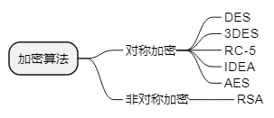

filters:: {"索引" false}
title:: 计算机系统知识/安全性&可靠性&系统性能评测/加密技术和认证技术
alias:: 加密技术和认证技术

- ## 加密技术
  collapsed:: true
	- 数据加密是用加密算法E和加密密钥 $$K_{1}$$ 将明文 P 变换成密文 C
	  \( C = E_{K_{1}}(P) \)
	  数据解密是解密算法 D 和解密密钥 $$K_{2}$$ 将密文 C 变换成明文P
	  \( P = D_{K_{2}}(C) \)
	- 
	- ### 对称加密技术 #对称加密技术
		- 私人密钥加密
	- ### 非对称加密 #非对称加密
		- 公开密钥加密：如果用公开密钥对数据加密，只有用对应的私有密钥才能解密；如果用私有密钥对数据加密，只有用对应的公开密钥才能解密。
	- ### 密钥管理
		- 密钥产生：
			- 密钥对的产生是证书申请过程中重要的一步，其中产生的私钥由用户保留，公钥和其他信息则将于CA中心进行签名，从而产生证书。
			- 对普通证书和测试证书，一般由浏览器或固定的终端应用来产生，这样产生的密钥强度较小，不适合应用于比较重要的安全网络交易。
			- 而对于比较重要的证书，如商家证书和服务器证书等，密钥对一般由专用应用程序或CA中心直接产生，密钥强度大，适合于重要的应用场合。
		- 密钥备份和恢复：
			- **PKI**：Public Key Infrastructure，公开密钥体系
			- PKI产品应用能够备份密钥，即使口令丢失，它也能够让用户在一定条件下恢复该密钥，并设置新的口令。
		- 密钥更新：
		- 多密钥的管理：
			- 为能在因特网上提供一个实用的解决方案，Kerberos建立了一个安全的、可信任的密钥分发中心（Key Distribution Center， <u>KDC</u> ），每个用户只要知道一个和KDC进行会话的密钥就可以了，而不需要知道该机构所有成百上千个不同的密钥。
- ## 认证技术
	- ### PKI技术
		- PKI技术是信息安全技术的核心，也是电子商务的关键和基础技术。
		- 认证机构：CA必须具备权威性
		- 数字证书库：用于存储已签发的数字证书及公钥
		- 密钥备份及恢复系统：密钥备份与恢复只能针对解密密钥，签名私钥为确保其唯一性而不能够作备份。
		- 证书作废系统：密钥介质丢失或者用户身份变更。
		- 应用接口：
	- ### PKI发展的标准化
		- RSA公司的公钥加密标准（Public Key Cryptography Standards，**PKCS**）
		- Internet工程任务组（Internet Engineering Task Force，**IETF**）和PKI工作组（Public Key Infrastructure Working Group，**PKIX**）
	- ### Hash函数与信息摘要 #Hash函数与信息摘要
		- （Message Digest）
		- 数字签名：
		  > 1. 信息发送者使用一个单向散列函数（Hash函数）对信息生成信息摘要
		  > 2. 信息发送者使用自己的私钥签名信息摘要
		  > 3. 信息发送者把信息本身和已签名的信息摘要一起发送出去
		  >４. 信息接收者通过使用与信息发送者使用的同一个单向散列函数（Hash函数）对接收的信息本身生成新的自底向上摘要，再使用信息发送者的公钥对信息摘要进行验证，以确认发送者的身份和信息是否被修改过。
		- 数字加密：
		  > 1. 当信息发送者需要发送信息时，首先生成一个对称密钥，用该对称密钥加密要发送的报文
		  > 2. 信息发送者用信息接收者的公钥加密上述对称密钥
		  > 3. 信息发送者将第（1）步和第（2）步的结果结合在一起传给信息接收者，称为数字信封
		  > 4. 信息接收者使用自己的私钥解密被加密的对称密钥，再用此对称密钥解密被发送方加密的密文，得到真正的原文。
		- 数字加密 vs 数字签名：
		  > 数字签名使用的是发送方的密钥对，接收方用发送方的公开密钥进行解密，这是一个一对多的关系。
		  > 数字加密则使用的是接收方的密钥对，这是多对一的关系，任何知道接收方公开密钥的人都可以向接收方发送加密信息，只有唯一拥有接收方私钥的人才能对信息解密。
	- ### SSL协议 #SSL协议
	- ### 数字时间戳技术
		- 数字时间戳服务，Digital Time Stamp Service 是网上电子商务安全服务项目之一，能提供电子文件的日期和时间信息的安全保护。
		- 时间戳是一个经加密后形成的凭证文档，包括如下三个部分。
		  > 1. 需加时间戳的文件的摘要（digest）
		  > 2. DTS收到文件的日期和时间
		  > 3. DTS的数字签名
		- 用户首先将需要加时间戳的文件用Hash编码加密形成摘要，然后将该摘要发送到DTS，DTS在加入了收到文件摘要的日期和时间信息后再对该文件加密（数字签名），然后送回用户。
		- 书面签署文件的时间是由签署人自己写上的，而数字时间戳则是由认证单位DTS来加入的，以DTS收到文件的时间为依据。