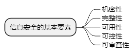
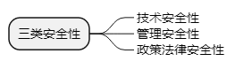
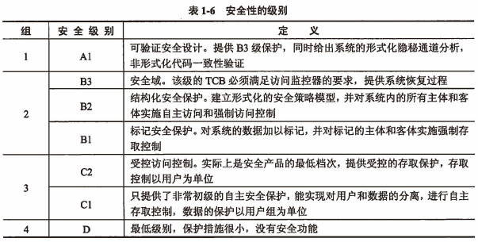
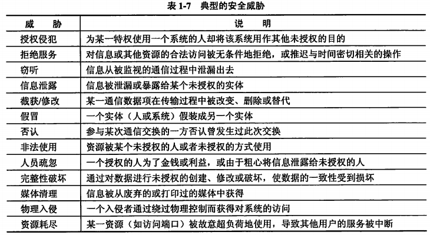
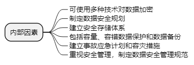
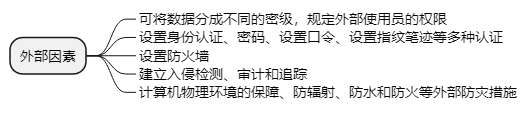

filters:: {"索引" false}
title:: 计算机系统知识/安全性&可靠性&系统性能评测/计算机安全概述
alias:: 计算机安全概述

- 计算机资产：
	- 系统资源：硬件、软件、配套设备设施、有关文件资料、有关的服务系统和业务工作人员
	- 信息资源：机系统中存储、处理和传输的大量各种各样的信息
- 包括硬件、软件和技术，又包括安全规划、安全管理和安全监督。计算机安全可包括安全管理、通信与网络安全、密码学、安全体系及模型、容错与容灾、涉及安全的应用程序及系统开发、法律、犯罪及道德规范等领域。
- 其中**安全管理**是非常重要的，作为信息系统的管理部门应根据管理原则和该系统处理数据的保密性，制定相应的管理制度或规范。例如，根据工作的重要程度确定系统的安全等级，根据确定的安全等级确定安全管理的范围，制定相应的机房管理制度、操作规程、系统维护措施以及应急措施等。
- ## 信息安全的基本要素
	- 
		- > 1. 机密性：确保信息不暴露给未受权的实体或进程
		  > 2. 完整性：只有等到允许的人才能修改数据，并能够判别出数据是否已被篡改
		  > 3. 可用性：得到授权的实体在需要时可访问数据
		  > 4. 可控性：可以控制授权范围内的信息流向及行为方式
		  > 5. 可审查性：对出现的安全问题提供调查的依据和手段
	- TODO 安全管理：
- ## 计算机的安全等级
	- 
	- TODO 美国国防部和国家标准局《可信计算机系统评测标准》**TCSEC** #TCSEC /TDI 4组7个等级
	  
	- 加拿大的《可信计算机产品评估准则》（CTCPEC）
	- 美国制定的《联邦（最低安全要求）评估准则》（FC）
	- 欧洲英、法、德、荷四国国防部门信息安全机构联合制定的《信息技术安全评估准则》（ITSEC），该准则事实上已成为欧盟各国使用的共同评估标准。
	- 美国制定的《信息技术安全通用评估准则》（简称CC标准），国际标准组织（ISO）于1996年批准CC标准以ISO/IEC15408-1999名称正式列入国际标准系列。
- ## 安全威胁 #安全威胁
	- 
- ## 影响数据安全的因素
	- ### 内部因素
		- 
	- ### 外部因素
		- 