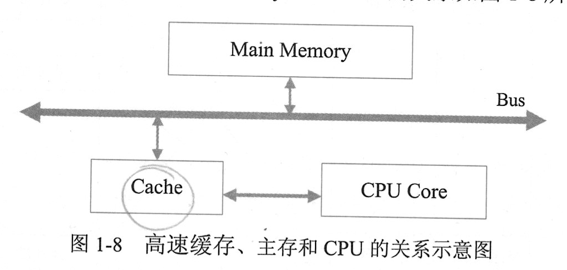
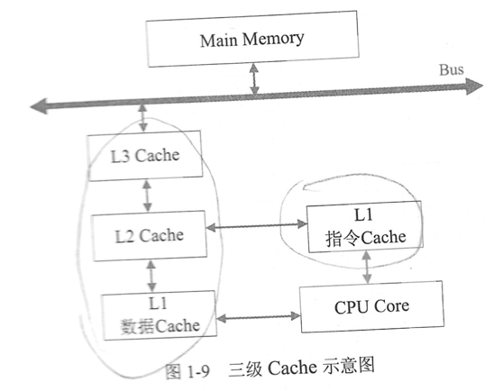
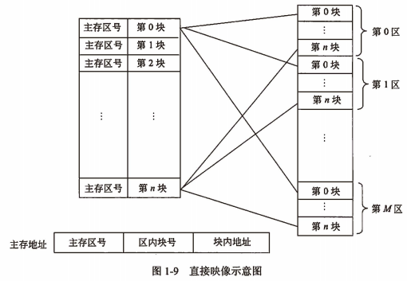
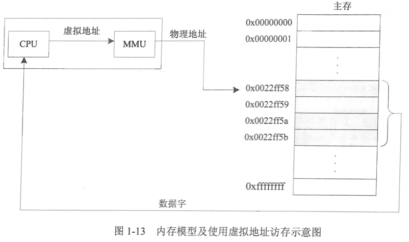

filters:: {"索引" false}
alias:: 存储系统

- ## 存储器的层次结构
  collapsed:: true
	- 
	- Cache和主存之间的交互功能全部由硬件实现，而主存与辅存之间的交互功能可由硬件和软件结合起来实现。
- ## 存储器的分类
  collapsed:: true
	- ### 位置
		- 内存；外存；
	- ### 构成材料
		- 磁存储器：
		- 半导体存储器：双极型、MOS型；数据是否需要刷新：静态、动态
		- 光存储器：
	- ### 工作方式
		- 读写：RAM：
		- 只读：
		  > 1. 固定只读存储器Read Only Memory，ROM
		  > 2. 可编程的只读存储器Programmable Read Only Memory，PROM
		  > 3. 可擦除可编程的只读存储器Erasable Programmable Read Only Memory，EPROM
		  > 4. 电擦除可编程的只读存储器Electrically Erasable Programmable Read Only Memory，EEPROM
		  > 5. 闪速存储器Flash Memory
	- ### 访问方式
		- 按地址，按内容
	- ### 按寻址方式
		- > 1. 随机存储器Random Access Memory，RAM
		  > 2. 顺序存储器Sequentially Addressed Memory，SAM：磁带
		  > 3. 直接存储器Direct Addressed Memory，DAM：磁盘
- ## 相联存储器
  collapsed:: true
	- 相联存储器是一种按内容访问的存储器。其工作原理就是把数据或数据的某一部分作为关键字，按顺序写入信息，读出时并行地将该关键字与存储器中的每一单元进行比较，找出存储器中所有与关键字相同的数据字，特别适合于信息的检索和更新。
	- 
	- 相联存储器的结构如图，其中，输入检索寄存器用来存放要检索的内容（关键字），屏蔽寄存器用来屏蔽那些不参与检索的字段，比较器将检索的关键字与存储体的每一单元进行比较。为了提高速度，比较器的数量应很大。对于位比较器，应每位对应一个，应有\(2^m \times N\)个，对于字比较器应有\(2^m\)个。匹配寄存器用来记录比较的结果，它应有\(2^m\)个二进制位，用来记录\(2^m\)个比较器的结果，1为相等（匹配），0为不相等（不匹配）。
	- 高速缓冲存储器；在虚拟存储器中用来作 <u>段表</u> 、 <u>页表</u> 或 <u>快表存储器</u> ；用在数据库和知识库中
- ## 高速缓存
  collapsed:: true
	- 高速缓存用来存放当前最活跃的程序和数据，其特点是：位于CPU与主存之间：容量一般在几千字节到几兆字节之间；速度一般比主存快5~10倍，由快速半导体存储器构成；其内容是主存局部域的副本，对程序员来说是透明的。
	- ### 高速缓存的组成
	  :LOGBOOK:
	  CLOCK: [2022-03-18 Fri 22:10:13]--[2022-03-18 Fri 22:10:14] =>  00:00:01
	  CLOCK: [2022-03-18 Fri 22:10:30]--[2022-03-18 Fri 22:10:31] =>  00:00:01
	  CLOCK: [2022-03-18 Fri 22:10:33]--[2022-03-18 Fri 22:10:34] =>  00:00:01
	  :END:
		- {:height 186, :width 386}
		- 控制判断CPU要访问的信息是否在Cache存储器中，命中时直接对Cache存储器寻址，未命中时按照替换原则 ((62480fc8-9dc4-4d03-a3d0-b8ec0339dc9a)) 决定主存的一块信息放到Cache存储器的哪一块里。
		- 现代CPU中Cache分为多个层级。
		  {:height 294, :width 367}
	- ### 高速缓存中的地址映像方法
		- 在CPU工作时，送出的是主存单元的地址，而应从Cache存储器中读/写信息。这就需要将主存地址转换成Cache存储器的地址，这种地址的转换称为地址映像。
		- #### 直接映像
			- 
			- 主存的块与Cache中块的对应关系是固定的
			- 地址变换简单；但是灵活性差：不同区号中块号相关的块无法同时调入Cache存储器，即使Cache存储器中有空着的块也只能空着
		- #### 全相联映像
			- 
			- 例如，主存为64MB，Cache为32KB，块的大小为4KB（块内地址需要12位），因此主存分为16384块，块号从0~16383，表示块号需要14位，Cache分为8块，块号为0~7，表示块号需3位。存放主存块号的相联存储器需要有Cache块个数相同数目的单元（该例中为8），相联存储器中每个单元记录所存储的主存块的块号，该例中相联存储器每个单元应为14位，共8个单元。
			- > 1. 优点：主存的块调入Cache的位置不受限制，十分灵活
			  > 2. 缺点：无法从主存块号中直接获得Cache的块号，变换比较复杂，速度比较慢
		- #### 组相联映像
			- 这种方式是前面两种方式的折中，具体方法是将Cache中的块再分成组。
			- 例如，假定Cache有16块，再将每两块分为1组，则Cache就分为8组。主存同样分区，每区16块，再将每两块分为1组，则每区就分为8组。
	- ### 替换算法
	  id:: 62480fc8-9dc4-4d03-a3d0-b8ec0339dc9a
		- 
	- ### Cache的性能分析
		- 命中率是Cache的一个重要指标，但不是最主要的指标。
		- \(H_c\)为Cache的命中率，\(t_c\) 为Cache的存取时间，\(t_m\)为主存的访问时间
		- Cache存储器的等效加权平均访问时间
		  \( t_{a} = H_c t_c + (1-H_c) t_m = t_c + (1-H_c)(t_m-t_c) \)
		- 降低Cache失效率：
		  
	- ### 多级Cache
- ## 虚拟存储器
  collapsed:: true
	- {:height 338, :width 564}
	- 虚拟存储器实际上是一种逻辑存储器，实质是对物理存储设备进行逻辑化的处理，并将统一的逻辑视图呈现给用户。因此，用户在使用时，操作的是虚拟设备，无需关心底层的物理环境，从而可以充分利用基于异构平台的存储空间，达到最优化的使用效率。
- ## 外存储器：
  collapsed:: true
	- ### 磁表面存储器
		- 磁盘存储器由盘片、驱动器、控制器和接口组成。盘片用来存储信息。驱动器用于驱动磁头沿盘面径向运动以寻找目标磁道位置，驱动盘片以额定速率稳定旋转，并且控制数据的写入和读出。控制器接收主机发来的命令，将它转换成磁盘驱动器的控制命令，将它转换成磁盘驱动器的控制命令，并实现主机和驱动器之间数据格式的转换及数据传送，以控制驱动器的读/写操作。一个控制器可以控制一台或多台驱动器。接口是主机和磁盘存储器之间的连接逻辑。
		- 硬盘 #硬盘
	- ### 光盘
		- > 1. 只读CD-ROM
		  > 2. 只写一次型WORM
		  > 3. 可擦除型
		- 光盘存储器由光学、电学和机械部件等组成。其特点是记录密度高、存储容量大、采用非接触式读/写信息（光头距离光盘通常为2mm）、信息可长期保存（其寿命达10年以上）、采用多通道记录时数据传送率可超过200Mb/s、制造成本低、对机械结构的精度要求不高、存取时间较长。
	- ### 固态硬盘
		- 存储介质：闪存；DRAM。
		- 基于闪存的固态硬盘：主控芯片的主要作用，一是合理调配数据在各个闪存芯片上的负荷，二则是承担数据中转的作用，连接闪存芯片和外部SATA接口。不同**主控芯片**的能力相差非常大，在数据处理能力、算法，对闪存芯片的读取写入控制上会有非常大的不同，直接会导致固态硬盘产品在性能上差距很大。
- ## 磁盘阵列技术
	- 廉价冗余磁盘阵列 Redundant Array of Independent Disk，独立冗余磁盘阵列，RAID #RAID
- ## 存储域网络
	- Storage Area Network, #SAN