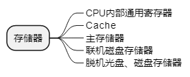
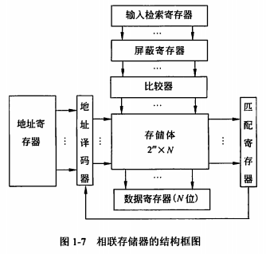
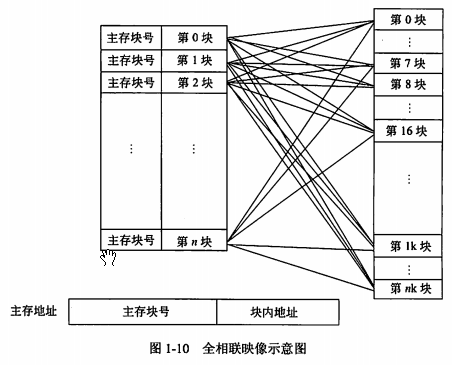
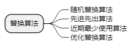
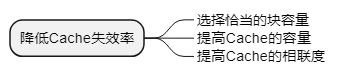

alias:: 存储系统

- ## 存储器的层次结构
  collapsed:: true
	- 
	- Cache和主存之间的交互功能全部由硬件实现，而主存与辅存之间的交互功能可由硬件和软件结合起来实现。
- ## 存储器的分类
  collapsed:: true
	- ### 位置
		- 内存；外存；
	- ### 构成材料
		- 磁存储器：
		- 半导体存储器：双极型、MOS型；数据是否需要刷新：静态、动态
		- 光存储器
	- ### 工作方式
		- 读写：RAM：
		- 只读：
		  > 1. 固定只读存储器Read Only Memory，ROM
		  > 2. 可编程的只读存储器Programmable Read Only Memory，PROM
		  > 3. 可擦除可编程的只读存储器Erasable Programmable Read Only Memory，EPROM
		  > 4. 电擦除可编程的只读存储器Electrically Erasable Programmable Read Only Memory，EEPROM
		  > 5. 闪速存储器Flash Memory
	- ### 访问方式
		- 按地址，按内容
	- ### 按寻址方式
		- > 1. 随机存储器Random Access Memory，RAM
		  > 2. 顺序存储器Sequentially Addressed Memory，SAM：磁带
		  > 3. 直接存储器Direct Addressed Memory，DAM：磁盘
- ## 相联存储器
  collapsed:: true
	- 
	- 高速缓冲存储器；在虚拟存储器中用来作 <u>段表</u> 、 <u>页表</u> 或 <u>快表存储器</u> ；用在数据库和知识库中
- ## 高速缓存
  collapsed:: true
	- ### TODO 高速缓存的组成
	  :LOGBOOK:
	  CLOCK: [2022-03-18 Fri 22:10:13]--[2022-03-18 Fri 22:10:14] =>  00:00:01
	  CLOCK: [2022-03-18 Fri 22:10:30]--[2022-03-18 Fri 22:10:31] =>  00:00:01
	  CLOCK: [2022-03-18 Fri 22:10:33]--[2022-03-18 Fri 22:10:34] =>  00:00:01
	  :END:
		- 控制判断CPU要访问的信息是否在Cache存储器中，命中时直接对Cache存储器寻址，未命中时按照替换原则 ((62480fc8-9dc4-4d03-a3d0-b8ec0339dc9a)) 决定主存的一块信息放到Cache存储器的哪一块里
	- ### 高速缓存中的地址映像方法
		- 直接映像：主存的块与Cache中块的对应关系是固定的
			- 地址变换简单；但是灵活性差：不同区号中块号相关的块无法同时调入Cache存储器，即使Cache存储器中有空着的块也只能空着
		- **全相联映像**：
			- 
			- > 1. 优点：主存的块调入Cache的位置不受限制，十分灵活
			  > 2. 缺点：无法从主存块号中直接获得Cache的块号，变换比较复杂，速度比较慢
		- 组相联映像：
	- ### 替换算法
	  id:: 62480fc8-9dc4-4d03-a3d0-b8ec0339dc9a
		- 
	- ### Cache的性能分析
		- `H_c` 为Cache的命中率，`t_c` 为Cache的存取时间，`t_m`为主存的访问时间
		- \( t_{存} = H_c t_c + (1-H_c) t_m = t_c + (1-H_c)(t_m-t_c) \)
		- 降低Cache失效率：
		  
	- ### 多级Cache
- ## TODO 虚拟存储器
- ## 外存储器：
	- ### 磁盘存储器
		- 硬盘 #硬盘
	- ### 光盘
	  > 1. 只读CD-ROM
	  > 2. 只写一次型WORM
	  > 3. 可擦除型
	- ### 固态硬盘
		- 存储介质：闪存；DRAM。
		- 基于闪存的固态硬盘：主控芯片的主要作用，一是合理调配数据在各个闪存芯片上的负荷，二则是承担数据中转的作用，连接闪存芯片和外部SATA接口。不同**主控芯片**的能力相差非常大，在数据处理能力、算法，对闪存芯片的读取写入控制上会有非常大的不同，直接会导致固态硬盘产品在性能上差距很大。
- ## 磁盘阵列技术
	- 廉价冗余磁盘阵列 Redundant Array of Independent Disk，独立冗余磁盘阵列，RAID #RAID
- ## 存储域网络
	- Storage Area Network, #SAN