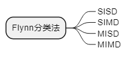
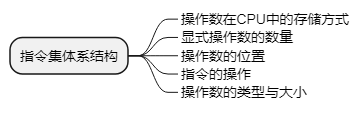
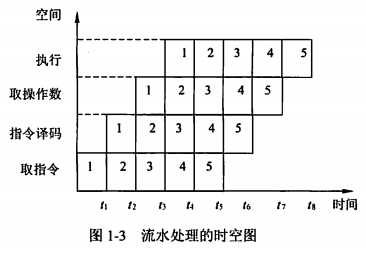
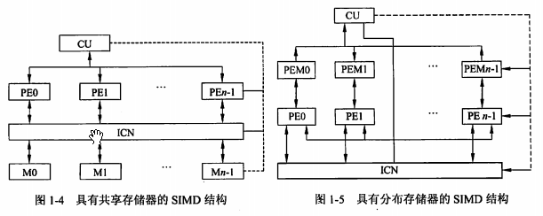

filters:: {"索引" false}
title:: 计算机系统知识/计算机体系结构/计算机体系结构的发展
alias:: 计算机体系结构的发展

- ## 计算机系统结构概述
  collapsed:: true
	- 计算机**体系结构**是指计算机的概念性结构和功能属性
	- 计算机**组织**是指计算机体系结构的逻辑实现，包括机器内的数据流和控制流的组成以及逻辑设计等（常称为计算机组成原理）
	- 计算机**实现**是指计算机组织的物理实现
	- 1964年 <u>阿姆达尔</u> ；1982年 <u>梅尔斯</u> ；1984年 <u>拜尔</u> ；
- ## 计算机体系结构分类
  collapsed:: true
	- 宏观上按**处理机的数量**分类
	  
	- 微观上按**并行程度**分类
		- Flynn分类法：按指令流和数据流的多少，SISD、SIMD、MISD、MIMD
		  
		- 冯译云分类法：按并行度对各种计算机系统分类，
		- Handler分类法：基于硬件并行程度计算并行度的方法，处理机级、每个处理机中的算逻单元级、每个算逻单元中的逻辑门电路级
		- Kuck分类法：指令流和执行流及其多重性，SISE、SIME、MISE、MIME
- ## 指令系统
	- ### 指令集体系结构
		- 
		- TODO 堆栈、累加器、寄存器组：
		  :LOGBOOK:
		  CLOCK: [2022-04-02 Sat 16:28:19]--[2022-04-02 Sat 16:28:20] =>  00:00:01
		  :END:
		- TODO 通用寄存器（General-Purpose Register Machines，GPR）：
		- 指令格式及其优化：指令长度、是否有足够空间表示所有期望的操作、存取指令速度的提高及寻址字段长度的选择
	- ### CISC和RISC #CISC和RISC
	- ### 指令的流水处理：
		- 指令控制方式：
			- 顺序方式：
			- 重叠方式：
			- 流水方式： 
			  
		- TODO 流水线种类：
			- 级别：
			- 功能：
			- 连接：
			- 是否有反馈回路：
			- 流动顺序：
			- 数据表示：
		- TODO 流水的相关处理：
			- 局部性相关处理：推后法，通路法
			- 全部性相关处理转移指令（尤其是条件转移指令）：猜测转移分支，加快和提前形成条件码，加快短循环程序的处理
			- 条件转移指令有两个分支：
			- 循环结构中：中断出现的概率要比条件转移出现的概率低的多，因此只要处理好断点现场保护及中断后的恢复，尽量缩短断流时间。
			- RISC #CISC和RISC 中采用的流水技术：
			  > 1. 超流水线（Super Pipeline）技术：
			  > 2. 超标量（Super Scalar）技术：
			  > 3. 超长指令字（Very Long Instruction Word，VLIW）技术：
		- 吞吐率和流水建立时间：
			- 吞吐率p为最长子过程的倒数：
			  \( p = 1/max\{\Delta t_1,\Delta t_2,...,\Delta t_m\} \)
			- 若m个子过程所用时间一样，均为 $$\Delta t_0$$，则建立时间
			  \( T_0 = m\Delta t_0 \)
- ## 阵列处理机、并行处理机和多处理机
  collapsed:: true
	- **同时性**：两个或两个以上的事件在同一时刻发生；
	  **并发性**：两个或两个以上的事件在同一时间间隔内连续发生
	- 计算机信息处理的步骤和阶段的角度看，并行处理分为：
	  > 1. 存储器操作并行
	  > 2. 处理器操作步骤并行（流水线处理机）
	  > 3. 处理器操作并行（阵列处理机）
	  > 4. 指令、任务、作业并行（多处理机、分布处理系统、计算机网络）
	- ### 阵列处理机
		- 多个处理单元PU，单个控制部件CU。
		  单指令流多数据流计算机，通过资源重复实现并行性
	- ### 并行处理机
		- SIMD和MIMD。
		  互联网络ICN，处理单元PE，控制部件CU，共享存储器M，局部存储器PEM。
		  
		- 分布存储器的并行处理机结构中有两类存储器，一类存储器附属于主处理机，主处理机实现整个并行处理机的管理，在其附属的存储器内常驻操作系统。另一类是分布在各个处理单元上的存储器（即PEM），这类存储器用来保存程序和数据。在阵列控制部件的统一指挥下，实现并行操作。程序和数据通过主机装入控制存储器。通过控制部件的是单指令流，所以指令的执行顺序还是和单处理机一样，基本上是中午处理。指令送到控制部件进行译码。划分后的数据集合通过向量数据总线分布到所有PE的本地存储器PEM。PE通过数据寻径网络互连。数据寻径执行PE间的通信。控制部件通过执行程序来控制寻径网络。PE的同步由控制部件的硬件实现。
	- ### 多处理机
		- 多指令流，多数据流
		- 机间的互联技术决定着多处理机的性能。
		  高频带、低成本、连接方式的多样性以及在不规则通信情况下连接的无冲突性。
	- ### 其他计算机
		- 集群 #集群 ；网格计算 #网格计算 ；