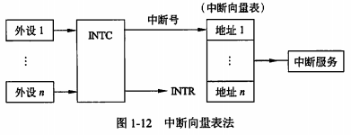

filters:: {"索引" false}
title:: 计算机系统知识/计算机体系结构/输入输出技术
alias:: 输入输出技术

- ## 微型计算机中最常用的内存与接口的编址方式
	- ### 内存与接口地址独立编址方法
		- 内存地址和接口地址是完全独立的两个地址空间，访问数据时所使用的指令也完全不同
		- 缺点：用于接口的指令太少、功能太弱
	- ### 内存与接口地址统一编址方法
		- 内存地址和接口地址统一在一个公共的地址空间里
		- 优点：原则上用于内存的指令全都可以用于接口，增强了对接口的操作功能，而且在指令上也不再区分内存或接口指令
		- 缺点：整个地址空间被分成两部分，经常会导致内存地址不连续。不容易根据指令区分内存和接口。
- ## 直接程序控制
  id:: 573692d0-7d28-452c-8ad1-8e24bc1a77b2
	- 直接程序控制是指外设数据的输入/输出过程是在CPU执行程序的控制下完成的。
	- ### 无条件传送
		- 外设总是准备好的，无条件地随时接收CPU发来的输出数据，也能够无条件地随时向CPU提供需要输入的数据
	- ### 程序查询方式
		- 通过CPU执行程序查询外设的状态，判断外设是否准备好接收数据或准备好了向CPU输入的数据
		- 缺点：
		  > 1. 降低了CPU的效率。CPU不停地对外设的状态进行查询。
		  > 2. 对外部的突发事件无法做出实时响应。
- ## 中断方式
	- 当I/O系统与外设交换数据时，CPU无须等待也不必去查询I/O的状态，而可以抽身出来其他任务。当I/O系统准备好以后，则发出中断请示信号通知CPU，CPU接到中断请求信号后，保存正在执行程序的现场，转入I/O中断服务程序的执行，完成与I/O系统的数据交换，然后再返回被打断的程序继续执行。
	- 与 ((573692d0-7d28-452c-8ad1-8e24bc1a77b2)) 方式相比，中断方式因为CPU无须等待而提高了效率。
	- ### 中断处理方法
		- 
		- 多中断信号线法（Multiple Interrupt Lines）：
		- 中断软件查询法（Software Poll）：
		- 菊花链法（Daisy Chain）：
		- 总线仲裁法：
		- **中断向量表法**： 中断请求信号INTR，中断控制器INTC
		  {:height 158, :width 391}
	- ### 中断优先级控制
		- 中断嵌套：一个中断服务程序中嵌套着另一个中断服务程序。
- ## 直接存储器存取方式
- Direct Memory Access, #直接内存访问(DMA) :
- ## 输入输出处理机
- IOP
- **通道**是一个具有特殊功能的处理器，又称为输入输出处理器（Input/Output Processor，IOP），它分担了CPU的一部分功能，可以实现对外围设备的统一管理，完成外围设备与主存之间的数据传送。
- 外围处理机（Peripheral Processor Unit，PPU）方式是通道方式的进一步发展。PPU是专用处理机，它根据主机的I/O命令，完成对外设数据的输入输出。在一些系统中，设置了多台PPU，分别承担I/O控制、通信、维护诊断等任务。从某种意义上说，这种系统已变成分布式的多机系统。
- _输入输出处理机是一个专用处理机，接在主计算机上，主机的输入输出操作由它来完成。它根据主机的I/O命令，完成对外设数据的输入输出。既然输入输出由IOP来完成了，主机的工作效率必然提高了。字节多路方式、选择传送方式和数组多路方式。_