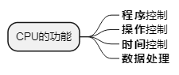
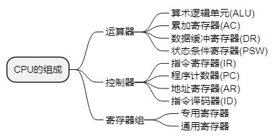
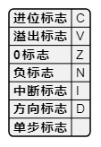
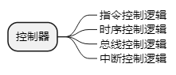
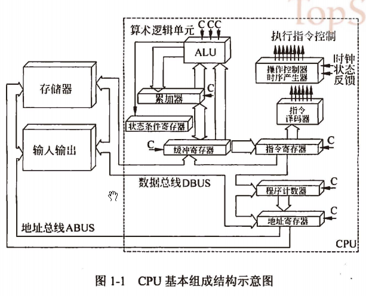
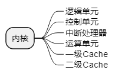

filters:: {"索引" false, "目录" false}
alias:: 中央处理单元, CPU

## CPU的功能
	- 
	- **程序控制**：CPU通过执行指令来控制程序的执行顺序
	- **操作控制**：CPU产生每条指令的操作信号并将操作信号送往不同的部件，控制相应的部件按指令的功能要求进行操作
	- **时间控制**：指令执行过程中操作信号的出现时间、持续时间及出现的时间顺序都需要进行严格控制
	- **数据处理**：CPU通过对数据进行算术运算及逻辑运算等方式进行加工处理，数据加工处理的结果被人们所利用
	- 此外，CPU还需要对系统内部和外部的中断（异常）做出响应，进行相应的处理。
## CPU的组成
	- 
	  注意：运算器和控制器中的寄存器属于==专用寄存器==
	- **运算器**：执行所有的^^算术运算^^，如加、减、乘、除等基本运算及附加运算；执行所有的^^逻辑运算^^并进行逻辑测试，如与、或、非、零值测试或两个值的比较等。
		- **算术逻辑单元**（ALU）：处理数据，实现对数据的算术运算和逻辑运算
		- **累加寄存器**（AC）：它是一个^^通用寄存器^^。其功能是当运算器的算术逻辑单元执行算术或逻辑运算时，为ALU提供一个工作区。
		- **数据缓冲寄存器**（DR）：在对内存储器进行读写操作时，用DR暂时存放由内存储器读写的一条指令或一个数据字，将不同时间段内读写的数据隔离开来。DR的主要作用为：作为CPU和内存、外部设备之间数据传送的中转站；作为CPU和内存、外围设备之间在操作速度上的缓冲；在单累加器结构的运算器中，数据缓冲寄存器还可兼作为操作数寄存器。
		- **状态条件寄存器**（PSW）：PSW保存由算术指令和逻辑指令运行或测试的结果建立的各种条件码内容，主要分为状态标志和控制标志。这些标志通常分别由1位触发器保存，保存了当前指令执行完成之后的状态。通常，一个算术操作产生一个运算结果，而一个逻辑操作则产生一个判决。
		  
	- **控制器**：用于控制整个CPU的工作，它决定了计算机运行过程的自动化。它不仅要保证程序的正确执行，而且要能够处理异常事件。
	  
		- **指令控制逻辑**：要完成取指令、分析指令和执行指令的操作，其过程分为取指令、指令译码、按指令操作码执行、形成下一条指令地址等步骤。
			- **指令寄存器**（IR）：当CPU执行一条指令时，先把它从内存储器取到缓冲寄存器中，再送往IR暂存，指令译码器根据IR的内容产生各种微操作指令，控制其他的组成部件工作，完成所需的功能。
			- **程序计数器**（PC）：PC具有**寄存信息**和**计数**两种功能，又称为指令计数器。程序的执行分两种情况，一是顺序执行，二是转移执行。在程序开始执行前，将程序的起始地址送入PC，该地址在程序加载到内存时确定，因此PC的内容即是程序第一条指令的地址。执行指令时，CPU将自动修改PC的内容，以便使其保持的总是^^将要执行的下一条指令的地址^^。由于大多数指令都是按顺序来执行的，所以修改的过程通常只是简单地对PC加1。当遇到转移指令时，后继指令的地址根据当前指令的地址加上一个向前或向后转移的位移量得到，或者根据转移指令给出的直接转移的地址得到。
			- **地址寄存器**（AR）：AR保存^^当前CPU所访问的内存单元的地址^^。由于内存和CPU存在着操作速度上的差异，所以需要使用AR保持地址信息，直到内存的读/写操作完成为止。
			- **指令译码器**（ID）：指令分为**操作码**和**地址码**两部分，为了能执行任何给定的指令，必须对操作码进行分析，以便识别所完成的操作。指令译码器就是对指令中的操作码字段进行分析解释，识别该指令规定的操作，向操作控制器发出具体的控制信号，控制各部件工作，完成所需的功能。
		- **时序控制逻辑**：为每条指令按时间顺序提供应有的控制信号
		- **总线控制逻辑**：为多个功能部件服务的信息通路的控制电路
		- **中断控制逻辑**：用于控制各种中断请求，并根据优先级的高低对中断请求进行排除，逐个交给CPU处理
	- **寄存器组**：可分为专用寄存器和通用寄存器。运算器和控制器中的寄存器是**专用寄存器**，其作用是固定的。 通用寄存器 #通用寄存器 用途广泛并可由程序员规定其用途，其数目因处理器不同有所差异。
	- CPU基本组成结构示意图
	  {:height 347, :width 475}
- ## 多核CPU：
	- **核心**（Die）：又称为内核，是CPU最重要的组成部分。CPU中心那块隆起的芯片就是核心，是由单晶硅以一定的生产工艺制造出来的，CPU所有的计算、接收/存储命令、处理数据都由核心执行。各种CPU核心都具有固定的逻辑结构，一级缓存、二级缓存、执行单元、指令级单元和总线接口等逻辑单元都会有科学的布局。 
	  
	- **多核**：多核即在一个单芯片上面集成两上甚至更多个处理器内核，其中每个内核都有自己的逻辑单元、控制单元、中断处理器、运算单元，一级Cache、二级Cache共享或独有，其部件的完整性和单核处理器内核相比完全一致。
	- **AMD**将两个内核做在一个Die(晶元)上，通过直连架构连接起来，集成度更高（能够使双核CPU的管脚、功耗等指标跟单核CPU保持一致） —— “双核”。**Intel**则是将放在不同Die上的两个内核封装在一起 —— “双芯”。
- ## TODO 指令集  #指令集 ：