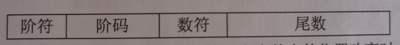

filters:: {"索引" false, "目录" false}
title:: 计算机系统知识/计算机系统基础知识/数据表示
alias:: 数据表示

- 各种数值在计算机中表示的形式称为机器数，其特点是采用二进制计数制，数的符号用0，1表示，小数点则隐含表示而不点位置。
  机器数对应的实际数值称为数的**真值**。
- 对于==无符号数==，若约定小数点的位置在机器数的最低位之后，则是==纯整数==；
  若约定小数点的位置在机器数的最高位之前，则是==纯小数==。
  对于==带符号数==，机器数的最高位是表示正、负的符号位，其余位则表示数值。
  若约定小数点的位置在机器数的最低数值位之后，则是==纯整数==；
  若约定小数点的位置在机器数的最高数值位之前（符号位之后），则是==纯小数==。
- 为了便于运算，带符号的机器数可采用原码、反码和补码等不同的编码方法，机器数这些编码方法称为**码制**。（以下n是^^机器字长^^）
- ## 原码、反码、补码和移码
	- ### 原码
	  collapsed:: true
		- 纯整数：
		  $$
		  [X]_{原}= 
		  \begin{cases}
		  X & 0<=X<=2^{n-1}-1 \\
		  2^{n-1}+|X| & -(2^{n-1}-1)<=X<=0
		  \end{cases}
		  $$
		- 纯小数：
		  $$
		  [X]_{原}=
		  \begin{cases}
		  X & 0 <= X < 1 \\
		  2^{0}+|X| & -1 < X <= 0
		  \end{cases}
		  $$
		- 
		- [+0]原=0 0000000，[-0]原 = 1 0000000。
	- ### 反码
	  collapsed:: true
		- 纯整数：
		  $$
		  [X]_{反}=
		  \begin{cases}
		  X & 0 <= X <= 2^{n-1} - 1 \\
		  2^{n} - 1 + X & -(2^{n-1} - 1) <= X <= 0
		  \end{cases}
		  $$
		- 纯小数：
		  $$
		  [X]_{反}=
		  \begin{cases}
		  X & 0 <= X < 1 \\
		  2-2^{-(n-1)} + X & -1 < X <= 0
		  \end{cases}
		  $$
		- 
		- [+0]反=0 0000000，[-0]反=1 1111111
	- ### 补码
	  collapsed:: true
		- 纯整数：
		  $$
		  [X]_{补}=
		  \begin{cases}
		  X & 0<=X<=2^{n-1}-1 \\
		  2^{n} + X & -2^{n-1} <= X <= 0
		  \end{cases}
		  $$
		- 纯小数：
		  $$
		  [X]_{补}=
		  \begin{cases}
		  X & 0<=X<1 \\
		  2+X & -1<=X<0
		  \end{cases}
		  $$
		- 
		- [+0]补=0 0000000，[-0]补=00000000
	- ### 移码
	  collapsed:: true
		- 纯整数：
		  $$
		  [X]_{移}=
		  2^{n-1}+X (-2^{n-1}<=X<2^{n-1})
		  $$
		- 纯小数：
		  $$
		  [X]_{移}=1+X (-1<=X<1)
		  $$
		- 
- ## 定点数和浮点数
	- ### 定点数
	  collapsed:: true
		- 所谓定点数，就是小数点的位置固定不变的数。
		  小数点的位置通常有两种约定方式：**定点整数**（纯整数，小数点在最低有效数值位之后）和**定点小数**（纯小数，小数点在最高有效数值位之前）。
		- {:height 176, :width 667}
	- ### 浮点数
	  collapsed:: true
		- 定点数的补码和移码可表示 \( 2^{n-1} \) 个数，而其原码和反码只能表示 \( 2^{n-1}-1 \) 个数（0的表示占用了两个编码），因此，定点数所能表示的数值范围比较小，运算中很容易因结果超出范围而溢出。浮点数是小数点位置不固定的数，它能表示更大范围的数。
		- 一个二进制数也可以写成多种表示形式。例如，二进制数1011.10101可以写成 $$2^4 \times 0.101110101$$、$$2^5 \times 0.0101110101$$ 或 $$2^6 \times 0.00101110101$$ 等。由此可知，一个二进制数N可以表示 为更一般的形式 \( N = 2^E \times F \)，其中E称为**阶码**，F称为**尾数**。用阶码和尾数表示的数称为浮点数，这种表示数的方法称为浮点表示法。
		- 在浮点表示法中，阶码为带符号的纯整数 ，尾数为带符号的纯小数。浮点数的表示 格式如下：
		  {:height 48, :width 325}
		- 很明显，一个数的浮点表示不是唯一的。当小数点的位置改变时，阶码也随着相应改变，因此可以用多个浮点形式表示同一个数。
		- 浮点数所能表示的数值范围主要由阶码决定，所表示数值的精度则由尾数决定。
		- 为了充分利用尾数来表示更多的有效数字，通常采用规格化浮点数。==规格化==就是将尾数的绝对值限定在区间==[0.5,1]==。当尾数用补码表示 时，需要注意如下问题。
			- > 1. 若尾数 M \ge 0，则其规格化的尾数形式为 M=0.1XXX \cdots X，其中，X可为0，也可为1，即将尾数限定在区间[0.5,1]。
			  > 2. 若尾数 M \lt 0，则其规格化的尾数形式为 M=1.0XXX \cdots X，其中，X可为0，也可为1，即将尾数M的范围限定在区间[-1,-0.5]。
		- 如果浮点数的阶码（包括1位阶符）用R位的移码表示，尾数（包括1位数符）用M位的补码表示 ，则这种浮点数所能表示的数值范围如下。
		  最大的正数：\( +(1 - 2^{-M+1}) \times 2^{(2^{R-1} - 1)} \)，最小的负数：\( -1 \times 2^{(2^{R-1} - 1)} \)
	- ### 工业标准IEEE 754 [百度百科](https://baike.baidu.com/item/IEEE%20754/3869922)
	  collapsed:: true
		- IEEE 754是由IEEE制定的有关浮点数的工业标准，被广泛采用。该标准的表示形式如下：
		  collapsed:: true
			- $$
			  (-1)^S2^E(b_{0}b_{1}b_{2}b_{3} \cdots b_{p-1})
			  $$
			- 其中，\( (-1)^S \) 为该浮点数的==数符==，当S为0时表示正数，S为1时表示负数；
			  E为指数（==阶码==），用移码表示；
			  \( (b_0 b_1 b_2 b_3 \cdots b_{p-1}) \) 为==尾数==，其长度为P位，用原码表示。
		- 目前，计算机中主要使用3种形式的IEEE 754浮点数，如下表所示。
		  collapsed:: true
			- {:height 253, :width 667}
		- 根据IEEE 754标准，被编码的值分为3种不同的情况：规格化的值、非规格化的值和特殊值，规格化的值为最普遍的情形。
		- #### 规格化的值
			- 当阶码部分的二进制值不全为0也不全为1时，所表示的是规格化的值。例如，在单精度浮点格式下，阶码为10110011时，偏移量为+127（01111111），则其表示的真值为10110011-01111111=00110100，转换为十进制后为52。
			- 对于尾数部分，由于约定小数点左边隐含有一位，通常这位数就是1，因此单精度浮点数尾数的有效位数为24位，即尾数为1.XX...X。也就是说，不溢出的情况下尾数M的值在1<=M<2之中，这是一种获得一个额外精度位的表示技巧。
			- 例如，单精度浮点数格式下，b0b1...b22=0100 1001 1000 1000 1001 011时，其对应的尾数真值为 \( 1+2^{-2}+2^{-5}+2^{-8}+2^{-9}+2^{-13}+2^{-17}+2^{-20}+2^{-22}+2^{-23} \)，即尾数的真值为1.28724038600921630859375（在程序中以十进制方式输出时，由于精度的原因不能能完全给出此值）。
			- 【例1.5】利用IEEE 754标准将数176.0625表示为单精度浮点数。
				- 解：首先将该十进制转换成二进制数。
				- \( (176.0625)_{10} = (10110000.0001)_2 \)
				- 其次对二进制数进行规格化处理：\( 10110000.0001 = 1♢01100000001 \times 2^7 \)。这就保证了使b0为1，而且小数点应当在♢位置上。将b0去掉并扩展为单精度浮点数所规定的23位尾数0110 0000 0001 0000 0000 000。
				- 然后求阶码，上述表示中的指数为7，而单精度浮点数规定指数的偏移量为127（注意，不是前面移码描述中所提到的128），即在指数7上加127。那么， E=7+127=134，则指数的移码表示为10000110。
				- 最后，可得到 \( (176.0625)_{10} \) 的单精度浮点数表示形式：
				  01000011 00110000 00010000 0000000
		- #### 非格式化的值
			- 当阶码部分的二进制值全为0时，所表示的数是非规格化的。在这种情况下，指数的真值为1-偏移量（对于单精度浮点数为-126，对于双精度浮点数为-1022），尾数的值就是二进制形式对应的小数，不包含隐含的1。
			- 非规格化数有两个用途：一是用来表示数值0，二是表示那些非常接近于0的数。因为在规格化表示方式下，必须使尾数大于等于1，因此不能表示出0。实际上，+0.0的浮点表示是符号、阶码和尾数的二进制表示都全为0。需要注意的是，符号位为1而阶码和尾数部分全为0时表示-0.0。也就是说，+0.0和-0.0在浮点表示时有所不同。
		- #### 特殊值
			- 当阶码部分的二进制值全为1时，表示特殊的值。当尾数部分全部为0时表示无穷大，当符号位为0时表示 +\infty，当符号位为1时表示-\infty。当浮点运算溢出时，用无穷来表示。当尾数部分不全为0时，称为“NaN”，即“不是一个数”。当运算结果不是实数或者无穷，就表示为NaN。
	- ### 浮点数的运算
		- 设有浮点数 $$X = M \times 2^j, Y = N \times 2^j$$，求 $$X \pm Y$$的运算过程要经过对阶、求尾数和（差）、结果规格化并判溢出、舍入处理和溢出判别等步骤。
		- > 1. ==对阶==。使两个数的阶码相同。令 \( K=\vert i - j \vert \)，把阶码小的数的尾数右移K位，使其阶码加上K。
		  > 2. ==求尾数和（差）==。
		  > 3. ==结果规格化并判溢出==。若运算结果所得的尾数不是规格化的数，则需要进行规格化处理。当尾数溢出时，需要调整阶码。
		  > 4. ==舍入处理==。在对结果右规时，尾数的最低位将因移出而丢掉。另外，在对阶过程中也会将尾数右移使最低位丢掉。这就需要进行舍入处理，以求得最小的运算误差。
		  > 5. ==溢出判别==。以阶码为准，若阶码溢出，则运算结果溢出；若阶码下溢（小于最小值），则结果为0；否则结果正确，无溢出。
		- 浮点数相乘，其积的阶码等于两乘数的阶码相加，积的尾数等于两乘数的尾数相乘。
		  浮点数相除，其商的阶码等于被除数的阶码减去除数的阶码，商的尾数等于被除数的尾数除以除数的尾数。
		  乘除运算的结果都需要进行规格化处理并判断阶码是否溢出。