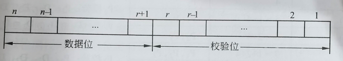

filters:: {"索引" false, "目录" false}
title:: 计算机系统知识/计算机系统基础知识/校验码
alias:: 校验码

- 计算机系统运行时，为了确保数据在传送过程中正确无误，一是提高硬件电路的可靠性，二是提高代码的校验能力，包括查错和纠错。通常使用校验码的方法来检测传送的数据是否出错。其基本思想是把数据可能出现的编码分为两类：合法编码和错误编码。合法编码用于传送数据，错误编码是不允许在数据中出现的编码。合理地设计错误编码以及编码规则，使得数据在传送中出现某种错误时会变成错误编码，这样就可以检测出接收到的数据是否有错。
- 所谓**码距**，是指一个编码系统中任意两个合法编码之间至少有多少个二进制位不同。例如，4位8421码的码距为1，在传输过程中，该代码的一位或多位发生错误，都将变成另外一个合法的编码，因此这种代码无检错能力。下面简要介绍常用的3种校验码：奇偶检验码、海明码和循环冗余校验码。
- ## 奇偶校验码
	- 奇偶校验（Parity Codes）是一种简单有效的检验方法。这种方法通过在编码中增加一位校验位来使编码中1的个数为奇数（奇校验）或者为偶数（偶校验），从而使码距变为2。对于奇检验，它可以检测代码中奇数位出错的编码，但不能发现偶数位出错的情况，即当合法编码中的奇数位发生了错误时，即编码中的1变成0或0变成1，则该编码中1的个数的奇偶性就发生了变化，从而可以发现错误。
	- 常用的奇偶检验码有3种：水平奇偶校验码、垂直奇偶校验码和水平垂直检验码。
- ## 海明码
	- 海明码（Hamming Code）是由贝尔实验室的Richard Hamming设计的，是一种利用奇偶性来检错和纠错的检验方法。海明码的构成方法是在数据位之间的特定位置上插入k个校验位，通过扩大码距来实现检错和纠错。
	- 设数据位是n位，校验位是k位，则n和k必须满足以下关系：
	  \( 2^{k} - 1 >= n + k \)
	- 海明码的编码规则如下。
	- 设k个校验位为 \( P_k,P_{k-1},\cdots,P_1 \)，n个数据位为 \( D_{n-1},D_{n-2},\cdots,D_1,D_0 \)，对应的海明码为 \( H_{n+k},H_{n+k-1},\cdots,H_1 \)，那么：
		- > 1. Pi在海明码的第 \(2^{i-1}\) 位置，即Hj=Pi，且j= \(2^{i-1}\)，数据位则依序从低到高占据海明码中剩下的位置。
		  > 2. 海明码中的任何一位都是由若干个校验位来校验的。其对应关系如下：被校验的海明位的下标等于所有参与校验该位的校验位的下标之和，而校验位由自身检验。
	- 对于8位的数据位，进行海明校验需要4个校验位（\(2^3-1=7,2^4-1=15>8+4\)）。令数据位为\(D_7,D_6,D_5,D_4,D_3,D_2,D_1,D_0\)，校验位为\(P_4,P_3,P_2,P_1\)，形成的海明码为\(H_{12},H_{11},\cdots,H_3,H_2,H_1\)，则编码过程如下。
	  collapsed:: true
		- 1. 确定D与P在海明码中的位置，如下所示：
		  | H_{12} | H_{11} | H_{10} | H_{9} | H_{8} | H_{7} | H_{6} | H_{5} | H_{4} | H_{3} | H_{2} | H_{1} |
		  | D_{7} | D_{6} | D_{5} | D_{4} | P_{4} | D_{3} | D_{2} | D_{1} | P_{3} | D_{0} | P_{2} | P_{1} |
		- 2. 确定校验关系，如下表所示。
			- {:height 322, :width 592}
			- 若采用奇校验，则将各校验位的偶校验值取反即可。
		- 3. 检测错误。对使用海明编码的数据进行差错检测只需做以下计算：
			- $$
			  \begin{align}
			  G_1 &= P_1 \oplus D_0 \oplus D_1 \oplus D_3 \oplus D_4 \oplus D_6 \\
			  G_2 &= P_2 \oplus D_0 \oplus D_2 \oplus D_3 \oplus D_5 \oplus D_6 \\
			  G_3 &= P_3 \oplus D_1\oplus D_2 \oplus D_3 \oplus D_7 \\
			  G_4 &= P_4 \oplus D_4 \oplus D_5 \oplus D_6 \oplus D_7
			  \end{align}
			  $$
			- 若采用偶校验，则G_{4}G_{3}G_{2}G_{1}全为0时表示接收到的数据无错误（奇检验应全为1）。
			- 当G_{4}G_{3}G_{2}G_{1}不全为0时说明发生了差错，而且G_{4}G_{3}G_{2}G_{1}的十进制值指出了发生错误的位置，例如G_{4}G_{3}G_{2}G_{1}=1010，说明H_{10}(D_{5})出错了，将其取反即可纠正错误。
	- 【例1.6】设数据为01101001，试采用4个校验位求其偶校验方式的海明码。
		- 解：D_{7}D_{6}D_{5}D_{4}D_{3}D_{2}D_{1}D_{0}=01101001，根据公式
		- $$
		  \begin{align}
		  P_1 &= D_0 \oplus D_1 \oplus D_3 \oplus D_4 \oplus D_6 = 1 \oplus 0 \oplus 1 \oplus 0 \oplus 1 = 1 \\
		  P_2 &= D_0 \oplus D_2 \oplus D_3 \oplus D_5 \oplus D_6 = 1 \oplus 0 \oplus 1 \oplus 1 \oplus 1 = 0 \\
		  P_3 &= D_1 \oplus D_2 \oplus D_3 \oplus D_7 = 0 \oplus 0 \oplus 1 \oplus 0 = 1 \\
		  P_4 &= D_4 \oplus D_5 \oplus D_6 \oplus D_7 = 0 \oplus 1 \oplus 1 \oplus 0 = 0
		  \end{align}
		  $$
		- 求得的海明码为：
		  | H_{12} | H_{11} | H_{10} | H_{9} | H_{8} |H_{7} | H_{6} |H_{5} |H_{4} |H_{3} |H_{2} |H_{1} |
		  |D_{7} |D_{6} |D_{5} |D_{4} |P_{4} |D_{3} |D_{2} |D_{1} |P_{3} |D_{0} |P_{2} |P_{1} |
		  |0 |1 |1 |0 |0 |1 |0 |0 |1 |1 |0 |1 |
- ## 循环冗余校验码
	- 循环冗余校验码（Cyclic Redundancy Check, CRC）广泛应用于数据通信领域和磁介质存储系统中。它利用生成多项式为k个数据位产生r个校验位来进行编码，其编码长度为k+r。CRC的代码格式为：
		- {:height 83, :width 459}
	- 由此可知，循环冗余校验码是由两部分组成的，左边为信息码（数据），右边为校验码。若信息码占k位，则校验码就点n-k位。其中，n为CRC码的字长，所以又称为（n，k）码。校验码是由信息码产生的，校验码位数越多，该代码的校验能力就越强。在求CRC编码时，采用的是模2运算。模2加减运算的规则是按位运算，不发生借位和进位。