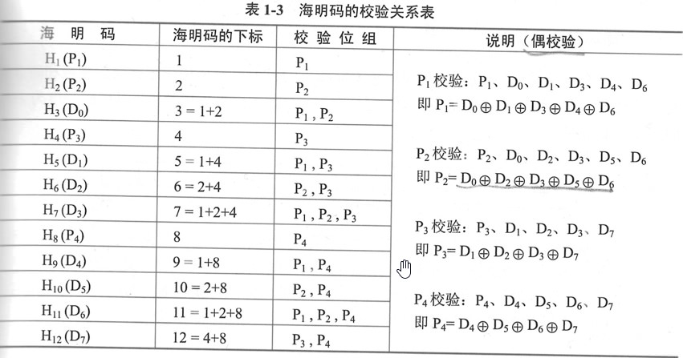

filters:: {"索引" false, "目录" false}
title:: 计算机系统知识/计算机系统基础知识/校验码
alias:: 校验码

- 所谓**码距**，是指一个编码系统中任意两个合法编码之间至少有多少个二进制位不同。例如，4位8421码的码距为1，在传输过程中，该代码的一位或多位发生错误，都将变成另外一个合法的编码，因此这种代码无检错能力。
- ### 奇偶校验码 Parity Codes
- ### 海明码（Hamming Code）
	- ：$$2^{k} - 1 >= n + k$$，其中数据位 $$n$$ ，校验位 $$k$$
	- {:height 322, :width 592}
	- 设k个校验位为Pk,Pk-1,...,P1，n个数据位为Dn-1,Dn-2,...,D1,D0，对应的海明码为Hn+k,Hn+k-1,...,H1，那么：
		- 1. Pi在海明码的第$$2^{i-1}$$位置，即Hj=Pi，且j=$$2^{i-1}$$，数据位则依序从低到高占据海明码中剩下的位置。
		- 2. 海明码中的任何一位都是由若干个校验位来校验的。其对应关系如下：被校验的海明位的下标等于所有参与校验该位的校验位的下标之和，而校验位由自身检验。
	- 检测错误。对使用海明编码的数据进行差错检测只需做以下计算：
	  ```
	  G1 = P1 \oplus D0 \oplus D1 \oplus D3 \oplus D4 \oplus D6
	  G2 = P2 \oplus D0 \oplus D2 \oplus D3 \oplus D5 \oplus D6
	  G3 = P3 \oplus D1\oplus D2 \oplus D3 \oplus D7
	  G4 = P4 \oplus D4 \oplus D5 \oplus D6 \oplus D7
	  ```
	- 若采用偶校验，则G4G3G2G1全为0时表示接收到的数据无错误（奇检验应全为1）。
	- G4G3G2G1不全为0时说明发生了差错，而且G4G3G2G1的十进制值指出了发生错误的位置，例如G4G3G2G1=1010，说明H10(D5)出错了，将其取反即可纠正错误。
- ### 循环冗余校验码（Cyclic Redundancy Check, CRC）
	- TODO 用于：
	  1. 数据通信领域：
	  2. 磁介质存储系统：
	- 它利用生成多项式为k个数据位产生r个校验位来进行编码，其编码长度为k+r。