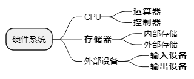

filters:: {"目录" false, "索引" false}
title:: 计算机系统知识/计算机系统基础知识/计算机系统硬件基本组成
alias:: 计算机系统硬件基本组成

- 
- 计算机的基本硬件系统由**运算器**、**控制器**、**存储器**、**输入设备**和**输出设备**5大部件组成。运算器、控制器等部件被集成在一起统称为中央处理单元（Central Processing Unit，CPU）。CPU是硬件系统的核心，用于数据的加工处理，能完成各种算术、逻辑运算及控制功能。存储器是计算机系统中的记忆设备，分为内部存储器和外部存储器。前者速度高、容量小，一般用于临时存放程序、数据及中间结果。而后者容量大、速度慢，可以长期保存程序和数据。输入设备和输出设备合称为外部设备（简称外设），输入设备用于输入原始数据及各种命令而输出设备则用于输出计算机运行的结果。