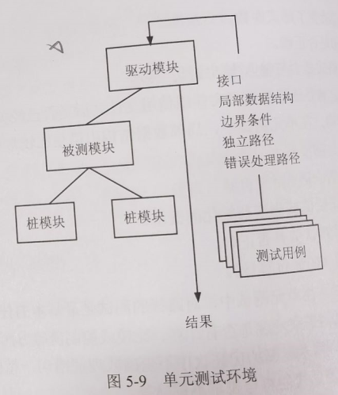
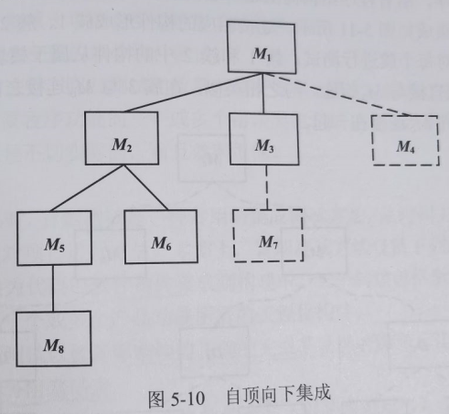
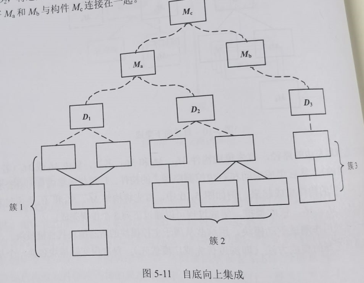

title:: 软件工程基础知识/系统测试/传统软件的测试策略
alias:: 传统软件的测试策略

- 软件测试策略将软件测试用例的设计方法集成到一系列经过周密计划的步骤中，从而使软件构造成功地完成。测试策略提供以下方面的路径图：描述将要进行的测试步骤，这些步骤计划和执行的时机，需要多少工作量、时间和资源。因此，任何测试策略都必须包含测试计划、测试用例设计、测试执行以及结果数据的收集和评估。
- 软件测试策略应该具有足够的灵活性，以便促进测试方法的制定。同时，它必须足够严格，以便在项目进行过程中对项目进行合理地策划和追踪管理。
- 有效的软件测试实际上分为4步进行，即单元测试、集成测试、确认测试和系统测试。
- ## 单元测试  #单元测试
	- 单元测试也称为模块测试，在模块编写完成且无编译错误后就可以进行。单元测试侧重于模块中的内部处理逻辑和数据结构。如果选用机器测试，一般用白盒测试法。这类测试可以对多个模块同时进行。
	- ### 单元测试的测试内容
		- 单元测试主要检查模块的以下5个特征：
		- #### 模块接口
			- 模块的接口保证了测试模块的数据流可以正确地流入、流出。在测试中应检查以下要点：
				- > 1. 测试模块的输入参数和形式参数在个数、属性、单位上是否一致
				  > 2. 调用其他模块时，所给出的实际参数和被调用模块的形式参数在个数、属性、单位上是否一致
				  > 3. 调用标准函数时，所用的参数在属性、数目和顺序上是否正确
				  > 4. 全局变量在各模块中的定义和用法是否一致
				  > 5. 输入是否仅改变了形式参数
				  > 6. 开/关的语句是否正确
				  > 7. 规定的I/O格式是否与输入/输出语句一致
				  > 8. 在使用文件之前是否已经打开文件或使用文件之后是否已经关闭文件
		- #### 局部数据结构
			- 在单元测试中，局部数据结构出错是比较觉的错误，在测试时应重点考虑以下因素：
				- > 1. 变量的说明是否合适。
				  > 2. 是否使用了尚未赋值或尚未初始化的变量。
				  > 3. 变量的初始值或默认值是否正确。
				  > 4. 变量名是否有错（例如拼写错）
		- #### 重要的执行路径
			- 在单元测试中，对路径的测试是最基本的任务。由于不能进行穷举测试，需要精心设计测试例子来发现是否有计算、比较或控制流等方面的错误。
				- > 1. 计算方面的错误。算术运算的优先次序不正确或理解错误；精度不够；运算对象的类型彼此不相容；算法错；表达式的符号表示不正确等。
				  > 2. 比较和控制流的错误。本应相等的量由于精度造成不相等；不同类型进行比较；逻辑运算符不正确或优先次序错误；循环终止不正确（如多循环一次或少循环一次）、死循环；不恰当地修改循环变量；当遇到分支循环时出口错误等。
		- #### 出错处理
			- 好的设计应该能预测到出错的条件并且有对出错处理的路径。虽然计算机可以显示出错信息的内容，但仍需要程序员对出错进行处理，保证其逻辑的正确性，以便于用户维护。
		- #### 边界条件
			- 边界条件的测试是单元测试的最后工作，也是非常重要的工作。软件容易在边界出现错误。
	- ### 单元测试过程
		- 由于模块不是独立运行的程序，各模块之间存在调用与被调用的关系。在对每个模块进行测试时，需要开发两种模块。单元测试环境如图5-9所示。
			- > 1. 驱动模块。相当于一个主程序，接收测试例子的数据，将这些数据送到测试模块，输出测试结果。
			  > 2. 桩模块（也称为存根模块）。桩模块用来代替测试模块中所调用的子模块，其内部可进行少量的数据处理，目的是为了检验入口，输出调用和返回的信息。
			- {:height 305, :width 258}
		- 提高模块的内聚度可以简化单元测试。如果每个模块只完成一种功能，对于具体模块来讲，所需的测试方案数据会显著减少，而且更容易发现和预测模块中的错误。
- ## 集成测试
	- 集成测试就是把模块按系统设计说明书的要求组合起来进行测试。即使所有的模块都通过了测试，在集成之后，仍然可能出现问题：
		- > 1. 穿过模块的数据丢失；
		  > 2. 一个模块的功能对其他模块造成有害的影响；
		  > 3. 各个模块集成起来没有达到预期的功能；
		  > 4. 全局数据结构出现问题。
		- 另外，单个模块的误差可以接受，但模块组合后，可能会出现误差累积，最后累积到不能接受的程度。集成测试是构造软件体系结构的系统化技术，同时也是进行一些旨在发现与接口相关的错误的测试，其目标是利用已通过单元测试的构件建立设计中描述的程序结构。
	- 通常，集成测试有两种方法：一种是非增量集成，分别测试各个模块，再把这些模块组合起来进行整体测试；另一种是增量集成，即以小增量的方式逐步进行构造和测试。非增量式集成可以对模块进行并行测试，能充分利用人力，并加快工程进度。但这种方法容易混乱，出现错误不容易查找和定位。增量式测试的范围一步步扩大，错误容易定位，更易于对接口进行彻底测试，并且可以运用系统化的测试方法。下面讨论一些增量集成策略。
	- ### 自顶向下集成测试
		- 自顶向下集成测试是一种构造软件体系结构的增量方法。模块的集成顺序为从主控模块（主程序）开始，沿着控制层次逐步向下，以深度优先或广度优先的方式将从属于（或间接从属于）主控模块的模块集成到结构中。
		- 如图5-10所示，深度优先集成是首先集成位于程序结构中主控路径上的所有构件，也可以根据特定应用系统的特征进行选择。
		  {:height 297, :width 316}
		  例如，选择最左边的路径，首先集成构件M1、M2和M5；其次，集成M8或M6（若M2的正常运行是必须的），然后集成中间和右边控制路径上的构件。广度优先集成首先沿着水平方向，将属于同一层的构件集成起来。例如图5-10中，首先将构件M2、M3和M4集成起来；其次是控制成M5、M6、M7，依此类推。
		- 集成过程可以通过下列5个步骤完成。
			- > 1. 主控模块用作测试驱动模块，用这些从属于主控模块的所有模块代替桩模块。
			  > 2. 依靠所选择的集成方法（即深度优先或广度优先），每次用实际模块替换一个从属桩模块。
			  > 3. 在集成每个模块后都进行测试。
			  > 4. 在完成每个测试集之后，用实际模块替换另一个桩模块。
			  > 5. 可以执行回归测试，以确保没有引入新的错误。
			- 回到第（2）步继续执行此过程，直到完成了整个程序结构的构造。
			-
	- ### 自底向上集成测试
		- 自底向上集成测试就是从原子模块（程序结构的最底层构件）开始进行构造和测试，由于构件是自底向上集成的，在处理时所需要的从属于给定层次的的模块总是存在的，因此，没有必要使用桩模块。自底向上集成策略可以利用以下步骤来实现。
		- > 1. 连接低层构件以构成完成特定子功能的簇。
		  > 2. 编写驱动模块（测试的控制程序）以协调测试用例的输入和输出。
		  > 3. 测试簇。
		  > 4. 去掉驱动程序，沿着程序结构向上逐步连接簇。遵循这种模式的集成如图5-1所示。连接相应的构件形成簇1、簇2和簇3，利用驱动模块（图中的虚线框）对每个簇进行测试。簇1和簇2中的构件从属于模块Ma，去掉驱动模块D1和D2，将这两个簇直接与Ma相连。与之相类似，在簇3与Mb连接之前去掉驱动模块D3，最后将Ma和Mb与构件Mc连接在一起。
		- {:height 328, :width 421}
		- 随着集成向上进行，对单独的测试驱动模块的需求减少。事实上，若程序结构的最上两层是自顶向下集成的，驱动模块的数量可以大减少，而且簇的集成得到明显简化。
	- ### 回归测试
		- 每当加入一个新模块作为集成测试的一部分时，软件发生变更，建立了新的数据流路径，可能出现新的I/O，以及调用新的控制逻辑。这些变更可能会使原来可以正常工作的功能产生问题。在集成测试策略的环境下，回归测试是重新执行已测试过的某些子集，以确保变更没有传播不期望的副作用。
		- 回归测试有助于保证变更不引入无意识行为或额外的错误。回归测试可以手工进行，方法是重新执行所有测试用例的子集，或者利用捕捉/回放工具自动执行。捕捉/回放工具使软件工程师能够为后续的回放与比较捕捉测试用例和测试结果。回归测试要执行的测试子集包含以下3种测试用例。
			- > 1. 能够测试软件所有功能的具有代表性的测试样本。
			  > 2. 额外测试，侧重于可能会受变更影响的软件功能。
			  > 3. 侧重于已发生变更的软件构件测试。
		- 随着集成测试的进行，回归测试的数量可能变得相当庞大，因此，应将回归测试用例设计成只包括设计每个主要程序功能的一个或多个错误类的测试。一旦发生变更，对每个软件功能重新执行所有的测试是不切实际的，而且效率很低。
	- ### 冒烟测试
		- 当开发软件产品时，冒烟测试是一种常用的集成测试方法，是时间关键项目的决定性机制，它让软件团队频繁地对项目进行评估。本质上，冒烟测试方法包括下列活动：
			- > 1. 将已经转换为代码的软件构件集成到构建中。一个构建包括所有的数据文件、库、可复用的模块以及实现一个或多个产品功能所需的工程化构件。
			  > 2. 设计一系列测试以暴露影响构建正确的完成其功能的错误，其目的是为了发现极有可能造成项目延迟的业务阻塞错误。
			  > 3. 每天将该构建与其他构建及整个软件产品（以其当前形势）集成起来进行冒烟测试。这种集成方法可以自顶向下，也可以自底向上。
	-
- ## 确认测试
	- 确认测试开始于集成测试的结束，那时已测试完单个构件，软件已组装成完整的软件包，且接口错误已被发现和改正。在进行确认测试或系统级测试时，传统软件、面向对象软件及WebApp之间的差别已经消失，测试集中于用户可见的动作和用户可识别的系统输出。
	- ### 确认测试准则
		- 软件确认是通过一系列表明与软件需求相符合的测试而获得的。测试计划列出将要执行的测试类，测试规程定义了特定的测试用例，设计的特定测试用例用于确保满足所有的功能需求，具有所有的行为特征，所有内容都准确无误且正确显示，达到所有的性能需求，文档是正确可用的，且满足其他需求（如可移植性、兼容性、错误恢复和可维护性）。
		- 执行每个确认测试用例之后，存在下面两种可能条件之一：
			- > 1. 功能或性能特征符合需求规格说明，可以接受；
			  > 2. 发现了与规格说明的偏差，创建缺陷列表。
			- 在项目的这个阶段发现的错误或偏差很难在预定的交付期之前得到改正。此时往往必须与客户进行协商，确定解决缺陷的方法。
	- ### 配置评审
		- 确认过程的一个重要成分是配置评审，主要是检查软件（源程序、目标程序）、文档（包括面向开发和用户的文档）和数据（程序内部的数据或程序外部的数据）是否齐全以及分类是否有序。确保文档、资料的正确和完善，以便维护阶段使用。
	- ### \alpha 测试与 \beta 测试
		- 当为客户开发软件时，执行一系列验收测试能使客户确认所有的需求。验收测试是由最终用户而不是软件工程师进行的，它的范围从非正式的“测试驱动”直到有计划地、系统地进行一系列测试。
		- 若将软件开发为产品，由多个用户使用，让每个用户都进行正式的验收测试是不切实际的。多数软件开发者使用被称为\alpha测试与\beta测试的过程，以期查找到似乎只有最终用户才能发现的错误。
		- **\alpha测试**是由有代表性的最终用户在开发者的场所进行。软件在自然的环境下使用，开发者站在用户的后面观看，并记录错误和使用问题。\alpha测试在受控的环境下进行。
		- **\beta测试**在一个或多个最终用户场所执行。与\alpha测试不同，开发者通常不在场，因此，\beta测试是在不被开发者控制的环境下软件的“现场”应用。最终用户记录测试过程中遇见的所有问题（现实存在的或想象的），并定期地报告给开发者。接到\beta测试的问题报告之后，开发人员对软件进行修改，然后准备向最终用户发布软件产品。
		- \beta测试的一种变体称为客户验收测试，有时是按照合同交付给客户时进行的。客户执行一系列的特定测试，试图在从开发者那里接收软件之前发现错误。在某些情况下（例如，大公司或政府系统），验收测试可能是非常正式的，可能会测试很多天，甚至几个星期。
- ## 系统测试
	- 系统测试是将已经确认的软件、计算机硬件、外设和网络等其他因素结合在一起，进行信息系统的各种集成测试和确认测试，其目的是通过与系统的需求相比较，发现所开发的系统与用户需求不符或矛盾的地方。
	- ### 恢复测试
		- 多数基于计算机的系统必须从错误中恢复并在一定的时间内重新运行。在有些情况下，系统必须是容错的，也就是说，处理错误绝不能使整个系统功能都停止。而在有些情况下，系统的错误必须在特定的时间内或严重的经济危害发生之前得到改正。
		- 恢复测试是一种系统测试，通过各种方式强制地让系统发生故障，并验证能否按照要求从故障中恢复过来，并在约定的时间内开始事务处理，而且不对系统造成任何伤害。如果系统的恢复是自动的（由系统自动完成），需要重新验证初始化、检查点和数据恢复等是否正确。如果恢复需要人工干预，就要对恢复的平均时间进行评估并判断它是否在允许的范围内。
	- ### 安全性测试
		- 任何管理敏感信息或能够对个人造成不正当伤害（或带来好处）的计算机系统都是非法入侵的目标。安全性测试验证建立在系统内的保护机制是否能够实际保护系统不受非法入侵。
		- 在安全性测试过程中，测试人员模拟非法入侵者，采用各种方法冲破防线。系统安全性设计准则是使非法入侵者所花费的代价大于攻破系统之后获取信息的价值，此时非法入侵已无利可图。
	- ### 压力测试
		- 压力测试要求以非正常的数量、频率或容量待方式执行系统。例如：在平均每秒出现1~2次中断的情况下，可以设计每秒产生10次中断的测试用例；将输入数据的量提高一个数量级以确定输入功能将如何反应；执行需要最大内存或其他资源的测试用例；设计可能在实际的运行系统中产生惨败的测试用例；创建可能会过多查找磁盘驻留数据的测试用例。从本质上来说，压力测试者是在试图破坏程序。
		- 压力测试的一个变体称为敏感性测试。在一些情况下（最常见的是在数学算法中），包含在有效数据界限之内的一小部分数据可能会引起极端处理情况，甚至是错误处理或性能的急剧下降。敏感性测试试图在有效输入类中发现会引发系统不稳定或错误处理的数据组合。
	- ### 性能测试
		- 对于实时和嵌入式系统，提供所需功能但不符合性能需求的软件是不能接受的。性能测试用来测试软件在集成环境中的运行性能。在测试过程中的任何步骤都可以进行性能测试。即使是在单元级，也可以在执行测试时评估单个模块的性能。然而，只有当整个系统的所有成分完全集成指挥时才能确定系统的真实性能。
		- 性能测试经常与压力测试一起进行，且常需要硬件和软件工具。也就是说，以严格的方式测量资源（例如，处理器周期）的利用往往是必要的。当有运行间歇或时间发生时，外部工具可以监测到，并可定期监测采样机的状态。通过检测系统，测试人员可以发现导致效率降低或系统故障的情形。
	- ### 部署测试
		- 在很多情况下，软件必须在多种平台及操作系统环境中运行。有时也将部署测试称为配置测试，是在软件将要运行的每一种环境中测试软件。另外，部署测试检查客户将要使用的所有安装程序及专业安装软件，并检查用于向最终用户介绍软件的所有文档。