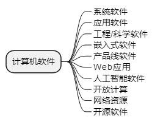

title:: 软件工程基础知识/软件工程概述/计算机软件
alias:: 计算机软件

- **计算机软件**是指计算机系统中的程序及其文档。
  **程序**是计算任务的处理对象和处理规则的描述。
  任何以计算机为处理工具的任务都是**计算任务**。
  **处理对象**是数据（如数字、文字、图形、图像、声音等，它们只是表示，而无含义）或信息（数据及有关的含义）。
  **处理规则**一般指处理的动作和步骤。
  **文档**是为了便于了解程序所需的阐述性资料。
- 按照软件的应用领域，可以将计算机软件分为十大类。
  
- **系统软件**：系统软件是一整套服务于其他程序的程序。某些系统软件处理复杂但是确定的信息结构。另一些系统应用程序（如操作系统构件、驱动程序、网络软件、远程通信处理器）主要处理的是不确定的数据。无论何种情况，系统软件多具有以下特点：
  > 1. 和计算机硬件大量交互；
  > 2. 多用户大量使用；
  > 3. 需要调度、资源共享和复杂进程管理的同步操作；
  > 4. 复杂的数据结构以及多种外部接口。
- **应用软件**：应用软件是解决特定业务需要的独立应用程序。这类应用软件处理商务或技术数据，以协助业务操作和管理或技术决策。除了传统数据处理的应用程序，应用软件也被用于业务功能的实时控制（例如销售点的交易处理、实时制造过程控制等）。
- **工程/科学软件**：这类软件通常带有“数值计算”算法的特征。工程/科学软件涵盖了广泛的应用领域，从天文学到火山学，从自动应力分析到航天飞机轨道动力学，从分子生物学到自动制造业。不过当今科学工程领域的应用软件已经不仅仅局限于传统的数值算法，==计算机辅助设计==、系统仿真和其他的交互性应用程序已经呈现出实时性甚至具有系统软件的特性。
- **嵌入式软件**：嵌入式软件存在于某个产品或系统中，可实现和控制面向最终使用者和系统本身的特性和功能。嵌入式软件可以执行有限但难于实现的功能（例如，微波炉的按键控制）或者提供重要的功能和控制能力（例如，汽车中的燃油控制、仪表板显示、刹车系统等汽车电子功能）。
- **产品线软件**：产品为多个不同用户的使用提供特定功能。产品线软件关注有限的特定专业市场（例如库存控制产品）或大众消费品市场（例如，文字处理、多媒体、娱乐、数据库管理等）。
- **Web应用**：Web应用(WebApp)是一类以网络为中心的软件，其概念涵盖了宽泛的应用程序产品。最简单可以是一组超文本链接文件，仅仅用文本和有限的图形表达信息。然而，随着Web 2.0的出现，网络应用正在发展为复杂的计算环境，不仅为最终用户提供独立的特性、计算功能和内容信息，还==与企业数据库和商务应用程序相结合==。绝大多数WebApp具备网络密集性、并发性、无法预知的负载量、性能、可用性和数据驱动属性。
- **人工智能软件**：人工智能软件利用非数值算法解决计算和直接分析无法解决的复杂问题。这个领域的应用包括机器人、专家系统、模式识别、人工神经网络、定理证明和博弈等。
- **开放计算**：==无线网络==的快速发展将促成真正的普适计算、分布式计算的实现。软件工程师所面临的挑战是如何开发系统和应用软件，以使移动设备、个人电脑和企业应用可以通过大量的网络设施进行通信。
- **网络资源**：现在，万维网已经快速发展为一个==计算引擎和内容提供平台==。软件工程师面临的新任务是构建一个简单而智能的应用程序，为全世界的最终用户市场提供服务。
- **开源软件**：开源软件就是开放系统应用程序的代码，使得很多人能够为软件开发做贡献，这种方式正在逐步成为一种趋势。软件工程师面临的挑战是==开发可以自我描述的代码==，更重要的是开发某种技术，以便于用户和开发人员都能够了解已经发生的改动，并且知道这些改动如何在软件中体现出来。