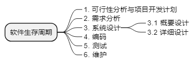

title:: 软件工程基础知识/软件工程概述/软件生存周期
alias:: 软件生存周期

- 与其他事物一样，一个软件产品或软件系统也要经历孕育、诞生、成长、成熟、衰亡的许多阶段，一般称为**软件生存周期**。把整个软件生存周期划分为若干阶段，使得每个阶段有明确的任务，使规模大、结构复杂和管理复杂的软件的开发变得容易控制和管理。通常，软件生存周期包括可行性分析与项目开发计划、需求分析、设计（概要设计和详细设计）、编码、测试、维护等活动，可以将这些活动以适当的方式分配到不同的阶段去完成。
  
- ### 1. 可行性分析与项目开发计划
	- 这个阶段主要确定软件的开发目标及其可行性。
	- > 1. 要解决的问题是什么？
	  > 2. 该问题有可行的解决办法吗？
	  > 3. 若有解决的办法，则需要多少费用？
	  > 4. 需要多少资源？
	  > 5. 需要多少时间？
	- 问题定义、可行性分析、制订项目开发计划。
	- 参与人：用户、项目负责人和系统分析师。
	- 文档：可行性分析报告、项目开发计划。
- ### 2. 需求分析
	- 需求分析阶段的任务不是具体地解决问题，而是地确定软件系统必须做什么，确定软件系统的==功能、性能、数据和界面==等要求，从而确定系统的逻辑模型。
	- 参与人：用户、项目负责人和系统分析师。
	- 文档：软件需求说明书。
- ### 3. 系统设计
	- #### 3.1 概要设计
		- 在概要设计阶段，开发人员把确定的各项功能需求转换成需要的体系结构。在该体系结构中，每个成分都是意义明确的模块，即每个模块都和某些功能需求相对应，因此概要设计就是：
			- > 1. 设计软件的结构，明确软件由哪些模块组成，
			  > 2. 这些模块的层次结构是怎样的
			  > 3. 这些模块的调用关系是怎样的
			  > 4. 每个模块的功能是什么
			- 同时，还要设计该项目的应用系统的总体数据结构和数据库结构，即
			- > 5. 应用系统要存储什么数据
			  > 6. 这些数据是什么样的结构
			  > 7. 它们之间有什么关系
		- 参与人员：系统分析师和软件设计师。
		- 文档：概要设计说明书。
	- #### 3.2 详细设计
		- 详细设计阶段的主要任务是对每个模块完成的功能进行具体描述，要把功能描述转变为精确的、结构化的过程描述。即
			- > 1. 该模块的控制结构是怎样的
			  > 2. 先做什么，后做什么
			  > 3. 有什么样的条件判定
			  > 4. 有些什么重复处理等
			  > 5. 并用相应的表示工具把这些控制结构表示出来。
		- 参与人员：软件设计师和程序员
		- 文档：详细设计文档
- ### 4. 编码
	- 编码阶段就是把每个模块的控制结构转换成计算机可接受的程序代码，即写成某种特定程序设计语言表示的源程序清单。
- ### 5. 测试
	- 测试是保证软件质量的重要手段，其主要方式是在设计测试用例的基础上检查软件的各个组成部分。
	- 参与人员：另一部门的软件设计师或系统分析师
	- 文档：软件测试计划、测试用例和软件测试报告。
- ### 6. 维护
	- 软件维护是软件生存周期中时间最长的阶段。已交付的软件投入正式使用后，便进入软件维护阶段，它可以持续几年甚至几十年。在软件运行过程中可能由于各方面的原因需要对它进行修改，其原因可能是
		- > 1. 运行中发现了软件隐含的错误而需要修改；
		  > 2. 也可能是为了适应变化了的软件工作环境而需要做适当变更；
		  > 3. 也可能是因为用户业务发生变化而需要扩充和增强软件的功能；
		  > 4. 还可能是为将来的软件维护活动做预先准备等。