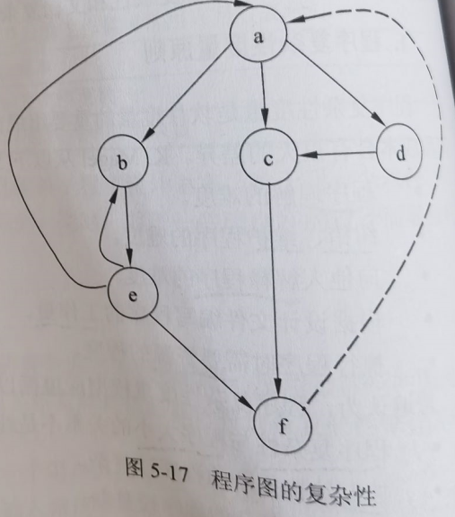

title:: 软件工程基础知识/软件度量/软件复杂性度量
alias:: 软件复杂性度量

- 软件复杂性是指理解和处理软件的难易程度。软件复杂性度量的参数很多，主要有以下几个。
	- > 1. 规模。规模即总共的指令数，或源程序行数。
	  > 2. 难度。通常由程序中出现的操作数的数目所决定的量来表示。
	  > 3. 结构。通常用与程序结构有关的度量来表示。
	  > 4. 智能度。智能度即算法的难易程度。
	- 
- 软件复杂性包括**程序复杂性**和**文档复杂性**，软件复杂性主要体现在程序的复杂性中。
- ## 程序复杂性度量原则
	- 程序复杂性度量是软件度量的重要组成部分。开发规模相同、复杂性不同的程序花费的时间和成本会有很大的差异。K.Magel从以下5个方面描述程序的复杂性。
		- > 1. 程序理解的难度。
		  > 2. 纠错、维护程序的难度。
		  > 3. 向他人解释程序的难度。
		  > 4. 根据设计文件编写程序的工作量。
		  > 5. 执行程序时需要资源的程度。
	- 普遍认为，程序复杂性度量模型应遵循以下基本原则。
		- > 1. 程序复杂性与程序大小的关系不是线性的。
		  > 2. 控制结构复杂的程序较复杂。
		  > 3. 数据结构复杂的程序较复杂。
		  > 4. 转向语句使用不当的程序较复杂。
		  > 5. 循环结构比选择结构复杂，选择结构又比顺序结构复杂。
		  > 6. 语句、数据、子程序和模块在程序中的次序对复杂性有影响。
		  > 7. 全局变量、非局部变量较多时程序较复杂。
		  > 8. 函数的隐式副作用相对于显式参数传递而言更加难以理解。
		  > 9. 具有不同作用的变量共用一个名字时较难理解。
		  > 10. 模块间、过程间联系密切的程序比较复杂。
		  > 11. 嵌套程度越深，程序越复杂。
	- 典型的程序复杂性度量有McCabe环路复杂性度量和Halstead的复杂性度量，本节主要介绍McCabe度量法。
- ## McCabe度量法
	- > McCabe度量法是由托马斯·麦克凯提出的一种基于程序控制流的复杂性度量方法。McCabe复杂性度量又称环路度量。它认为程序的复杂性很大程度上取决于程序图的复杂性。单一的顺序结构最为简单，循环和选择所构成的环路越多，程序就越复杂。这种方法以图论为工具，先画出**程序图**，然后用该图的环路数作为程序复杂性的度量值。程序图是退化的程序流程图。也就是说，把程序流程图的每一个处理符号都退化成一个结点，原来连接不同处理符号的流线变成连接不同结点的有向弧，这样得到的有向图就叫做程序图。
	- [百度百科 - McCabe度量法](https://baike.baidu.com/item/McCabe%E5%BA%A6%E9%87%8F%E6%B3%95)
	- McCabe度量法是由Thomas McCabe提出的一种基于程序控制流的复杂性度量方法。McCabe复杂性度量又称为环路度量，它认为程序的复杂性在很大程度上取决于控制的复杂性。单一的顺序程序结构最为简单，循环和选择构成的环路越多，程序就越复杂。这种方法以图论为工具，先画出程序图，然后用该图的环路数作为程序复杂性的度量值。程序图是退化的程序流程图，也就是说，把程序流程图中的每个处理符号都退化成一个结点，原来连接不同处理符号的流线变成连接不同点的有向弧，这样得到的有向图称为程序图，如图5-17所示。程序图仅描述程序内部的控制流程，完全不表现对数据的具体操作以及分支和循环的具体条件。
	- 根据图论，在一个强连通的有向图G中，环的个数V(G)由以下公式给出：
	  $$
	  V(G) = m - n + 2p
	  $$
	  其中，V(G)是有向图G中的环路数，m是图G中弧的个数，n是图G中的结点数，p是G中的强连通分量个数。在一个程序中，从程序图的入口点总能到达图中的任何一个结点，因此，程序总是连通的，但不是强连通的。为了使程序图成为强连通图 ((6274c89e-0cd1-464a-964b-7c4709204e15)) ，从图的入口点到出口点加一条用虚线表示的有向边，使图成为强连通图。这样就可以使用上式计算环路复杂性了。
	- 以图5-17为例，其中结点数n=6，弧数m=9，p=1，则有：
	  $$
	  V(G) = m - n + 2p = 9-6+2 = 5
	  $$
	  即McCabe环路复杂的度量值为5。
	  {:height 306, :width 264}
	- 环路复杂性度量反映了程序（或模块）的控制结构的复杂性。McCabe发现V(G) = 10是一个实际模块的上限。当模块的环路复杂度超过10时，要充分测试这个模块变得特别难。