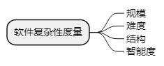

title:: 软件工程基础知识/软件度量/软件复杂性度量
alias:: 软件复杂性度量

- 软件复杂性是指理解和处理软件的难易程度。软件复杂性度量的参数很多，主要有以下几个。
	- 
- 软件复杂性包括**程序复杂性**和**文档复杂性**，软件复杂性主要体现在程序的复杂性中。
- ## 程序复杂性度量原则
- ## McCabe度量法
	- > McCabe度量法是由托马斯·麦克凯提出的一种基于程序控制流的复杂性度量方法。McCabe复杂性度量又称环路度量。它认为程序的复杂性很大程度上取决于程序图的复杂性。单一的顺序结构最为简单，循环和选择所构成的环路越多，程序就越复杂。这种方法以图论为工具，先画出**程序图**，然后用该图的环路数作为程序复杂性的度量值。程序图是退化的程序流程图。也就是说，把程序流程图的每一个处理符号都退化成一个结点，原来连接不同处理符号的流线变成连接不同结点的有向弧，这样得到的有向图就叫做程序图。
	- [百度百科 - McCabe度量法](https://baike.baidu.com/item/McCabe%E5%BA%A6%E9%87%8F%E6%B3%95)