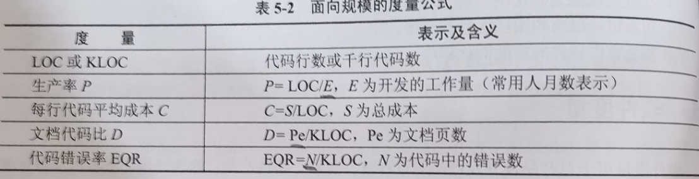

title:: 软件工程基础知识/软件度量/软件度量分类
alias:: 软件度量分类

- 软件度量有两种分类方法，第一种分类是将软件度量分为面向规模的度量、面向功能的度量和面向人的度量；第二种分类是将软件度量分为生产率度量、质量度量和技术度量。
  
- > 软件生产率度量主要关注于软件工程活动的制品。
  > 软件质量度量可指明软件满足明确的和隐含的用户需求的程度。
  > 技术度量主要集中在软件产品的某些特征（如逻辑复杂性、模块化程度等）上，而不是软件开发的全过程。
- > 面向规模的度量用于收集与软件规模相关的软件工程输出信息和质量信息，
  > 面向功能的度量则集中在程序的“功能性”和“实用性”。
  > 面向人的度量收集有关人们开发软件所用方式的信息和人员理解有关工具的方法和效率的信息。还有基于问题、基于过程、基于用例等成本估算方法。
- ## 面向规模的度量
	- 面向规模的度量是通过对质量和（或）生产率的测量进行规范化得到的，而这些量都是根据开发过的软件的规模得到的。
	- 软件规模通常用程序的代码行（Line of Code，LOC）或千行代码KLOC来衡量。由于代码行自然、直观地反映了软件项目的规模，也容易直接测量，因此面向规模的度量是一种常用的度量方法。计算出软件项目的代码行后，可方便地度量其他的软件属性，如软件开发的生产率、每行代码的平均开发成本、文档数量（页数）与代码量（KLOC）的比例关系、每千行代码中包含的软件错误数等。表5-2给出了面向规模的常用度量公式。其中，工作量和成本不仅仅编码活动的工作量和成本，而是指整个软件工程活动（包括分析、设计、编码和测试）的工作量成本。
	- {:height 160, :width 620}
	- 虽然面向规模的度量方便、直观，但代码行数依赖于程序设计语言，对于同一个软件，采用不同程序设计编写的程序，代码行数是不同的。同时，对于一些因良好的设计而导致代码量小的软件来说，这种度量显得不够客观。
- ## 面向功能的度量
	- 面向功能的度量以功能（由应用程序提供）测量数据作为规范化值。应用最广泛的面向功能的度量是功能点（Function Point，FP）。功能点是根据软件信息域的特性及复杂性来计算的。
	- 信息域的值用下列方式定义。
	- 
	- 外部输入数（EI）。每个外部输入源于一个用户，或从另一个应用系统中传送过来，它提供了面向不同应用系统的数据或控制信息，输入常用于更新内部逻辑文件（ILF），输入应该与独立计数的查询区分开来。
	- 外部输出数（EO）。每个外部输出从应用系统中导出，并为用户提供信息。在这种情况下，外部输出指的是报告、屏幕、错误消息等，不对报告中的单独数据项进行分开计数。
	- 外部查询数（EQ）。一个外部查询定义为一个在线输入。其结果是以在线输出（经常从ILF中得到）的方式产生某个即时软件响应。
	- 内部逻辑文件数（ILF）。每个内部逻辑文件是驻留在应用系统边界之内的数据逻辑分组，它通过外部输入来维护。
	- 外部接口文件数（EIF）。每个外部接口文件是驻留在应用系统外部的数据逻辑分组，它通过应用系统提供有用的信息。
	- 利用下面的关系式计算功能点：
	  $$
	  F_P = 总计 \times [0.65 + 0.01 \times \sum(F_i)]
	  $$
	  其中，“总计”是所有Fp项的总数。Fi(i=1~14)是值调整因子。