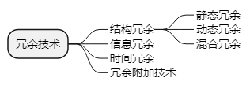

title:: 软件工程基础知识/软件质量/软件容错技术
alias:: 软件容错技术

- 提高软件质量和可靠性的技术大致可分为两类，一类是避开错误，即在开发的过程中不让差错潜入软件的技术；另一类是容错技术，即对某些无法避开的差错，使其影响减至最小的技术。
- ## 容错软件的定义
- ## 容错的一般方法
	- 实现容错的主要手段是冗余。==冗余==是指对于实现系统规定功能是多余的那部分资源，包括硬件、软件、信息和时间。由于加入了这些资源，有可能使系统的可靠性得到较大的提高。通常，冗余技术分为4类。
	- 