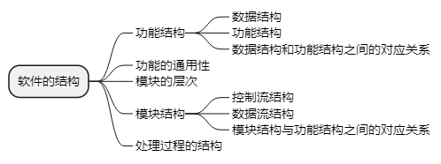

alias:: 软件评审

- 通常，把“质量”理解为“用户满意程度”。为了使得用户满意，有以下两个必要条件。
  > 1. 设计的规格说明书符合用户的要求，这称为==设计质量==。
  > 2. 程序按照设计规格说明所规定的情况正确执行，这称为==程序质量==。
- 软件的规格说明分为外部规格说明和内部规格说明。外部规格说明是从用户角度来看的规格，包括硬件/软件系统设计、功能设计；内部规格说明是为了实现外部规格的更详细的规格，即软件模块结构与模块处理过程的设计。因此，内部规格说明是从开发者角度来看的规格说明。设计质量是由外部规格说明决定的，程序是由内部规格说明决定的。
- ## 设计质量的评审内容
	- 设计质量评审的对象是在需求分析阶段产生的软件需求规格说明、数据需求规格说明，以及在软件概要设计阶段产生的软件概要设计说明书等。通常从以下几个方面进行评审。
		- > 1. 评价软件的规格说明是否合乎用户的要求，即总体设计思想和设计方针是否明确；需求规格说明是否得到了用户或单位上级机关的批准；需求规格说明与软件的概要设计规格说明是否一致等。
		  > 2. 评审可靠性，即是否能避免输入异常（错误或超载等）、硬件失效及软件失效所产生的失效，一旦发生应能及时采取代替手段或恢复手段。
		  > 3. 评审保密措施实现情况，即是否对系统使用资格进行检查；是否对特定数据、特定功能的使用资格进行检查；在检查出有违反使用资格的情况后，能否向系统管理人员报告有关信息；是否提供对系统内重要数据加密的功能。
		  > 4. 评审操作特性实施情况，即操作命令和操作信息的恰当性；输入数据与输入控制语句的恰当性；输出数据的恰当性；应答时间的恰当性等。
		  > 5. 评审性能实现情况，即是否达到所规定性能的目标值。
		  > 6. 评审软件是否具有可修改性、可扩充性、可互换性和可移植性。
		  > 7. 评审软件是否具有可测试性。
		  > 8. 评审软件是否具有复用性。
- ## 程序质量的评审内容
	- 程序质量评审通常是从开发者的角度进行评审，与开发技术直接相关。它是着眼于软件本身的结构、与运行环境的接口以及变更带来的影响而进行的评审活动。
	- 软件的结构如下。
		- 
	- ### 功能结构
		- 在软件的各种结构中，功能结构是用户唯一能见到的结构。因此，功能结构是联系用户与开发者的规格说明，它在软件的设计中占有极其重要的地位。在评审软件的功能结构时，必须明确软件的数据结构。需要检查的项目如下。
		- > 1. 数据结构。包括数据名和定义；构成该数据的数据项；数据与数据之间的关系。
		  > 2. 功能结构。包括功能名和定义；构成该功能的子功能；功能与子功能之间的关系。
		  > 3. 数据结构和功能结构之间的对应关系。包括数据元素与功能元素之间的对应关系；数据结构与功能结构的一致性。
	- ### 功能的通用性
		- 在软件的功能结构中，某些功能有时可以作为通用功能反复出现多次。从功能便于理解、增强软件的通用性及降低开发的工作量等观点出发，希望尽可能多地使功能通用化。另外，需检查的项目包括抽象数据结构（抽象数据的名称和定义、抽象数据组成元素的定义）、抽象功能结构。
	- ### 模块的层次
		- 模块的层次是指程序模块结构。由于模块是功能的具体体现，所以模块层次应当根据功能层次来设计。
	- ### 模块结构
		- 上述的模块层次结构是模块的静态结构，现在要检查模块的动态结构。模块分为处理模块和数据模块两类，模块间的动态结构也与这些模块分类有关。对这样的模块结构进行检查的项目如下。
			- > 1. 控制流结构。规定了处理模块与处理模块之间的流程关，检查处理模块之间的控制转移关系与控制转移形式（调用方式）。
			  > 2. 数据流结构。规定了数据模块是如何被处理模块进行加工的流程关系，检查处理模块与数据模块之间的对应关系；处理模块与数据模块之间的存取关系。
			  > 3. 模块结构与功能结构之间的对应关系。包括功能结构与控制流结构的对应关系；功能结构与数据流结构的对应关系；每个模块的定义（功能、输入/输出数据）。
	- ### 处理过程的结构
		- 处理过程是最基本的加工逻辑过程。对它的检查项目有模块的功能结构与实现这些功能的处理过程的结构应明确对应；控制流应是结构化的；数据的结构与控制流之间的对应关系应是明确的，并且可根据这种对应关系来明确数据流程的关系；用于描述的术语标准化。
- ## 与运行环境的接口
	- 运行环境包括硬件、其他软件和用户，主要的检查项目如下。
	- ### 与硬件的接口
		- 包括
		- > 1. 与硬件的接口约定，即根据硬件的使用说明等所做出的规定；
		  > 2. 硬件故障时的处理和超载时的处理。
	- ### 与用户的接口
		- 包括
		- > 1. 与用户的接口约定，即输入数据的结构；
		  > 2. 输出数据的结构；
		  > 3. 异常输入时的处理，超载输入时的处理；
		  > 4. 用户存取资格的检查等。