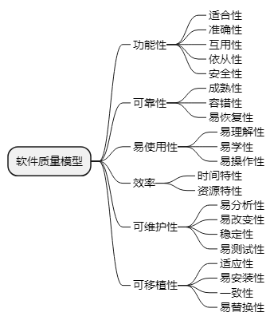
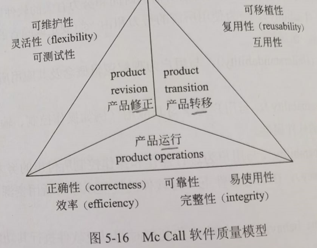

alias:: 软件质量特性

- 讨论软件质量首先要了解软件的质量特性，目前已经有多种软件质量模型来描述软件质量特性，例如ISO/IEC 9126软件质量模型和Mc Call软件质量模型。
- ## ISO/IEC 9126软件质量模型
	- ISO/IEC 9126软件质量模型由3个层次组成：第一层是质量特性，第二层是质量子特性，第三层是度量指标。该模型的质量特性和质量子特性如图5-15所示：
	  
	- 其中，各质量特性和质量子特性的含义如下：
	- （1）功能性。与一组功能及其指定的性质的存在有关的一组属性，功能是指满足规定或隐含需求的那些功能。
		- 适应性（Suitability）。与对规定任务能否提供一组功能以及这组功能是否适合有关的软件属性。
		- 准确性（Accurateness）。与能够得到正确或相符的结果或效果有关的软件属性。
		- 互用性（Interoperability）。与其他指定系统进行交互操作的能力相关的软件属性。
		- 依从性（Compliance）。使软件服从有关的标准、约定、法规及类似规定的软件属性。
		- 安全性（Security）。与避免对程序及数据的非授权故意或意外访问的能力有关的软件属性。
	- （2）可靠性（Reliability）。与在规定的一段时间内和规定的条件下软件维持在其性能水平有关的能力。
		- 成熟性（Maturity）。与由软件故障引起失效的频度有关的软件属性。
		- 容错性（Fault tolerance）。与在软件错误或违反指定接口的情况下维持指定的性能水平的能力有关的软件属性。
		- 易恢复性（Recoverability）。与在故障发生后，重新建立其性能水平并恢复直接受影响数据的能力，以及为达到此目的所需的时间和努力有关的软件属性。
	- （3）易使用性（Usability）。与为使用所需的努力和由一组规定或隐含的用户对这样使用所做的个别评价有关的一组属性。
		- 易理解性（Understandability）。与用户为理解逻辑概念及其应用所付出的劳动有关的软件属性。
		- 易学性（Learnability）。与用户为学习其应用（例如操作控制、输入、输出）所付出的努力相关的软件属性。
		- 易操作性（Operability）与用户为进行操作和操作控制所付出的努力有关的软件属性。
	- （4）效率（Efficiency）。在规定条件下，与软件的性能水平与所用资源量之间的关系有关的软件属性。
		- 时间特性（Time behavior）。与响应和处理时间以及软件执行其功能时的吞吐量有关的软件属性。
		- 资源特性（Resource behavior）。与软件执行其功能时，所使用的资源量以及使用资源的持续时间有关的软件属性。
	- （5）可维护性（Maintainability）。与进行规定的修改所需要的努力有关的一组属性。
		- 易分析性（Analyzability）。与为诊断缺陷或失效原因，或为判定待修改的部分所需努力有关的软件属性。
		- 易改变性（Changeability）。与进行修改、排错或适应环境变换所需努力有关的软件属性。
		- 稳定性（Stability）。与修改造成未预料效果的风险有关的软件属性。
		- 易测试性（Testability）。为确认经修改软件所需努力有关的软件属性。
	- （6）可移植性（Portability）。与软件可从某一环境转移到另一环境的能力有关的一组属性。
		- 适应性（Adaptability）。与软件转移到不同环境时的处理或手段有关的软件属性。
		- 易安装性（Installability）。与在指定环境下安装软件所需努力有关的软件属性。
		- 一致性（Conformance）。使软件服从与可移植性有关的标准或约定的软件属性。
		- 易替换性（Replaceability）。与一软件在该软件环境中用来替代指定的其他软件的可能和努力有关的软件属性。
- ## Mc Call软件质量模型
	- Mc Call软件质量模型从软件产品的运行、修正和转移3个方面确定了11个质量特性（如图5-16所示）。Mc Call也给出了一个三层模型框架，第一层是质量特性，第二层是评价准则，第三层是度量指标。
	- {:height 319, :width 398}