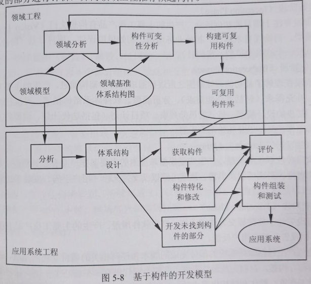

title:: 软件工程基础知识/软件过程模型/基于构件的开发模型
alias:: 基于构件的开发模型

- Component-based Development Model，基于构件的开发模型。
- 基于构件的开发是指利用预先包装的构件来构造应用系统。构件可以是组织内部开发的构件，也可以是商品化成品（Commercial Off-The-Shelf，COTS）软件构件。基于构件的开发模型具有许多螺旋模型的特点，它本质上是演化模型，需要以迭代方式构建软件。其不同之处在于，基于构件的开发模型采用==预先打包的软件构件==开发应用系统。
- 一种基于构件的开发模型如图5-8所示，包括领域工程和应用系统工程两部分。
  {:height 406, :width 438}
- ==领域工程==的目的是构建领域模型、领域基准体系结构和可复用构件库。为达到此目的，首先要进行领域分析，分析该领域中各种应用系统的公共部分或相似部分，构建领域模型和领域基准体系结构，表示领域的候选构件，对候选构件进行可变性分析，以适应多个应用系统的需要，最后构建可复用构件，经严格测试和包装后存入可复用构件库。
- ==应用系统工程==的目的是使用可复用构件组装应用系统。首先进行应用系统分析，设计应用系统的体系结构，标识应用系统所需的构件，然后在可复用构件库中查找合适的构件（也可以购买第三方构件），这些选取的构件需进行特化，必要时做适当的修改，以适应该应用系统的需要。对于那些未找到合适构件的应用部分，仍需单独开发，并将其与特化修改后的构件组装成应用系统。在此过程中，还需要对可复用构件的复用情况进行评价，以改进可复用构件，同时对新开发的部分进行评价，并向领域工程推荐候选构件。