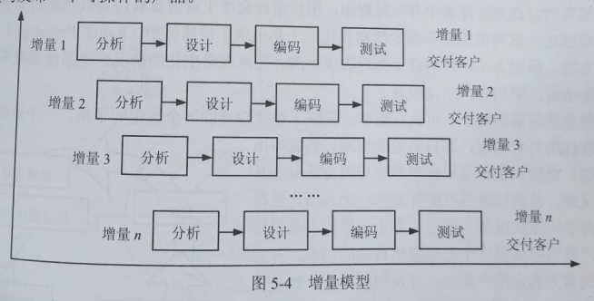

alias:: 增量模型

- Incremental Model，增量模型
- 增量模型融合了瀑布模型的基本成分和原型实现的迭代特征，它假设可以将需求分段为一系列增量产品，每一增量可以分别开发。该模型采用随着日程时间的进展而交错的线性序列，每一个线性序列产生软件的一个可发布的“增量”，如图5-4所示。当使用增量模型时，第1个增量往往是核心的产品。客户对每个增量的使用和评估都作为下一个增量发布的新特征和功能，这个过程在每一个增量发布后不断重复，直到产生了最终的完善产品。增量模型强调每一个增量均发布一个可操作的产品。
  {:height 252, :width 482}
- 增量模型作为瀑布模型的一个变体，具有瀑布模型的所有优点。此外，它还有以下优点：
	- > 1. 第一个可交付版本所需要的成本和时间很少；
	  > 2. 开发由增量表示的小系统所承担的风险不大；
	  > 3. 由于很快发布了第一个版本，因此可以减少用户需求的变更；
	  > 4. 运行增量投资，即在项目开始时，可以仅对一个或两个增量投资。
- 增量模型有以下不足之处：
	- > 1. 如果没有对用户的变更要求进行规划，那么产生的初始增量可能会造成后来增量的不稳定；
	  > 2. 如果需求不像早期思考的那样稳定和完整，那么一些增量就可能需要重新开发，重新发布；
	  > 3. 管理发生的成本、进度和配置的复杂性可能会超出组织的能力。