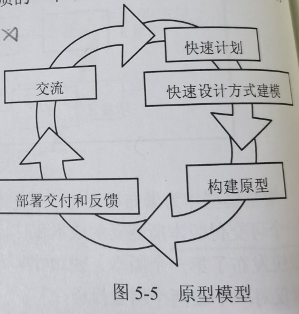
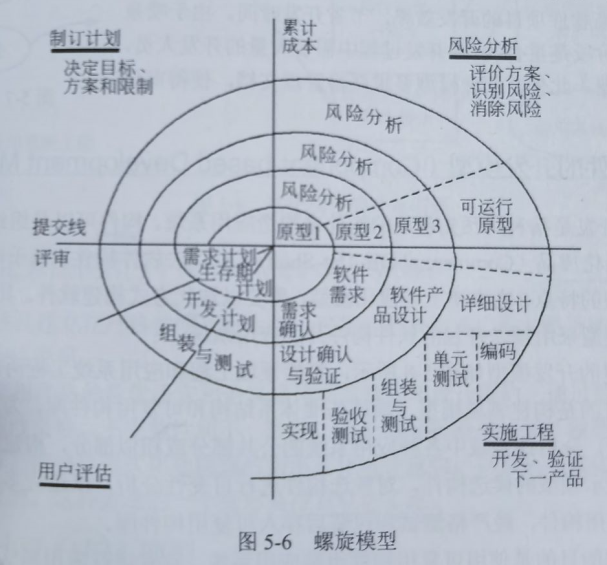

filters:: {"索引" false}
title:: 软件工程基础知识/软件过程模型/演化模型
alias:: 演化模型

- Evolutionary Model，演化模型
- 软件类似于其他复杂的系统，会随着时间的推移而演化。在开发过程中，常常会面临以下情形：
	- > 1. 商业和产品需求经常发生变化，直接导致最终产品难以实现；
	  > 2. 严格的交付时间使得开发团队不可能圆满地完成软件产品，但是必须交付功能有限的版本以应对竞争或商业压力；
	  > 3. 很好地理解了核心产品和系统需求，但是产品或系统扩展的细节问题却没有定义。
	- 在上述情况和类似情况下，软件开发人员需要一种专门应对不断演变的软件产品的过程模型。
- 演化模型是迭代的过程模型，使得软件开发人员能够逐步开发出更完整的软件版本。演化模型特别适用于对软件需求缺乏准确认识的情况。典型的演化模型有原型模型和螺旋模型等。
- ## 原型模型
	- Prototype Mode，原型模型。
	- 并非所有的需求都能够预先定义，大量的实践表明，在开发初期很难等到一个完整的、准确的需求规格说明。这主要是由于客户往往不能准确地表达对未来系统的全面要求，开发者对要解决的应用问题模糊不清，以至于形成的需求规格说明常常是不完整的、不准确的，有时甚至是有歧义的。此外，在整个开发过程中，用户可能会产生新的要求，导致需求的变更。而瀑布模型难以适应这种需求的不确定性和变化，于是出现了快速原型（Rapid Prototype）这种新的开发方法。原型方法比较适合于用户需求不清、需求经常变化的情况。当系统规模不是很大也不太复杂时，采用该方法比较好。
	- 原型是预期系统的一个可执行版本，反映了系统性质的一个选定的子集。一个原型不必满足目标软件的所有约束，其目的是能快速、低成本地构建原型。当然，能够采用原型方法是因为开发工具的快速发展，使得能够迅速地开发出一个让用户看得见、摸得着的系统框架。这样，对于计算机不是很熟悉的用户就可以根据这个框架提出自己的需求。开发原型系统首先确定用户需求，开发初始原型，然后征求用户对初始原型的改进意见，并根据意见修改原型。原型模型如图5-5所示。
	  {:height 241, :width 226}
	- 原型模型开始于沟通，其目的是定义软件的总体目标，标识需求，然后快速制订原型开发的计划，确定原型的目标和范围，采用快速射击的方式对其进行建模，并构建原型。被开发的原型应交付给客户使用，并收集客户的反馈意见，这些反馈意见可在下一轮中对原型进行改进。在前一个原型需要改进，或者需要扩展其范围的时候，进入下一轮原型的迭代开发。
	- 根据使用原型的目的的不同，原型可以分为探索型原型、实验型原型和演化型原型3种。**探索型原型**的目的是要弄清目标的要求，确定所希望的特性，并探讨多种方案的可行性。**实验型原型**的目的是验证方案或算法的合理性，是在大规模开发和实现前，用于考查方案是否合适、规格说明是否可靠等。**演化型原型**的目的是将原型作为目标系统的一部分，通过对原型的多次改进，逐步将原型演化成最终的目标系统。
- ## 螺旋模型
	- Spiral Model，螺旋模型。
	- 对于复杂的大型软件，开发一个原型往往达不到要求。螺旋模型将瀑布模型和演化模型结合起来，加入了两种模型均忽略的风险分析，弥补了这两种模型的不足。
	- 螺旋模型将开发过程分为几个螺旋周期，每个螺旋周期大致和瀑布模型相符合，如图5-6所示。每个螺旋周期分为如下4个工作步骤。
		- > 1. 制订计划。确定软件的目标，选定实施方案，明确项目开发的限制条件。
		  > 2. 风险分析。分析所选的方案，识别风险，消除风险。
		  > 3. 实施工程。实施软件开发，验证阶段性产品。
		  > 4. 用户评估。评价开发工作，提出修正建议，建立下一个周期的开发计划。
		- {:height 330, :width 348}
	- 螺旋模型强调==风险分析==，使得开发人员和用户对每个演化层出现的风险有所了解，从而做出应有的反应。因此，该模型特别适用于庞大、复杂且具有高风险的系统。
	- 与瀑布模型相比，螺旋模型支持用户需求的动态变化，为用户参与软件开发的所有关键决策提供了方便，有助于提高软件的适应能力，并且为项目管理人员及时调整管理决策提供了便利，从而降低了软件开发的风险。在使用螺旋模型进行软件开发时，需要开发人员具有相当丰富的风险评估经验和专门知识。另外，过多的迭代次数会增加开发成本，延迟提交时间。