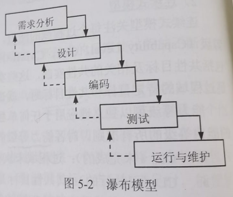
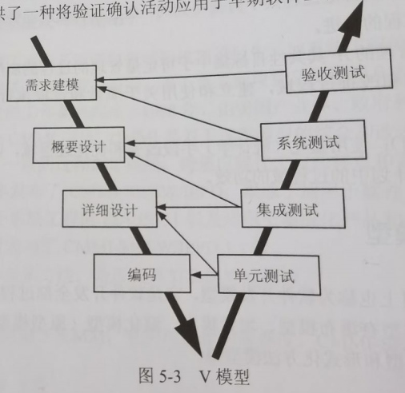

filters:: {"索引" false}
title:: 软件工程基础知识/软件过程模型/瀑布模型
alias:: 瀑布模型

- Waterfall Model，瀑布模型
- 瀑布模型是将软件生存周期中的各个活动规定为依线性顺序连接的若干阶段的模型，包括需求分析、设计、编码、测试、运行与维护。它规定了由前至后、相互衔接的固定次序，如同瀑布流水逐级下落，如图5-2所示。
  {:height 256, :width 295}
- 瀑布模型为软件的开发和维护提供了一种有效的管理模式，根据这一模式制订开发计划，进行成本预算，组织开发力量，以项目的阶段评审和文档控制为手段有效地对整个开发过程进行指导，所以它是以文档作为驱动、适合于软件需求很明确的软件项目的模型。
- 瀑布模型假设，一个待开发的系统需求是完整的、简明的、一致的，而且可以先于设计和实现完成之前产生。
- 瀑布模型的一个变体是V模型，如图5-3所示。V模型描述了质量保证活动和沟通、建模相关活动以及早期构建相关的活动之间的关系。随着软件团队工作沿着V模型左侧步骤向下推进，基本问题需求逐步细化，形成问题及解决方案的技术描述。一旦编码结束，团队沿着V模型右侧的步骤向上推进工作，其实际上是执行了一系列测试（质量保证活动），这些测试验证了团队沿着V模型左侧步骤向下推进过程中所生成的每个模型。V模型提供了一种将验证确认活动应用于早期软件工程工作中的方法。
  {:height 325, :width 328}
- 瀑布模型的优点是
	- > 1. 容易理解，管理成本低；
	  > 2. 强调开发的阶段性早期计划及需求调查和产品测试。
- 不足之处是
	- > 1. 客户必须能够完整、正确和清晰地表达他们的需要；
	  > 2. 在开始的两个或三个阶段中，很难评估真正的进度状态；
	  > 3. 当接近项目结束时，出现了大量的集成和测试工作；
	  > 4. 直到项目结束之前，都不能演示系统的能力。
- 在瀑布模型中，需求或设计中的错误往往只有到了项目后期才能够被发现，对于项目风险的控制能力较弱，从而导致项目常常延期完成，开发费用超出预算。