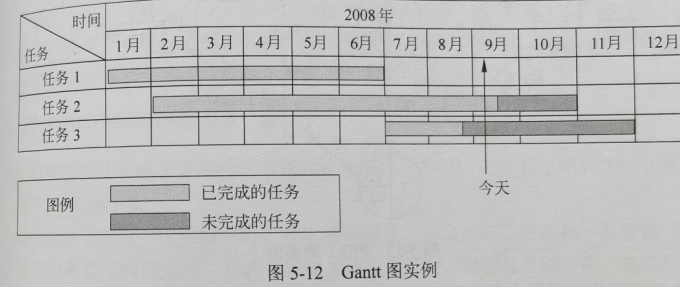
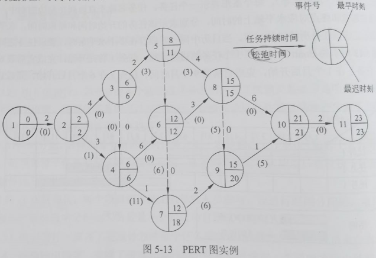

title:: 软件工程基础知识/软件项目管理/软件进度管理
alias:: 软件进度管理

- 软件项目进度管理的目的是确保软件项目在规定的时间内按期完成。一个软件项目通常可以分成多个子项目和任务，这些任务之间存在一定的关系。有些任务可并行开发，有些任务必须在另一些任务完成后才能进行。完成每个任务都需要一定的资源，包括人、时间等，项目管理者的任务就是定义所有的项目任务以及它们之间的依赖关系，制订项目的进度安排，规划每个任务所需的工作量和持续时间，并在项目开发过程中不断跟踪项目的执行情况，发现那些未按计划进度完成的任务对整个项目工期的影响，并及时进行调整。
- 软件开发项目的进度安排有如下两种方式：系统最终交付日期已经确定，软件开发部门必须在规定期限内完成；系统最终交付日期只确定了大致的年限，最后交付日期由软件开发部门确定。
- ## 进度管理的基本原则
	- 指导软件进度安排的基本原则如下：
		- > 1. 划分。项目必须被划分成若干可以管理的活动和任务。为了实现项目的划分，对于产品和过程都需要进行分解。
		  > 2. 相互依赖性。划分后的各个活动或任务之间的相互依赖关系必须是明确的。有些任务必须按顺序出现，而有些任务则可以并发进行。有些活动只有在其他活动产生的工作产品完成后才能够开始，而有些则可以独立进行。
		  > 3. 时间分配。必须为每个被调度的任务分配一定数量的工作单位（如若干人天的工作量）。此外，必须为每个任务制定开始和结束日期。任务的开始日期和结束日期取决于任务之间的相互依赖性以及工作方式。
		  > 4. 工作量确认。每个项目都有预定数量的人员参与。在进行时间分配时，项目管理者必须确保在任意时段中分配的人员数量不会超过项目团队中的总人数。
		  > 5. 确定责任。安排了进度计划的每个任务都应该指定特定的团队成员来负责。
		  > 6. 明确输出结果。安排了进度计划的每个任务都应该有一个明确的输出结果。对于软件项目而言，输出结果通常是一个工作产品（例如一个模块的设计）或某个工作产品的一部分。通常，可以将多个工作产品组合成可交付产品。
		  > 7. 确定里程碑。每个任务或任务组都应该与一个项目里程碑相关联。当一个或多个工作产品经过质量评审并且得到认可时，标志着一个里程碑的完成。
- ## 进度安排
	- 为监控软件项目的进度计划和工作的实际进展情况，表示各项任务之间进度的相互依赖关系，需要采用图示的方法。在图中明确标明如下内容。
		- > 1. 各个任务的计划开始时间和完成时间。
		  > 2. 各个任务的完成时间。
		  > 3. 各个任务与参与工作的人数，各个任务与工作量之间的衔接情况。
		  > 4. 完成各个任务所需的物理资源和数据资源。
	- 进度安排的常用图形描述方法有Gantt图（甘特图）和项目计划评审技术（Program Evaluation & Review Technique，PERT）图。
	- ### Gantt图
		- Gantt图是一种简单的水平条形图，它以日历为基准描述项目任务。水平轴表示日历时间线（如时、天、周、月和年等），每个条形表示一个任务，任务名称垂直地列在左边的列中，图中水平条的起点和终点对应水平轴上的时间，分别表示该任务的开始时间和结束时间，水平条的长度表示完成该任务所持续的时间。当日历中同一时段存在多个水平条时，表示任务之间的并发。图5-12所示的Gantt图描述了3个任务的进度安排。任务1首先开始，完成它需要6个月时间；任务2在1个月后开始，完成它需要9个月时间；任务3在6个月后开始，完成它需要5个月时间。
		  {:height 225, :width 522}
		- Gantt图能清晰地描述每个任务从何时开始，到何时结束，任务的进展情况以及各个任务之间的并行性。但是它不能清晰地反映出各任务之间的依赖关系，难以确定整个项目的关键所在，也不能反映计划中有潜力的部分。
	- ### PERT图
		- PERT图是一个有向图，图中的箭头表示任务，它可以标上完成该任务所需的时间。图中的结点表示流入结点的任务的结束，并开始流出结点的任务，这里把结点称为事件。只有当流入该结点的据爱你么么国都结束时，结点所表示的事件才出现，流出结点的任务才可以开始。事件本身不消耗时间和资源，它仅表示某个时间点。一个事件有一个事件号和出现该事件的最早时刻和最迟时刻。最早时刻表示在此时刻之前从该事件出发的任务不可能开始；最迟时刻表示从该事件出发的任务必须在此时刻之前开始，否则整个工程就不能如期完成。每个任务还可以有一个松弛时间（Slack Time），表示在不影响整个工期的前提下完成该任务有多少机动余地。为了表示任务间的关系，在图中还可以加入一些空任务（用虚线箭头表示），完成空任务的时间为0。
		- 图5-13是PERT图的一个实例。不难看出，该图中松弛时间为0的这些任务是完成整个工程的关键路径，其事件流为1->2->3->4->6->8->10->11。
		  {:height 360, :width 517}
		- PERT图不仅给出了每个任务的开始时间、结束时间和完成该任务所需的时间，还给出了任务之间的关系，即哪些任务完成后才能开始另外一些任务，以及如期完成整个工程的关键路径。图中的松弛时间则反映了完成某些任务时可以推迟其开始时间或延长其所需完成的时间。但是，PERT图不能反映任务之间的并行关系。