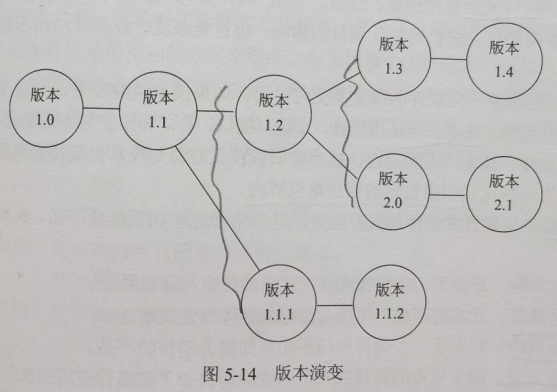

title:: 软件工程基础知识/软件项目管理/软件配置管理
alias:: 软件配置管理

- 在软件开发过程中变更是不可避免的，而变更时由于没有进行变更控制，可能加剧了项目中的混乱，为了协调软件开发使得混乱减到最小，使用配置管理技术，使变更所产生的错误达到最小并最有效地提高生产率。
- 软件配置管理（Software Configure Management，SCM）用于整个软件工程过程。其主要目标是标识变更；控制变更；确保变更正确地实现；报告有关变更。SCM是一组管理整个软件生存周期中各阶段变更的活动。
- ## 基线
	- 基线是软件生存周期中各开发阶段的一个特定点，它的作用是使各开发阶段的工作划分更加明确，使本来连续的工作在这些点上断开，以便于检查与肯定阶段成果。因此，基线可以作为一个检查点，在开发过程中，当采用的基线发生错误时可以知道所处的位置，返回到最近和最恰当的基线上。
- ## 软件配置项
	- 软件配置项（Software Configure Item，SCI）是软件工程中产生的信息项，它是配置管理的基本单位，对于已经成为基线的SCI，虽然可以修改，但必须按照一个特殊的、正式的过程进行评估，确认每一处修改。以下的SCI是SCM的对象，并可形成基线。
		- > 1. 系统规格说明书。
		  > 2. 软件项目实施计划。
		  > 3. 软件需求规格说明书。
		  > 4. 设计规格说明书（数据设计、体系结构设计、模块设计、接口设计、对象描述（使用面向对象技术时））
		  > 5. 源代码清单。
		  > 6. 测试计划和过程、测试用例和测试结果记录。
		  > 7. 操作和安装手册。
		  > 8. 可执行程序（可执行程序模块、连接模块）
		  > 9. 数据库描述（模式和文件结果、初始内容）
		  > 10. 用户手册。
		  > 11. 维护文档（软件问题报告、维护请求、工程变更次序）。
		  > 12. 软件工程标准。
		  > 13. 项目开发小结。
	- 此外，许多软件工程组织把配置控制之下的软件工具，即编辑程序、编译程序、其他CASE工具的特定版本都作为软件配置的一部分列入其中。
- ## 版本控制
	- 软件配置实际上是一个动态的概念，它一方面随着软件生存周期向前推进，SCI的数量在不断增多，一些文档经过转换生成另一些文档，并产生一些信息；另一方面又随时会有新的变更出现，形成新的版本。
	- 可以采用图5-14所示的演变图来表达系统的不同版本，在图中各个结点是一个完全的软件版本。软件的每一个版本都是SCI（源代码、文档、数据）的一个汇集，而且各个版本都可能由不同的变种组成。
	  {:height 267, :width 369}
- ## 变更控制
	- 软件工程过程中某一阶段的变更均要引起软件配置的变更，这种变更必须严格地加以控制和管理，保持修改信息，并把精确、清晰的信息传递到软件工程过程的下一步骤。
	- 对于一个大型软件来说，不加控制的变更很快就会引起混乱。因此，变更控制是一项最重要的软件配置任务。为了有效地实现变更控制，需借助于配置数据库和基线的概念。
	- 配置数据库可以分为以下三类。
		- > 1. 开发库。专供开发人员使用，其中的信息可能做频繁修改，对其控制相当宽松。
		  > 2. 受控库。在生存期某一阶段工作结束时发布的阶段产品，这些是与软件开发工作相关的计算机可读信息和人工可读信息。软件配置管理正是对受控库中的各个软件项进行管理，受控库也称为软件配置库。
		  > 3. 产品库。在开发的软件产品完成系统测试后，作为最终产品存入产品库，等待交付用户或现场安装。