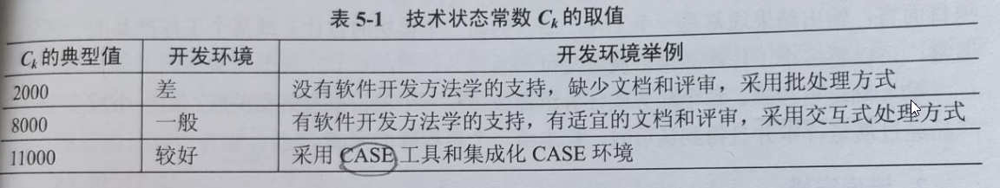

title:: 软件工程基础知识/软件项目管理/软件项目估算
alias:: 软件项目估算

- 软件项目估算涉及人、技术、环境等多种因素，因此很难在项目完成前准确地估算出开发软件所需的成本、持续时间和工作量。因此，需要一些方法和技术来支持项目的估算，常用的估算方法有下列3种。
	- > 1. 基于已经完成的类似项目进行估算。这是一种常用的也是有效的估算方法。
	  > 2. 基于分解技术进行估算。分解技术包括问题分解和过程分解。问题分解是将一个复杂问题分解成若干个小问题，通过对小问题的估算得到复杂问题的估算。过程分解是指先根据软件开发过程中的活动（分析、设计、编码、测试等）进行估算，然后得到整个项目的估算值。
	  > 3. 基于经验估算模型的估算。典型的经验估算模型有IBM估算模型、COCOMO模型和Putnam模型。
	- 上述方法可以组合使用，以提高估算的精度。
- ## 成本估算方法
	- ### 自顶向下估算方法
		- 估算人员参照以前完成的项目所耗费的总成本（或总工作量）来推算将要开发的软件的总成本（或总工作量），然后把它们按阶段、步骤和工作单元进行分配，这种方法称为自顶向下的估算方法。
		- 自顶向下估算方法的主要优点是对系统级工作的重视，所以估算中不会遗漏诸如集成、配置管理之类的系统级事务的成本估算，且估算工作量小、速度快。它的缺点是往往不清楚低级别上的技术性困难问题，而这些困难将会使成本上升。
	- ### 自底向上估算方法
		- 自底向上估算方法是将待开发的软件细分，分别估算每一个子任务所需要的开发工作量，然后将它们加起来，得到软件的总开发量。这种方法的优点是将每一部分的估算工作交给负责该部分工作的人来做，所以估算较为准确。其缺点是估算往往缺少各项子任务之间相互联系所需要的工作量和与软件开发有关的系统级工作量，所以估算往往偏低。
	- ### 差别估算方法
		- 差别估算方法的思想是将待开发项目与一个或多个已完成的类似项目进行比较，找出与某个相似项目的若干不同之处，并估算每个不同之处对成本的影响，导出待开发项目的总成本。该方法的优点是可以提高估算的准确度，缺点是不容易明确“差别”的界限。
	- ### 其他估算方法
		- 除了以上方法之外，还有专家估算法、类推估算法和算式估算法等。
		- 专家估算法。该方法依靠一个或多个专家对要求的项目做出估算，其精确性取决于专家对估算项目的定性参数的了解和他们的经验。
		- 类推估算法。在自顶向下的方法中，它是将估算项目的总体参数与类似项目进行直接比较得到结果；在自底向上方法中，类推是在两个具有相似条件的工作单元之间进行。
		- 算式估算法。专家估算法和类推估算法的缺点在于它们依靠带有一定盲目性和主观性的猜测对项目进行估算。算式估算法则是企图避免主观因素的影响，用于估算的方法有两种基本类型：由理论导出和由经验导出。
- ## COCOMO估算模型
	- COCOMO模型是一种精确的、易于使用的成本估算模型。COCOMO模型按其详细程度分为基本COCOMO模型、中级COCOMO模型和详细COCOMO模型。
	- ### 基本COCOMO模型
		- 基本COCOMO模型是一个静态单变量模型，用于对整个软件系统进行估算。其公式如下。
		  $$
		  E = a(L)^b \\
		  D = cE^d
		  $$
		- 其中，E表示工作量，单位是人月；D表示开发时间，单位是月；L是项目的源代码行估计值，不包括程序中的注释及文档，其单位是千行代码；a、b、c、d是常数。
		- 基本COCOMO模型可通过估算代码行的值L，然后计算开发工作量和开发时间的估算值。
	- ### 中级COCOMO模型
		- 中级COCOMO模型是一个静态多变量模型，它将软件系统模型分为系统和部件两个层次，系统由部件构成，它把软件开发所需的人力（成本）看作是程序大小和一系列“成本驱动属性”的函数。
		- 中级COCOMO模型以基本COCOMO模型为基础，并考虑了15种影响软件工作量的因素，通过工作量调节因子（EAF）修正对工作量的估算，从而使估算更合理。其公式如下：
		  $$
		  E = a(L)^b \mathrm{EAF}
		  $$
		- 其中，L是软件产品的目标代码行数，单位是千行代码数；a、b是常数。
	- ### 详细COCOMO模型
		- 它将软件系统模型分为系统、子系统和模块3个层次，除包括中级模型所考虑的因素外，还考虑了在需求分析、软件设计等每一步的成本驱动属性的影响。
- ## COCOMOII模型
	- 最初的COCOMO模型是得到产业界最广泛应用和讨论的软件成本估算模型之一，现在它已经演化成更全面的估算模型，称为COCOMOII。和其前身一样，COCOMOII也是一种层次结构的估算模型，被分为3个阶段性模型。
		- 应用组装模型。在软件工程的前期阶段使用，这时用户界面的原型开发、对软件和系统交互的考虑、性能的评估以及技术成熟度的评价是最重要的。
		- 早期设计阶段模型。在需求已经稳定并且基本的软件体系结构已经建立时使用。
		- 体系结构阶段模型。在软件的构造过程中使用。
	- 和所有的软件估算模型一样，COCOCMOII模型也需要使用规模估算信息，在模型层次结构中有3种不同的规模估算选择：对象点、功能点和代码行。应用组装模型使用的是对象点；早期设计阶段模型使用的是功能点，功能点可以转换为代码行。
	- 对象点也是一种间接的软件测量。计算对象点时使用如下的计数值：（用户界面的）屏幕书；报表数；构造应用系统可能需要的构件数。
- ## Putnam估算模型
	- Putnam模型是一种动态多变量模型，它是假设在软件开发的整个生存周期中工作量有特定的分布。
	- 根据一些大型软件项目（30人年以上）的工作量分布情况，推导出软件项目在软件生存周期各阶段的工作量分布。根据该曲线给出代码行数、工作量和开发时间之间的关系，如下所示：
	  $$
	  L = C_k E^{1/3} t_d^{}
	  $$
	- 其中，L表示源程序代码行数（LOC）；t_d 表示开发持续时间（年）；E是包括软件开发和维护在整个生存期所花费的工作量（人年）；Ck表示技术状态常数，其值依赖于开发环境，如表5-1所示。
	- {:height 115, :width 613}