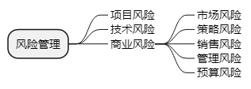

title:: 软件工程基础知识/软件项目管理/风险管理
alias:: 风险管理

- 一般认为软件风险包含两个特性：不确定性和损失。不确定性是指风险可能发生也可能不发生；损失是指如果风险发生，就会产生恶性后果。在进行风险分析时，重要的是量化每个风险的不确定程度和损失程度。为了实现这一点，必须考虑不同类型的风险。
- ==项目风险==威胁到项目计划。也就是说，如果项目风险发生，就有可能拖延项目的进度和增加项目的成本。项目风险是指预算、进度、人员（聘用职员及组织）、资源、利益相关者、需求等方面的潜在问题以及它们对软件项目的影响。项目复杂度、规模及结构不确定性也属于项目风险因素。
- ==技术风险==威胁到要开发软件的质量及交付时间。如果技术风险发生，开发工作就可能变得很困难或根本不可能。技术风险是指设计、实现、接口、验证和维护等方面的潜在问题。此外，规格说明的歧义性、技术的不确定性、技术陈旧以及“前沿”技术也是技术风险因素。技术风险的发生是因为问题比我们所设想的更加难以解决。
- ==商业风险==威胁到要开发软件的生存能力，且常常会危害到项目或产品。5个主要的商业风险如下。
	- > 1. 市场风险。开发了一个没有人真正需要的优良产品或系统。
	  > 2. 策略风险。开发的产品不再符合公司的整体商业策略。
	  > 3. 销售风险。开发了一个销售部门不知道如何去销售的产品。
	  > 4. 管理风险。由于重点的转移或人员的变动而失去了高级管理层的支持。
	  > 5. 预算风险。没有得到预算或人员的保证。
	- 
- 另一种常用的风险分类方式是由Charette提出的。已知风险是通过仔细评估项目计划、开发项目的商业和技术环境以及其他可靠的信息来源（如不现实的交付时间、没有文档化需求或文档化软件范围、恶劣的开发环境）之后可以发现的那些风险。可预测风险能够从过去项目的经验中推断出来（如人员变动、与客户缺乏沟通、由于正在进行维护而使开发人员精力分散）。不可预测风险可能会真的出现，但很难事先识别。
- ## 风险识别
	- 风险识别试图系统化地指出对项目计划（估算、进度、资源分配等）的威胁。识别出已知风险和可预测风险后，项目管理者首先要做的是在可能时回避这些风险，在必要时控制这些风险。
	- 识别风险的一种方法是建立风险条目检查表。该检查表可用于风险识别，并且主要用来识别下列几种类型中的一些已知风险和可预测风险。
		- > 1. 产品规模。与要开发或要修改的软件的总体规模相关的风险。
		  > 2. 商业影响。与管理者或市场所施加的约束相关的风险。
		  > 3. 客户特性。与客户的素质以及开发者和客户定期沟通的能力相关的风险。
		  > 4. 过程定义。与软件过程定义的程度以及该过程被开发组织遵守的程度相关的风险。
		  > 5. 开发环境。与用来开发产品的工具的可得性及质量相关的风险。
		  > 6. 开发技术。与待开发软件的复杂性及系统所包含技术的“新奇性”相关的风险。
		  > 7. 人员才干及经验。与软件工程师的总体技术水平及项目经验相关的风险。
	- 风险条目检查表可以采用不同的方式来组织。与上述每个主题相关的问题可以针对每一个软件项目来回答。根据这些问题的答案，项目管理者就可以估计风险产生的影响。
	- 当然，也可以采用另一种风险条目检查表格式，即仅仅列出与每一种类型有关的特性，最终给出一组风险因素和驱动因子以及它们发生的概率。风险因素包括性能、成本、支持和进度。风险因素是以如下方式定义的。
		- > 1. 性能风险。产品能够满足需求且符合其使用目的的不确定程度。
		  > 2. 成本风险。能够维持项目预算的不确定程度。
		  > 3. 支持风险。开发出的软件易于纠错、修改及升级的不确定程度。
		  > 4. 进度风险。能够维持项目进度且按时交付产品的不确定程度。
- ## 风险预测
	- 风险预测又称风险估计，它试图从两个方面评估一个风险：风险发生的可能性或概率；如果风险发生了所产生的后果。
	- ### 风险预测活动
		- 通常，项目计划人员与管理人员、技术人员一起进行以下4步风险预测活动。
			- > 1. 建立一个尺度或标准，以反映风险发生的可能性。
			  > 2. 描述风险产生的后果。
			  > 3. 估算风险对项目和产品的影响。
			  > 4. 标注风险预测的整体精确度，以免产生误解。
		- 一种简单的风险预测技术是建立风险表。风险表的第1列列出所有的风险（由风险识别活动得到），第2~4列列出每个风险的种类、发生的概率以及所产生的影响。风险所产生的影响可用一个数字来表示：“1”表示灾难性的；“2”表示严重的；“3”表示轻微的；“4”表示可忽略的。
	- ### 评估风险影响
		- 如果风险真的发生，有3个因素可能会影响风险所产生的后果，即风险的本质、范围和时间。风险的本质是指当风险发生时可能带来的问题。例如，一个定义很差的与客户硬件的外部接口（技术风险）会妨碍早期的设计和测试，也有可能导致项目后期阶段的系统集成问题。风险的范围包括风险的严重性（即风险有多严重）及风险的整体分布情况（即项目中有多少部分受到影响或有多少客户受到损害）。风险的时间是指何时能够感受到风险的影响及风险的影响会持续多长时间。在大多数情况下，项目管理者希望“坏消息”越早出现越好，但在某些情况下则是越迟越好。
		- 整体的风险显露度（Risk Exposure，RE）可由下面的关系确定：
		  $$
		  \mathrm{RE} = P \times C
		  $$
		  其中P 是风险发生的概率，C是风险发生时带来的项目成本。
- ## 风险评估
	- 在进行风险评估时，建立了如下形式的三元组：
	  $$
	  (r_i, l_i, x_i)
	  $$
	  `ri`表示风险，`li`表示风险发生的概率，`xi`表示风险产生的影响
	- 一种对风险评估很有用的技术就是定义风险参照水准。对于大多数软件项目来说，成本、进度和性能就是3种典型的风险参照水准。也就是说，对于成本超支、进度延期、性能降低（或它们的某种组合），有一个表明导致项目终止的水准。
	- 在风险评估过程中，需要执行以下4个步骤：
	  > 1. 定义项目的风险参考水平值。
	  > 2. 建立每一组 $$(r_i,l_i,x_i)$$ 与每一个参考水平值之间的关系。
	  > 3. 预测一组临界点以定义项目终止区域，该区域由一条曲线或不确定区域所界定。
	  > 4. 预测什么样的风险组合会影响参考水平值。
- ## 风险控制
	- 风险控制的目的是辅助项目组建立处理风险的策略。一个有效的策略必须考虑以下3个问题。
	- ### 风险避免
		- 应对风险的最好办法是主动地避免风险，即在风险发生前分析引起风险的原因，然后采取措施，以避免风险的发生。
		- 例如项目风险ri表示“频繁的人员流动”，根据历史经验可知，该风险发生的概率li大约为70%，该风险产生的影响xi是第2级（严重的）。为了避免该风险，可以采取以下策略。
			- > 1. 与现有人员一起探讨人员流动原因（如恶劣的工作条件、低报酬、竞争激烈的劳动力市场等）。
			  > 2. 在项目开始之前采取行动，设法缓解那些能够控制的起因。
			  > 3. 项目启动之后，假设会发生人员流动，当有人员离开时，找到能够保证工作连续性的方法。
			  > 4. 组织项目团队，使得每一个开发活动的信息都能被广泛传播和交流。
			  > 5. 制定工作产品标准，并建立相应机制以确保能够及时创建所有的模型和文档。
			  > 6. 同等对待所有工作的评审。
			  > 7. 给每一个关键的技术人员都指定一个后备人员。
	- ### 风险监控
		- 项目管理者应监控某些因素，这些因素可以提供风险是否正在变高或变低的指示。在频繁的人员流动的例子中，应该监测团队成员对项目压力的普遍态度、团队的凝聚力、团队成员彼此之间的关系、与报酬和利益相关的潜在问题、在公司内及公司外工作的可能性。
	- ### RMMM计划
		- 风险管理策略可以包含在软件项目计划中，或者风险管理步骤也可以组织成一个独立的风险==缓解==、==监控==和==管理==计划（RMMM计划）。RMMM计划将所有风险分析工作文档化，并由项目管理者作为整个项目计划中的一部分来使用。
		- 建立了RMMM计划，而且项目已经启动之后，风险缓解及监测步骤也就开始了。风险缓解是一种问题规避活动，而风险监测是一种项目跟踪活动，这种监测活动有3个主要目的：评估所预测的风险是否真的发生了；保证正确地实施了各风险的缓解步骤；收集能够用于今后风险缝隙的信息。在很多情况下，项目中发生的问题可以追溯到不止一个风险，所以风险监测的另一个任务就是试图找到“起源”（在整个项目中是哪些风险引起了哪些问题）。