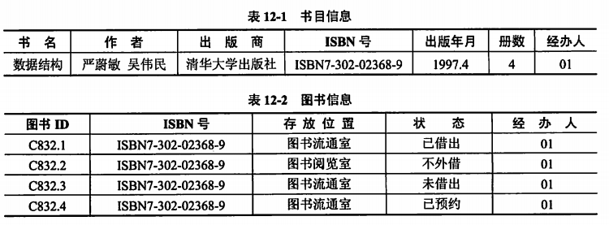
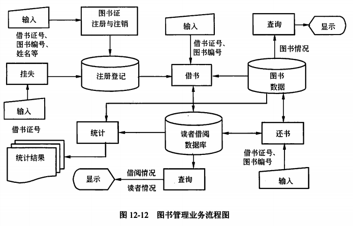
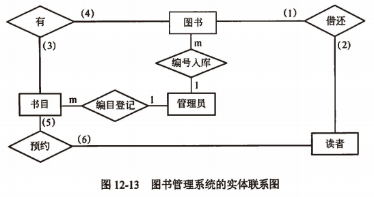
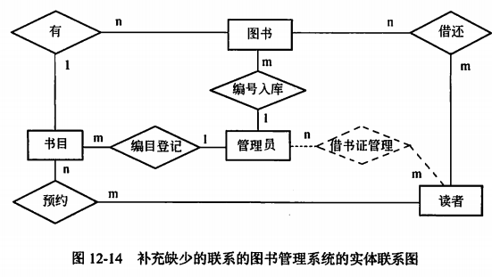

alias:: 数据库案例分析

- 某单位图书馆需要建立一个图书管理系统，在图书管理过程中，由于要处理多种不同的业务流程，各个部分之间有相互联系。
- ## 图书管理需求分析
	- 通过对图书管理日常工作的详细调查，该图书馆对某书目的信息如表12-1所示，与该书目对应的图书信息如表12-2所示。
	  {:height 235, :width 640}
	- ### 初步的需求分析结果
		- 1. 资料室有图书管理员若干名，他们负责已购入图书的编目和借还工作，每名图书管理员的信息包括工号和姓名。
		  2. 读者可在阅览室读书，也可通过图书流通室借还图书，读者信息包括姓名、年龄、工作单位、借书证号、电话和E-mail，系统为不同读者生成不同的借书证号。
		  3. 每部书在系统中对应唯一的一条图书在版编目数据（CIP，以下简称书目），书目的基本信息包括ISBN号、书名、作者、出版商、出版年月以及本资料室拥有该书的册数（以下简称册数），不同书目的ISBN号不相同。
		  4. 资料室对于同一书目的图书可拥有多册（本），图书信息包括图书ID、ISBN号、存放位置和当前状态，每一本书在系统中被赋予唯一的图书ID。
		  5. 一名读者最多只能借阅10本图书，且每本图书最多只能借两个月，读者借书时需由图书管理员登记读者ID、所借图书ID、借阅时间和应还时间，读者还书时图书管理员在对应的借书信息中记录归还时间。
		  6. 当某书目的可借出图书的数量为0时，读者可以对其进行预约登记，即记录读者ID、需要借阅的图书的ISBN号和预约时间。
	- ### 业务流程
		- 图书管理信息系统在应用中的业务流程图如图12-12所示。
		  {:height 378, :width 579}
		- 系统的主要业务处理如下。
		  1. 入库管理。图书购进入库时，管理员查询本资料室的书目信息，若该书的书目尚未建立，则由管理员编写该书的书目信息并录入系统，然后编写并录入图书信息；否则，修改该书目的册数，然后编写并录入图书信息。对于进入流通室的书，其初始状态为“未借出“，而送入阅览室的状态始终为”不外借“。
		  2. 图书证注册和注销。登记所有输的新图书证和注销图书证，需要注明办理及注销日期及管理员号。
		  3. 挂失管理。包括挂失登记，登记挂失的图书证，使得该图书证不能借书，注明挂失日期及管理员号；解除挂失，解除已经挂失的图书证，使得该借书证可以开始借书，注明解除挂失日期及管理员号。
		  4. 借书管理。读者借书时，若有，则由管理员为该读者办理借书手续，并记录该读者的借书信息，同时将借出图书的状态修改为”已借出“。
		  5. 预约管理。若图书流通室没有读者要借的书，则可为该读者建立预约登记，需要记录读者ID、书的ISBN号、预约时间和预约期限（最长为10天）。一旦其他读者归还这种书，就自动通知该预约读者。系统将自动清除超出预约期限的预约记录并修改相关信息。
		  6. 还书管理。读者还书时，则记录相应借还信息中的”归还时间“，对于超期归还者，系统自动计算罚金（具体的计算过程此处省略）。系统同时自动查询预约登记表，若存在其他读者预约该书的记录，则将该图书的状态修改为”已预约“，并将该图书ID写入相应的预约记录中（系统在清除超出预约期限的记录时解除该图书的”已预约“状态）；否则，将该图书的状态修改为”未借出“。
		  7. 通知处理。对于已到期且未归还的图书，系统通过E-mail自动通知读者。若读者预约的书已到，系统则自动通过E-mail通知该读者来办理借书手续。
- ## 图书管理概念结构设计
	- 根据需求分析的结果设计的实体联系图（不完整）如图12-13所示，请指出读者与图书、书目与读者、书目与图书之间的联系类型，并补充图12-13中实体间缺少的联系。
	  
	- 联系类型：读者与图书、书目与图书、书目与读者之间的联系类型分析如下。
	  1. 读者与图书之间的联系类型。读者与图书之间形成了借还关系，需求分析的结果已经说明”一名读者最多只能借阅10本图书“，显然一本图书可被多名读者借阅，而每名读者应该能够借阅多本图书，因此读者与图书之间的借还联系为多对多（n：m），即空（1）和空（2）应分别填写n和m。
	  2. 书目与图书之间的联系类型。图书馆对于同一书目的图书可拥有多册（本），每一本书在系统中被赋予唯一的图书ID，所以书目与图书之间的联系类型为一对多（1：n），即空（3）和空（4）应分别填写1和n。
	  3. 书目与读者之间的联系类型。当某书目的可借出图书的数量为0时，读者可以对其进行预约登记，由于一名读者可借阅多种图书，因此书目与读者之间的预约联系类型为多对多（n：m），即空（5）和空（6）应分别填写n和m。
	- 图书馆管理E-R模型：根据需求分析的结果，图书馆管理应该包括图书证注册、注销和挂失管理，因此在图12-13中，管理员和读者实体间缺少的联系有注册、注销和挂失借书证管理联系。补充缺少的联系的E-R模型如图12-14所示。
	  
- ## 图书管理逻辑结构设计
	- 根据概念设计得到的E-R图转换成图书管理系统的主要关系模式如下，请补充”借还记录“和”预约登记“关系中的空缺。注：时间格式为”年.月.日 时:分:秒“，请指出读者、书目关系模式的主键，以及图书、借还记录和预约登记关系模式的主键和外键。
	- ```
	  管理员（工号，姓名，权限）
	  读者（姓名，年龄，工作单位，借书证号，电话，E-mail）
	  书目（ISBN号，书名，作者，出版商，出版年月，册数，工号）
	  图书（图书ID，ISBN号，存放位置，状态，工号）
	  借还记录（\_\_a\_\_），借出时间，应还时间，归还时间）
	  预约登记（\_\_b\_\_），预约时间，预约期限，图书ID）
	  借书证管理（借书证号，使用状态，开始时间，结束时间，工号）
	  ```
	- ### 问题分析
		- 由于读者借书时需由图书管理员登记借书证号、所借图书iD、借出时间和应还时间，还书时图书管理员在对应的借书信息中记录归还时间，因此借还记录关系中的空（a）处应填入”借书证号，图书ID“。
		- 读者对某书目进行预约登记时，需记录借书证号、需要借阅的图书的ISBN号和预约时间等，目前的预约登记关系中已经有预约时间、预约期限、图书ID信息，显然还需要记录是哪位读者预约了书，以及书的ISBN号，因此，预约登记关系模式中的空（b）处应填入“借书证叼，ISBN号”。
	- ### 主键与外键分析
		- 主键刀称为主码，是关系中的一个或一组属性，其值能唯一标识一个元组。根据图书管理的需求分析如下。
			- 管理员关系。主键显然是“工号”。
			- 读者关系。“系统为不同读者生成不同的借书证号”，因此读者关系的主键显然是“借书证号”。
			- 书目关系。不同书目的ISBN号不相同，书目关系的主键为书的“ISBN号”，外键是管理员关系的“工号”。
			- 图书关系。同一书目的多册（本）图书具有相同的ISBN号，因此所有的图书依据“图书ID”相互区分，图书关系的主键是“图书ID”，外键是书目关系的“ISBN号”和管理员关系的“工号”。
			- 借还记录关系。用于记录读者的借书和还书信息，为了区分读者在同一日期对同一本书多次借还，借还记录的主键为“借书证号，图书ID，供出时间”。借还记录是由联系借还对应的关系，它记录与图书和读者的联系。因此，借还记录具有外键借书证号和图书ID，分别与读者和图书相关联。
			- 预约登记关系。主键为“借书证号，ISBN号，预约时间”，外键为读者关系的“借书证号”、书目关系的“ISBN号”和图书关系的“图书ID”。
			- 借书证管理关系。主键为“借书证号，开始时间”，外键是管理员关系的“工号”。
		- 在实现数据库逻辑结构设计之后，就要确定数据库在计算机中的具体存储。由于数据库在物理设备上的存储结构与存取方法依赖于给定的计算机系统和应用环境，故案例中不再介绍。