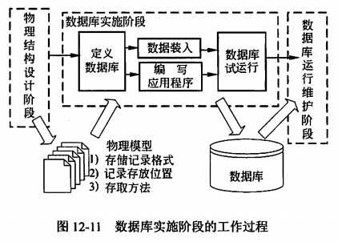

title:: 软件系统分析与设计/数据库分析与设计/数据库的实施与维护
alias:: 数据库的实施与维护

- 在数据库正式投入运行之前，还需要完成很多工作。例如，在模式和子模式中加入数据库安全性、完整性的描述，完成应用程序和加载程序的设计，数据库系统的试运行，并在试运行中对系统进行评价。如果评价结果不能满足要求，还需要对数据库进行修正设计，直到满意为止。数据库正式投入使用，也并不意味着数据库设计生命周期的结束，而是数据库维护阶段的开始。数据库实施阶段的工作过程如图12-11所示。
  
- ## 数据库实施
	- 根据逻辑和物理设计的结果，在计算机上建立起实际的数据库结构并装入数据，进行试运行和评价的过程，叫做数据库的实施（或实现）。
	- ### 建立实际的数据库结构
		- 用DBMS提供的数据定义语言（DDL）编写描述逻辑设计和物理设计结果的程序（一般称为数据库脚本程序），经计算机编译处理和执行后，就生成了实际的数据库结构。所用DBMS的产品不同，描述数据库结构的方式也不同。有的DBMS提供数据定义语言，有的提供数据库结构的图形化定义方式，有的两种方法都提供。在定义数据库结构时，应包含以下内容。
			- ==数据库模式与子模式，以及数据库空间等的描述==。例如，在Oracle系统中，数据库逻辑结果的描述包括表空间（Tablespace）、段（Segment）、范围（Extent）和数据块（Data block）。DBA或设计人员通过对数据库空间的管理和分配，可控制数据库中数据的磁盘分配，将确定的空间份额分配给数据库用户，控制数据的可用性，将数据存储在多个设备上，以提高数据库性能等。
			- ==数据库完整性描述==。所谓数据的完整性，是指数据的有效性、正确性和一致性。在数据库设计时，如果没有一定的措施确保数据库中数据的完整性，就无法从数据库中获得可信的数据。数据的完整性设计，应该贯穿在数据库设计的全过程中。例如，在数据需求分析阶段，收集数据信息时，应该向有关用户调查该数据的有效值范围。在模式与子模式中，可以用DBMS提供的DDL语句描述数据的完整性。
			- ==数据库安全性描述==。数据安全性设计同数据完整性设计一样，也应在数据库设计的各个阶段加以考虑。在进行需求分析时，分析人员除了收集信息及数据间联系的信息之外，还必须收集关于数据的安全性说明。在设计数据库逻辑结构时，对于保密级别高的数据，可以单独进行设计。子模式是实现安全性要求的一个重要手段，可以为不同的应用设计不同的子模式。在数据操纵上，系统可以对用户的数据操纵进行两方面的控制：一是给合法用户授权，目前主要有身份验证和口令识别；二是给合法用户不同的存取权限。
			- ==数据库物理存储参数描述==。物理存储参数因DBMS的不同而不同。一般可设置的参数包括块大小、页面大小（字节数或块数）、数据库的页面数、缓冲区个数、缓冲区大小和用户数等。详细内容请参考DBMS的用户手册。
	- ### 数据加载
		- 数据库应用程序的设计应该与数据库设计同时进行。一般地，应用程序的设计应该包括数据库加载程序的设计。在数据加载前，必须对数据进行整理。由于用户缺乏计算机应用背景的知识，常常不了解数据的准确性对数据库系统正常运行的重要性，因而未对提供的数据作严格的检查。所以，数据加载前要建立严格的数据登录、录入和校验规范，设计完善的数据校验与校正程序，排除不合格数据。
		- 数据加载分为手工录入和使用数据转换工具两种。现有的DBMS都提供了DBMS之间数据转换的工具。如果用户原来就使用数据库系统，可以利用新系统的数据转换工具。先将原系统中的表转换成新系统中相同结构的临时表，然后对临时表中的数据进行处理后插入到相应表中。数据加载是一项费时费力的工作。另外，由于还需要对数据库系统进行联合调试，所以大部分的数据加载工作应在数据库的试运行和评价工作中分批进行。
	- ### 数据库试运行和评价
		- 当加载了部分必须的数据和应用程序后，就可以开始对数据库系统进行联合调试，称为数据库的试运行。一般将数据库的试运行和评价结合起来的目的是测试应用程序的功能；测试数据库的运行效率是否达到设计目标，是否为用户所容忍。测试的目的是为了发现问题，而不是为了说明能达到哪些功能。所以，测试中一定要有非设计人员的参与。
- ## 数据库维护
	- 只有数据库顺利地进行了实施，才可将系统交付使用。数据库一旦投入运行，就标志着数据库维护工作的开始。数据库维护工作的内容主要包括对数据库的监测和性能改善、故障恢复、数据库的重组和重构。在数据库运行阶段，对数据库的维护主要由DBA完成。
		- ==对数据库性能的监测和改善==。性能可以用处理一个事务的I/O量、CPU时间和系统响应时间来度量。由于数据库应用环境、物理存储的变化，特别是用户数和数据量的不断增加，数据库系统的运行性能会发生变化。某些数据库结构（如数据页和索引）经过一段时间的使用以后，可能会被破坏。所以，DBA必须利用系统提供的性能监控和分析工具，经常对数据库的运行、存储空间及响应时间进行分析，结合用户的反映确定改进措施。目前的DBMS都提供一些系统监控或分析工具。例如，在SQL Server中使用SQL Server Profiler组件、Transaction-SQL工具和Query Analyzer组件等都可进行系统监测和分析。
		- ==数据库的备份及故障恢复==。数据库是企业的一种资源，所以在数据库设计阶段，DBA应根据应用要求制定不同的备份方案，保证一旦发生故障能很快将数据库恢复到某种一致性状态，尽量减少损失。数据库的备份及故障恢复方案，一般基于DBMS提供的恢复手段。
		- ==数据库重组和重构==。数据库运行一段时间后，由于记录的增、删、改，数据库物理存储碎片记录链过多，影响数据库的存取效率。这里，需要对数据库进行重组和部分重组。数据库的重组是指在不改变数据库逻辑和物理结构的情况下，去除数据库存储文件中的废弃空间以及碎片空间中的指针链，使数据库记录在物理上紧连。数据库的重构是指当数据库的逻辑结构不能满足当前数据处理的要求时，对数据库的模式和内模式修改。
	- 注意：由于数据库重构困难和复杂性，一般都在迫不得已的情况下才进行。例如，应用需求发生了变化，需要增加新的应用或实体，取消某此应用或实体。又如，表的增删、表中数据项的增删、数据项类型的变化等。重构数据库后，还需要修改相应的应用程序，并且重构也只能对部分数据库结构进行。一旦应用需求太大，需要对全部数据库结构进行重组，说明该数据库系统的生命周期已经结束，需要设计新的数据库应用系统。