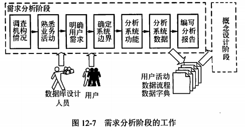

title:: 软件系统分析与设计/数据库分析与设计/数据库需求分析
alias:: 数据库需求分析

- 需求分析是在项目确定之后，用户和设计人员对数据库应用系统所要涉及的内容（数据）和功能（行为）的整理和描述，是以用户的角度来认识系统。这一过程是后续开发的基础，以后的逻辑设计和物理设计以及应用程序的设计都会以此为依据。
- ## 需求分析的任务、目标及方法
	- 需求分析阶段的任务：综合各个用户的应用需求，对现实世界要处理的对象（组织、部门和企业等）进行详细调查，在了解现行系统的概况，确定新系统功能的过程中，收集支持系统目标的基础数据及处理方法。
	- 参与需求分析的主要人员是分析人员和用户，由于数据库应用系统是面向企业和部门的具体业务，分析人员一般并不了解，而同样用户也不会具有系统分析的能力，这就需要双方进行有效的沟通，使得设计人员对用户的各项业务了解和熟悉，进行分析和加工，将用户眼中的业务转换成为设计人员所需要的信息组织。
	- 分析和表达用户需求的方法主要包括自顶向下和自底向上两类方法。自项向下的结构化分析（Structured Analysis，SA）方法从最上层的系统组织机构入手，采用逐层分解的方式分析系统，并把每一层用数据流图和数据字典描述。需求分析的重点是调查组织机构情况、调查各部门的业务活动情况、协助用户明确对新系统的各种要求、确定新系统的边界，以此获得用户对系统的如下要求。
		- ==信息要求==。用户需要在系统中保存哪些信息，由这些保存的信息要得到什么样的信息，这些信息以及信息间应当满足的完整性要求。
		- ==处理要求==。用户在系统中要实现什么样的操作功能，对保存信息的处理过程和方式，各种操作处理的频度、响应时间要求、处理方式等以及处理过程中的安全性要求和完整性要求。
		- ==系统要求==。包括安全性要求、使用方式要求和可扩充性要求。安全性要求：系统有几种用户使用，每一种用户的使用权限如何。使用方式要求：用户的使用环境是什么，平均有多少用户同时使用，每一种用户的使用权限如何。使用方式要求：用户的使用环境是什么，平均有多少用户同时使用，最高峰时有多少用户同时使用，有无查询相应的时间要求等。可扩充性要求：对未来功能、性能和应用访问的可扩充性要求。
	- 需求分析阶段的工作以及形成的相关文档（作为概念结构设计阶段的依据）如图12-7所示。
	  
- ## 需求分析阶段的文档
	- 需求调查所得到的数据可能是零碎的、局部的，分析师和设计人员必须进一步分析和表达用户的需求，建立需求说明文档、数据字典和数据流程图。将需求调查文档化，文档既要被用户所理解，又要方便数据库的概念结构设计。
	- 数据流分析是对事务处理所需的原始数据的收集及经处理后所得数据及其流向，一般用数据流程图（DFD）来表示。DFD不仅指出了数据的流向，而且还指出了需要进行的事务处理（但并不涉及如何处理，这是应用程序的设计范畴）。除了使用数据流程图、数据字典以外，需求分析还可使用判定表、判定树等工具。下面介绍数据流程图和数据字典，其他工具的使用可参见软件工程等方面的参考书。
	- **数据字典**（Data Dictionary，DD）是各类数据描述的集合，它是关于数据库中数据的描述，即元数据，而不是数据本身。如用户将向数据库中输入什么信息，从数据库中要得到什么信息，各类信息的内容和结构，信息之间的联系等。数据字典包括数据项、数据结构、数据流、数据存储和处理过程5个部分（至少应该包含每个字段的数据类型和在每个表内的主键、外键）。
		- ```
		  数据项描述={数据项名，数据项含义说明，别名，数据类型，长度，取值范围，取值含义，与其他数据项的逻辑关系}
		  数据结构描述={数据结构名，含义说明，组成：{数据项或数据结构}}
		  数据流描述={数据流名，说明，数据流来源，数据流去向，组成：{数据结构}，平均流量，高峰期流量}
		  数据存储描述={数据存储名，说明，编号，流入的数据流，流出的数据流，组成：{数据结构}，数据量，存取方式}
		  处理过程描述={处理过程名，说明，输入：{数据流}，输出：{数据流}，处理：{简要说明}}
		  ```
	- 需求分析阶段的成果是系统需求说明书，主要包括数据流图、数据字典、各种说明性表格、统计输出表和系统功能结构图等。系统需求说明书是以后设计、开发、测试和验收等过程的重要依据。关于需求分析的详细过程请参见第4.2节。